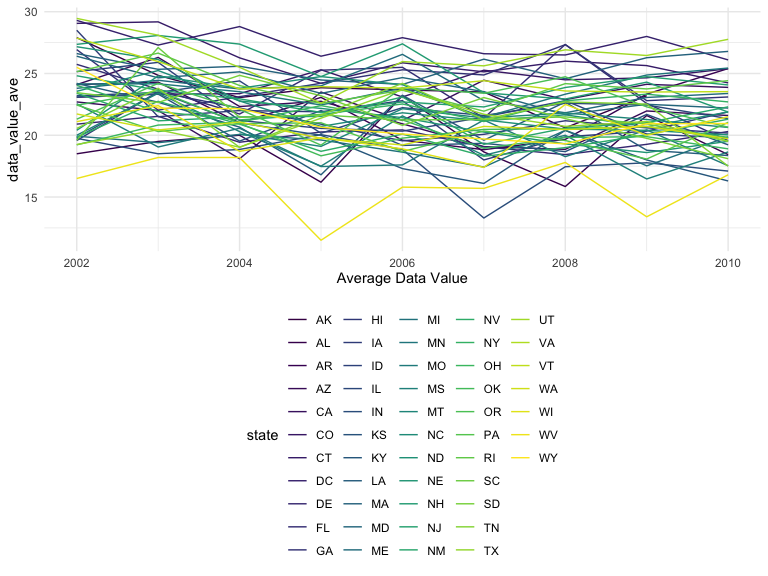
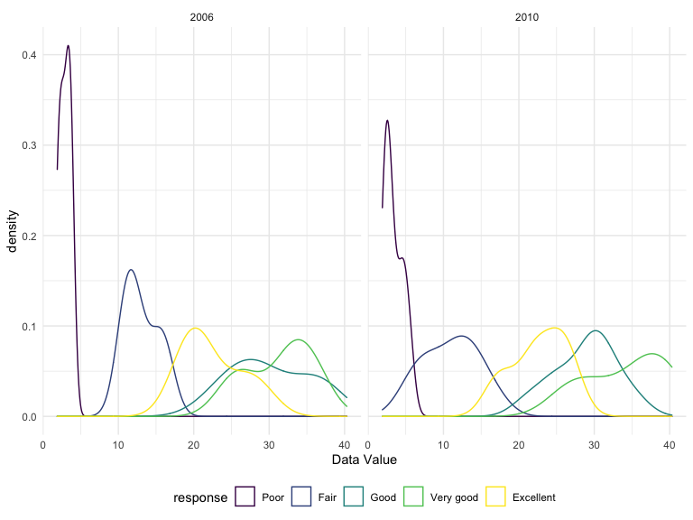

p8105\_hw3\_xf2226
================
Xin Fang
10/19/2021

# Problem 1

``` r
data("instacart")
summary(instacart) #order_dow is in range 0-6; not very understandable
instacart <- instacart %>% 
    mutate(
      order_dow = order_dow + 1,
      order_dow = wday(order_dow, label = T)
   ) 
```

## A short description of the dataset, noting the size and structure of the data, describing some key variables

This instacart dataset contains 1384617 rows and 15 columns.

The observations are orders which is included in the `order_id` column.
We have 131209 order in total. Within those orders, there are 39123
unique products. Some examples of the products include Bulgarian Yogurt,
Organic 4% Milk Fat Whole Milk Cottage Cheese, Organic Celery Hearts,
Cucumber Kirby, Lightly Smoked Sardines in Olive Oil. Those products are
coming from 134 unique aisles and 21 departments. The top two days of
the week where the most orders are placed is Sat, Sun, which are the
weekends.

Some key varaibles are:

-   `order_id`= order identifier
-   `product_id`= product identifier
-   `user_id`= customer identifier
-   `order_number`= the order sequence number for this user (1=first,
    n=nth)
-   `order_dow`= the day of the week on which the order was placed
-   `product_name`= name of the product
-   `aisle_id`= aisle identifier
-   `aisle`= the name of the aisle
-   `department_id`= department identifier
-   `department`= the name of the department

## Illstrative examples of observations

``` r
instacart_dow_dept <- instacart %>% 
  filter(department == "produce" | department == "frozen") %>% 
  group_by(order_dow, aisle, department) %>% 
  summarise(total = n())

instacart_dow_dept %>% 
  ggplot(aes(x = order_dow, y = total, group = aisle, color = aisle)) + 
  geom_line() +
  facet_grid(department ~ ., scales = "free_y") +
   labs(
    x = "Day of the Week",
    y = "Quantity of Orders",
  )
```

<!-- -->

## Problem 1.1 How many aisles, and which are most items from?

``` r
aisles <- instacart %>% 
  count(aisle) %>% 
  arrange(desc(n))
```

There are 134 number of aisles. The top 3 aisles where most items are
ordered are from fresh vegetables, fresh fruits, packaged vegetables
fruits

## Problem 1.2 Make a plot that shows the number of items ordered in each aisle, limiting this to aisles with more than 10000 items ordered. Arrange aisles sensibly, and organize your plot so others can read it.

``` r
aisles %>%
  filter(n > 10000) %>% 
  mutate(
    aisle = factor(aisle),
    aisle = fct_reorder(aisle, n)
  ) %>% 
  ggplot(aes(x = aisle, y = n)) + geom_point() +
  theme(axis.text.x = element_text(angle = 270, vjust = 0.5, hjust = 1)) + 
  labs(
    y = "number of items ordered", 
    title = "Number of items ordered from each aisle (that has more than 10000 items ordered)"
  )
```

<!-- -->

## Problem 1.3 Make a table showing the three most popular items in each of the aisles “baking ingredients”, “dog food care”, and “packaged vegetables fruits”. Include the number of times each item is ordered in your table.

``` r
instacart %>% 
  filter(aisle %in% c("baking ingredients", "dog food care", "packaged vegetables fruits")) %>% 
  group_by(aisle) %>% 
  count(product_name) %>% 
  mutate(rank = min_rank(desc(n))) %>% 
  filter(rank < 4) %>% #top three popular items
  arrange(aisle, rank) %>% 
  knitr::kable()
```

| aisle                      | product\_name                                 |    n | rank |
|:---------------------------|:----------------------------------------------|-----:|-----:|
| baking ingredients         | Light Brown Sugar                             |  499 |    1 |
| baking ingredients         | Pure Baking Soda                              |  387 |    2 |
| baking ingredients         | Cane Sugar                                    |  336 |    3 |
| dog food care              | Snack Sticks Chicken & Rice Recipe Dog Treats |   30 |    1 |
| dog food care              | Organix Chicken & Brown Rice Recipe           |   28 |    2 |
| dog food care              | Small Dog Biscuits                            |   26 |    3 |
| packaged vegetables fruits | Organic Baby Spinach                          | 9784 |    1 |
| packaged vegetables fruits | Organic Raspberries                           | 5546 |    2 |
| packaged vegetables fruits | Organic Blueberries                           | 4966 |    3 |

## Problem 1.4 Make a table showing the mean hour of the day at which Pink Lady Apples and Coffee Ice Cream are ordered on each day of the week; format this table for human readers (i.e. produce a 2 x 7 table).

``` r
instacart %>% 
    filter(product_name %in% c("Pink Lady Apples", "Coffee Ice Cream")) %>% 
    group_by(product_name, order_dow) %>% 
    summarize(mean_hour = mean(order_hour_of_day)) %>% #taking mean hour of the day
    pivot_wider(
        names_from = order_dow,
        values_from = mean_hour
    )
```

    ## # A tibble: 2 × 8
    ## # Groups:   product_name [2]
    ##   product_name       Sun   Mon   Tue   Wed   Thu   Fri   Sat
    ##   <chr>            <dbl> <dbl> <dbl> <dbl> <dbl> <dbl> <dbl>
    ## 1 Coffee Ice Cream  13.8  14.3  15.4  15.3  15.2  12.3  13.8
    ## 2 Pink Lady Apples  13.4  11.4  11.7  14.2  11.6  12.8  11.9

# Problem 2

## load and clean BRFSS dataset

``` r
data("brfss_smart2010")
brfss_smart2010 <- brfss_smart2010 %>% 
  janitor::clean_names() 

brfss <- brfss_smart2010 %>%  
  filter(topic %in% "Overall Health") %>%
  filter(response %in% c("Poor","Fair","Good","Very good","Excellent")) %>%
  mutate(response = factor(response, ordered = TRUE, 
                       levels = c("Poor", "Fair", "Good", "Very good", "Excellent")),
         locationdesc = gsub('^.{0,5}', '', locationdesc)) %>% 
  rename(state = locationabbr, county = locationdesc)
```

## Problem 2.1: In 2002, which states were observed at 7 or more locations? What about in 2010?

``` r
states_2002 <- brfss %>% 
  filter(year == 2002) %>% 
  group_by(state) %>% 
  summarise(n_state = n()) %>% 
  filter(n_state > 6)

states_2010 <- brfss %>% 
  filter(year == 2010) %>% 
  group_by(state) %>% 
  summarise(n_state = n()) %>% 
  filter(n_state > 6)
```

In 2002, the states that were observed at 7 or more locations are AZ,
CO, CT, DE, FL, GA, HI, ID, IL, IN, KS, LA, MA, MD, ME, MI, MN, MO, NC,
NE, NH, NJ, NV, NY, OH, OK, OR, PA, RI, SC, SD, TN, TX, UT, VT, WA.  
In 2010, the states that were observed at 7 or more locations are AL,
AR, AZ, CA, CO, CT, DE, FL, GA, HI, IA, ID, IL, IN, KS, LA, MA, MD, ME,
MI, MN, MO, MS, MT, NC, ND, NE, NH, NJ, NM, NV, NY, OH, OK, OR, PA, RI,
SC, SD, TN, TX, UT, VT, WA, WY.

## Problem 2.2 Construct a dataset that is limited to Excellent responses, and contains, year, state, and a variable that averages the data\_value across locations within a state. Make a “spaghetti” plot of this average value over time within a state (that is, make a plot showing a line for each state across years – the geom\_line geometry and group aesthetic will help).

``` r
brfss %>% 
  filter(response == "Excellent") %>% 
  group_by(state, year) %>%  
  mutate(
    data_value_ave = mean(data_value, na.rm = TRUE)
  ) %>% 
  select(year, state, data_value_ave) %>% 
  unique() %>% 
  ggplot(
    aes(x = year, y = data_value_ave, group = state, color = state)) + 
  geom_line() + 
  labs(
    x = "Average Data Value"
  )
```

<!-- -->

## Problem 2.3 Make a two-panel plot showing, for the years 2006, and 2010, distribution of data\_value for responses (“Poor” to “Excellent”) among locations in NY State.

``` r
brfss %>% 
  filter(year == "2006" | year == "2010", state == "NY") %>% 
  select(year, data_value, response) %>%
  ggplot(
    aes(x = data_value, color = response)) + 
  geom_density() + 
  facet_grid(.~ year) +
  labs(
    x = "Data Value"
  )
```

<!-- -->

# Problem 3

## load and tidy accelerometer dataset

``` r
accel <- read_csv("./data/accel_data.csv") %>% 
  janitor::clean_names() 

summary(accel)
```

    ##       week       day_id         day              activity_1    activity_2  
    ##  Min.   :1   Min.   : 1.0   Length:35          Min.   :  1   Min.   :   1  
    ##  1st Qu.:2   1st Qu.: 9.5   Class :character   1st Qu.:  1   1st Qu.:   1  
    ##  Median :3   Median :18.0   Mode  :character   Median :  1   Median :   1  
    ##  Mean   :3   Mean   :18.0                      Mean   : 67   Mean   :  96  
    ##  3rd Qu.:4   3rd Qu.:26.5                      3rd Qu.: 68   3rd Qu.:  71  
    ##  Max.   :5   Max.   :35.0                      Max.   :675   Max.   :1222  
    ##    activity_3     activity_4    activity_5    activity_6     activity_7  
    ##  Min.   :   1   Min.   :  1   Min.   :  1   Min.   :   1   Min.   :   1  
    ##  1st Qu.:   1   1st Qu.:  1   1st Qu.:  1   1st Qu.:   1   1st Qu.:   1  
    ##  Median :   1   Median :  1   Median :  1   Median :   1   Median :   1  
    ##  Mean   : 113   Mean   : 69   Mean   : 66   Mean   :  75   Mean   :  78  
    ##  3rd Qu.:  59   3rd Qu.: 29   3rd Qu.: 40   3rd Qu.:  33   3rd Qu.:  40  
    ##  Max.   :1310   Max.   :779   Max.   :821   Max.   :1195   Max.   :1281  
    ##    activity_8    activity_9   activity_10   activity_11    activity_12 
    ##  Min.   :  1   Min.   :  1   Min.   :  1   Min.   :   1   Min.   :  1  
    ##  1st Qu.:  1   1st Qu.:  1   1st Qu.:  1   1st Qu.:   1   1st Qu.:  1  
    ##  Median :  1   Median :  1   Median :  1   Median :   1   Median :  1  
    ##  Mean   : 52   Mean   : 54   Mean   : 72   Mean   :  84   Mean   : 76  
    ##  3rd Qu.: 13   3rd Qu.: 33   3rd Qu.: 58   3rd Qu.:  21   3rd Qu.: 24  
    ##  Max.   :618   Max.   :675   Max.   :580   Max.   :1010   Max.   :891  
    ##   activity_13   activity_14   activity_15   activity_16   activity_17   
    ##  Min.   :  1   Min.   :  1   Min.   :  1   Min.   :  1   Min.   :  1.0  
    ##  1st Qu.:  1   1st Qu.:  1   1st Qu.:  1   1st Qu.:  1   1st Qu.:  1.0  
    ##  Median :  1   Median :  1   Median :  1   Median :  1   Median :  1.0  
    ##  Mean   : 49   Mean   : 31   Mean   : 46   Mean   : 57   Mean   : 28.4  
    ##  3rd Qu.: 20   3rd Qu.: 29   3rd Qu.: 11   3rd Qu.: 13   3rd Qu.: 22.0  
    ##  Max.   :779   Max.   :393   Max.   :779   Max.   :960   Max.   :305.0  
    ##   activity_18     activity_19     activity_20   activity_21     activity_22   
    ##  Min.   :  1.0   Min.   :  1.0   Min.   :  1   Min.   : 1.00   Min.   :  1.0  
    ##  1st Qu.:  1.0   1st Qu.:  1.0   1st Qu.:  1   1st Qu.: 1.00   1st Qu.:  1.0  
    ##  Median :  1.0   Median :  1.0   Median :  1   Median : 1.00   Median :  1.0  
    ##  Mean   : 21.2   Mean   : 20.4   Mean   : 29   Mean   : 4.13   Mean   : 16.5  
    ##  3rd Qu.: 32.0   3rd Qu.: 11.5   3rd Qu.: 38   3rd Qu.: 1.00   3rd Qu.: 18.6  
    ##  Max.   :116.0   Max.   :238.0   Max.   :364   Max.   :25.31   Max.   :163.0  
    ##   activity_23   activity_24   activity_25    activity_26    activity_27  
    ##  Min.   :  1   Min.   :  1   Min.   :   1   Min.   :   1   Min.   :   1  
    ##  1st Qu.:  1   1st Qu.:  1   1st Qu.:   1   1st Qu.:   1   1st Qu.:   1  
    ##  Median :  1   Median :  1   Median :   1   Median :   1   Median :   1  
    ##  Mean   : 31   Mean   : 21   Mean   :  75   Mean   :  73   Mean   :  57  
    ##  3rd Qu.:  1   3rd Qu.: 11   3rd Qu.:   6   3rd Qu.:  11   3rd Qu.:  18  
    ##  Max.   :526   Max.   :458   Max.   :1736   Max.   :1701   Max.   :1281  
    ##   activity_28    activity_29     activity_30    activity_31   activity_32 
    ##  Min.   :   1   Min.   :  1.0   Min.   : 1.0   Min.   :  1   Min.   :  1  
    ##  1st Qu.:   1   1st Qu.:  1.0   1st Qu.: 1.0   1st Qu.:  1   1st Qu.:  1  
    ##  Median :   1   Median :  1.0   Median : 1.0   Median :  1   Median :  1  
    ##  Mean   :  50   Mean   : 18.2   Mean   : 7.9   Mean   : 47   Mean   : 46  
    ##  3rd Qu.:  16   3rd Qu.:  1.0   3rd Qu.: 1.0   3rd Qu.: 27   3rd Qu.: 11  
    ##  Max.   :1222   Max.   :251.0   Max.   :46.5   Max.   :800   Max.   :696  
    ##   activity_33   activity_34    activity_35   activity_36   activity_37 
    ##  Min.   :  1   Min.   :   1   Min.   :  1   Min.   :  1   Min.   :  1  
    ##  1st Qu.:  1   1st Qu.:   1   1st Qu.:  1   1st Qu.:  1   1st Qu.:  1  
    ##  Median :  1   Median :   1   Median :  1   Median :  1   Median :  1  
    ##  Mean   : 28   Mean   :  69   Mean   : 36   Mean   : 24   Mean   : 26  
    ##  3rd Qu.:  1   3rd Qu.:  32   3rd Qu.: 31   3rd Qu.:  9   3rd Qu.: 11  
    ##  Max.   :759   Max.   :1168   Max.   :320   Max.   :364   Max.   :492  
    ##   activity_38   activity_39   activity_40    activity_41   activity_42 
    ##  Min.   :  1   Min.   :  1   Min.   :   1   Min.   :  1   Min.   :  1  
    ##  1st Qu.:  1   1st Qu.:  1   1st Qu.:   1   1st Qu.:  1   1st Qu.:  1  
    ##  Median :  1   Median :  1   Median :   1   Median :  1   Median :  1  
    ##  Mean   : 56   Mean   : 60   Mean   :  69   Mean   : 42   Mean   : 29  
    ##  3rd Qu.: 24   3rd Qu.: 27   3rd Qu.:  29   3rd Qu.: 36   3rd Qu.: 11  
    ##  Max.   :696   Max.   :985   Max.   :1252   Max.   :599   Max.   :335  
    ##   activity_43   activity_44   activity_45   activity_46     activity_47  
    ##  Min.   :  1   Min.   :  1   Min.   :  1   Min.   :  1.0   Min.   :   1  
    ##  1st Qu.:  1   1st Qu.:  1   1st Qu.:  1   1st Qu.:  1.0   1st Qu.:   1  
    ##  Median :  1   Median :  1   Median :  1   Median :  1.0   Median :   1  
    ##  Mean   : 48   Mean   : 32   Mean   : 23   Mean   : 19.1   Mean   :  67  
    ##  3rd Qu.: 41   3rd Qu.:  6   3rd Qu.:  7   3rd Qu.: 11.5   3rd Qu.:  31  
    ##  Max.   :509   Max.   :845   Max.   :335   Max.   :213.0   Max.   :1010  
    ##   activity_48     activity_49   activity_50     activity_51     activity_52 
    ##  Min.   :  1.0   Min.   :  1   Min.   :  1.0   Min.   :  1.0   Min.   :  1  
    ##  1st Qu.:  1.0   1st Qu.:  1   1st Qu.:  1.0   1st Qu.:  1.0   1st Qu.:  1  
    ##  Median :  1.0   Median :  1   Median :  1.0   Median :  1.0   Median :  1  
    ##  Mean   : 31.9   Mean   : 36   Mean   : 24.2   Mean   : 14.4   Mean   : 26  
    ##  3rd Qu.: 50.5   3rd Qu.: 29   3rd Qu.:  1.0   3rd Qu.:  1.0   3rd Qu.:  1  
    ##  Max.   :238.0   Max.   :618   Max.   :305.0   Max.   :106.0   Max.   :542  
    ##   activity_53    activity_54    activity_55   activity_56     activity_57   
    ##  Min.   :   1   Min.   :   1   Min.   :  1   Min.   :  1.0   Min.   :  1.0  
    ##  1st Qu.:   1   1st Qu.:   1   1st Qu.:  1   1st Qu.:  1.0   1st Qu.:  1.0  
    ##  Median :   1   Median :   1   Median :  1   Median :  1.0   Median :  1.0  
    ##  Mean   :  60   Mean   :  45   Mean   : 29   Mean   : 12.1   Mean   : 14.4  
    ##  3rd Qu.:   1   3rd Qu.:   3   3rd Qu.: 11   3rd Qu.:  1.0   3rd Qu.: 11.0  
    ##  Max.   :1140   Max.   :1281   Max.   :779   Max.   :127.0   Max.   :116.0  
    ##   activity_58    activity_59   activity_60     activity_61     activity_62 
    ##  Min.   : 1.0   Min.   :  1   Min.   :  1.0   Min.   :  1.0   Min.   :  1  
    ##  1st Qu.: 1.0   1st Qu.:  1   1st Qu.:  1.0   1st Qu.:  1.0   1st Qu.:  1  
    ##  Median : 1.0   Median :  1   Median :  1.0   Median :  1.0   Median :  1  
    ##  Mean   :10.9   Mean   : 22   Mean   : 21.6   Mean   : 19.3   Mean   : 33  
    ##  3rd Qu.:16.5   3rd Qu.: 11   3rd Qu.:  6.0   3rd Qu.:  1.0   3rd Qu.:  6  
    ##  Max.   :64.0   Max.   :408   Max.   :305.0   Max.   :238.0   Max.   :492  
    ##   activity_63   activity_64   activity_65   activity_66     activity_67
    ##  Min.   :  1   Min.   :  1   Min.   :  1   Min.   :  1.0   Min.   : 1  
    ##  1st Qu.:  1   1st Qu.:  1   1st Qu.:  1   1st Qu.:  1.0   1st Qu.: 1  
    ##  Median :  1   Median :  1   Median :  1   Median :  1.0   Median : 1  
    ##  Mean   : 56   Mean   : 48   Mean   : 26   Mean   : 17.5   Mean   : 8  
    ##  3rd Qu.: 34   3rd Qu.:  9   3rd Qu.: 16   3rd Qu.:  6.0   3rd Qu.: 1  
    ##  Max.   :759   Max.   :492   Max.   :475   Max.   :291.0   Max.   :64  
    ##   activity_68     activity_69     activity_70   activity_71   activity_72 
    ##  Min.   :  1.0   Min.   :  1.0   Min.   :  1   Min.   :  1   Min.   :  1  
    ##  1st Qu.:  1.0   1st Qu.:  1.0   1st Qu.:  1   1st Qu.:  1   1st Qu.:  1  
    ##  Median :  1.0   Median :  1.0   Median :  1   Median :  1   Median :  1  
    ##  Mean   : 18.2   Mean   : 12.6   Mean   : 19   Mean   : 20   Mean   : 15  
    ##  3rd Qu.:  6.0   3rd Qu.:  1.0   3rd Qu.:  1   3rd Qu.:  6   3rd Qu.:  6  
    ##  Max.   :291.0   Max.   :200.0   Max.   :442   Max.   :425   Max.   :200  
    ##   activity_73   activity_74   activity_75     activity_76   activity_77 
    ##  Min.   :  1   Min.   :  1   Min.   :  1.0   Min.   :  1   Min.   :  1  
    ##  1st Qu.:  1   1st Qu.:  1   1st Qu.:  1.0   1st Qu.:  1   1st Qu.:  1  
    ##  Median :  1   Median :  1   Median :  1.0   Median :  1   Median :  1  
    ##  Mean   : 32   Mean   : 32   Mean   : 12.9   Mean   : 28   Mean   : 30  
    ##  3rd Qu.: 21   3rd Qu.: 11   3rd Qu.:  1.0   3rd Qu.: 11   3rd Qu.: 24  
    ##  Max.   :320   Max.   :845   Max.   :116.0   Max.   :561   Max.   :393  
    ##   activity_78     activity_79     activity_80     activity_81   
    ##  Min.   :  1.0   Min.   :  1.0   Min.   :  1.0   Min.   :  1.0  
    ##  1st Qu.:  1.0   1st Qu.:  1.0   1st Qu.:  1.0   1st Qu.:  1.0  
    ##  Median :  1.0   Median :  1.0   Median :  1.0   Median :  1.0  
    ##  Mean   : 13.3   Mean   : 12.6   Mean   : 12.4   Mean   : 12.3  
    ##  3rd Qu.:  1.0   3rd Qu.:  1.0   3rd Qu.:  4.6   3rd Qu.:  1.0  
    ##  Max.   :163.0   Max.   :188.0   Max.   :127.0   Max.   :137.0  
    ##   activity_82     activity_83     activity_84    activity_85  activity_86 
    ##  Min.   :  1.0   Min.   :  1.0   Min.   : 1.0   Min.   : 1   Min.   :  1  
    ##  1st Qu.:  1.0   1st Qu.:  1.0   1st Qu.: 1.0   1st Qu.: 1   1st Qu.:  1  
    ##  Median :  1.0   Median :  1.0   Median : 1.0   Median : 1   Median :  1  
    ##  Mean   :  7.5   Mean   : 31.6   Mean   :10.7   Mean   :12   Mean   : 28  
    ##  3rd Qu.:  1.0   3rd Qu.: 30.0   3rd Qu.: 1.0   3rd Qu.: 6   3rd Qu.: 16  
    ##  Max.   :106.0   Max.   :276.0   Max.   :95.0   Max.   :74   Max.   :408  
    ##   activity_87   activity_88   activity_89     activity_90   activity_91  
    ##  Min.   :  1   Min.   :  1   Min.   :  1.0   Min.   :  1   Min.   : 1.0  
    ##  1st Qu.:  1   1st Qu.:  1   1st Qu.:  1.0   1st Qu.:  1   1st Qu.: 1.0  
    ##  Median :  1   Median :  1   Median :  1.0   Median :  1   Median : 1.0  
    ##  Mean   : 22   Mean   : 42   Mean   :  9.3   Mean   : 26   Mean   : 4.7  
    ##  3rd Qu.:  1   3rd Qu.:  4   3rd Qu.:  1.0   3rd Qu.:  1   3rd Qu.: 1.0  
    ##  Max.   :492   Max.   :914   Max.   :150.0   Max.   :335   Max.   :46.8  
    ##   activity_92     activity_93    activity_94   activity_95     activity_96 
    ##  Min.   :  1.0   Min.   : 1.0   Min.   :  1   Min.   :  1.0   Min.   :  1  
    ##  1st Qu.:  1.0   1st Qu.: 1.0   1st Qu.:  1   1st Qu.:  1.0   1st Qu.:  1  
    ##  Median :  1.0   Median : 1.0   Median :  1   Median :  1.0   Median :  1  
    ##  Mean   :  7.8   Mean   : 6.6   Mean   : 19   Mean   : 12.6   Mean   : 24  
    ##  3rd Qu.:  1.0   3rd Qu.: 1.0   3rd Qu.:  1   3rd Qu.:  1.0   3rd Qu.: 12  
    ##  Max.   :137.0   Max.   :95.0   Max.   :320   Max.   :116.0   Max.   :458  
    ##   activity_97     activity_98     activity_99     activity_100  activity_101  
    ##  Min.   :  1.0   Min.   :  1.0   Min.   :  1.0   Min.   :  1   Min.   :  1.0  
    ##  1st Qu.:  1.0   1st Qu.:  1.0   1st Qu.:  1.0   1st Qu.:  1   1st Qu.:  1.0  
    ##  Median :  1.0   Median :  1.0   Median :  1.0   Median :  1   Median :  1.0  
    ##  Mean   : 14.5   Mean   : 19.2   Mean   : 13.4   Mean   : 22   Mean   : 19.0  
    ##  3rd Qu.: 20.4   3rd Qu.:  1.0   3rd Qu.:  1.0   3rd Qu.:  1   3rd Qu.: 20.2  
    ##  Max.   :106.0   Max.   :213.0   Max.   :238.0   Max.   :425   Max.   :200.0  
    ##   activity_102  activity_103  activity_104  activity_105    activity_106
    ##  Min.   :  1   Min.   :  1   Min.   :  1   Min.   :  1.0   Min.   :  1  
    ##  1st Qu.:  1   1st Qu.:  1   1st Qu.:  1   1st Qu.:  1.0   1st Qu.:  1  
    ##  Median :  1   Median :  1   Median :  1   Median :  1.0   Median :  1  
    ##  Mean   : 62   Mean   : 49   Mean   : 44   Mean   : 23.2   Mean   : 42  
    ##  3rd Qu.: 14   3rd Qu.: 18   3rd Qu.:  8   3rd Qu.: 11.0   3rd Qu.: 18  
    ##  Max.   :580   Max.   :475   Max.   :696   Max.   :276.0   Max.   :800  
    ##   activity_107  activity_108  activity_109  activity_110  activity_111 
    ##  Min.   :  1   Min.   :  1   Min.   :  1   Min.   :  1   Min.   : 1.0  
    ##  1st Qu.:  1   1st Qu.:  1   1st Qu.:  1   1st Qu.:  1   1st Qu.: 1.0  
    ##  Median :  1   Median :  1   Median :  1   Median :  1   Median : 1.0  
    ##  Mean   : 11   Mean   : 27   Mean   : 32   Mean   : 38   Mean   :11.6  
    ##  3rd Qu.:  1   3rd Qu.:  4   3rd Qu.:  6   3rd Qu.: 16   3rd Qu.: 9.6  
    ##  Max.   :150   Max.   :364   Max.   :542   Max.   :821   Max.   :95.0  
    ##   activity_112    activity_113  activity_114  activity_115   activity_116
    ##  Min.   :  1.0   Min.   :  1   Min.   :  1   Min.   :   1   Min.   :  1  
    ##  1st Qu.:  1.0   1st Qu.:  1   1st Qu.:  1   1st Qu.:   1   1st Qu.:  1  
    ##  Median :  1.0   Median :  1   Median :  1   Median :   1   Median :  1  
    ##  Mean   : 18.7   Mean   : 28   Mean   : 25   Mean   :  65   Mean   : 40  
    ##  3rd Qu.: 23.0   3rd Qu.: 25   3rd Qu.:  1   3rd Qu.:  27   3rd Qu.: 30  
    ##  Max.   :127.0   Max.   :320   Max.   :637   Max.   :1168   Max.   :696  
    ##   activity_117  activity_118  activity_119  activity_120  activity_121  
    ##  Min.   :  1   Min.   :  1   Min.   :  1   Min.   :  1   Min.   :  1.0  
    ##  1st Qu.:  1   1st Qu.:  1   1st Qu.:  1   1st Qu.:  1   1st Qu.:  1.0  
    ##  Median :  1   Median :  1   Median :  1   Median :  1   Median :  1.0  
    ##  Mean   : 38   Mean   : 27   Mean   : 33   Mean   : 21   Mean   : 13.1  
    ##  3rd Qu.: 12   3rd Qu.: 26   3rd Qu.: 18   3rd Qu.: 14   3rd Qu.:  1.0  
    ##  Max.   :960   Max.   :335   Max.   :364   Max.   :335   Max.   :137.0  
    ##   activity_122    activity_123  activity_124  activity_125    activity_126  
    ##  Min.   :  1.0   Min.   :  1   Min.   :  1   Min.   :  1.0   Min.   :  1.0  
    ##  1st Qu.:  1.0   1st Qu.:  1   1st Qu.:  1   1st Qu.:  1.0   1st Qu.:  1.0  
    ##  Median :  1.0   Median :  1   Median :  1   Median :  1.0   Median :  1.0  
    ##  Mean   : 14.3   Mean   : 37   Mean   : 29   Mean   : 11.4   Mean   : 23.4  
    ##  3rd Qu.:  4.2   3rd Qu.:  1   3rd Qu.:  6   3rd Qu.:  1.0   3rd Qu.:  5.2  
    ##  Max.   :226.0   Max.   :580   Max.   :599   Max.   :150.0   Max.   :213.0  
    ##   activity_127    activity_128  activity_129    activity_130   activity_131  
    ##  Min.   :  1.0   Min.   :  1   Min.   :  1.0   Min.   :   1   Min.   :  1.0  
    ##  1st Qu.:  1.0   1st Qu.:  1   1st Qu.:  1.0   1st Qu.:   1   1st Qu.:  1.0  
    ##  Median :  1.0   Median :  1   Median :  1.0   Median :   1   Median :  1.0  
    ##  Mean   : 16.7   Mean   : 34   Mean   : 12.1   Mean   :  52   Mean   : 13.1  
    ##  3rd Qu.: 12.4   3rd Qu.:  1   3rd Qu.:  6.0   3rd Qu.:  32   3rd Qu.:  6.0  
    ##  Max.   :226.0   Max.   :580   Max.   :200.0   Max.   :1010   Max.   :106.0  
    ##   activity_132  activity_133  activity_134  activity_135  activity_136
    ##  Min.   :  1   Min.   :  1   Min.   :  1   Min.   :  1   Min.   :  1  
    ##  1st Qu.:  1   1st Qu.:  1   1st Qu.:  1   1st Qu.:  1   1st Qu.:  1  
    ##  Median :  1   Median :  1   Median :  1   Median :  1   Median :  1  
    ##  Mean   : 46   Mean   : 43   Mean   : 37   Mean   : 34   Mean   : 19  
    ##  3rd Qu.: 13   3rd Qu.:  1   3rd Qu.: 35   3rd Qu.: 12   3rd Qu.:  1  
    ##  Max.   :937   Max.   :914   Max.   :251   Max.   :561   Max.   :442  
    ##   activity_137  activity_138  activity_139   activity_140  activity_141
    ##  Min.   :  1   Min.   :  1   Min.   :   1   Min.   :  1   Min.   :  1  
    ##  1st Qu.:  1   1st Qu.:  1   1st Qu.:   1   1st Qu.:  1   1st Qu.:  1  
    ##  Median :  1   Median :  1   Median :   1   Median :  1   Median :  1  
    ##  Mean   : 52   Mean   : 53   Mean   :  51   Mean   : 40   Mean   : 54  
    ##  3rd Qu.: 11   3rd Qu.: 28   3rd Qu.:   6   3rd Qu.: 13   3rd Qu.: 29  
    ##  Max.   :914   Max.   :800   Max.   :1035   Max.   :618   Max.   :509  
    ##   activity_142  activity_143  activity_144  activity_145  activity_146
    ##  Min.   :  1   Min.   :  1   Min.   :  1   Min.   :  1   Min.   :  1  
    ##  1st Qu.:  1   1st Qu.:  1   1st Qu.:  1   1st Qu.:  1   1st Qu.:  1  
    ##  Median :  1   Median :  1   Median :  1   Median :  1   Median :  1  
    ##  Mean   : 60   Mean   : 35   Mean   : 19   Mean   : 25   Mean   : 21  
    ##  3rd Qu.: 11   3rd Qu.: 14   3rd Qu.:  1   3rd Qu.:  5   3rd Qu.:  1  
    ##  Max.   :891   Max.   :599   Max.   :408   Max.   :320   Max.   :475  
    ##   activity_147  activity_148  activity_149  activity_150  activity_151
    ##  Min.   :  1   Min.   :  1   Min.   :  1   Min.   :  1   Min.   :  1  
    ##  1st Qu.:  1   1st Qu.:  1   1st Qu.:  1   1st Qu.:  1   1st Qu.:  1  
    ##  Median :  1   Median :  1   Median :  1   Median :  1   Median :  1  
    ##  Mean   : 51   Mean   : 48   Mean   : 31   Mean   : 40   Mean   : 24  
    ##  3rd Qu.: 26   3rd Qu.: 34   3rd Qu.: 11   3rd Qu.: 24   3rd Qu.: 10  
    ##  Max.   :542   Max.   :526   Max.   :509   Max.   :526   Max.   :509  
    ##   activity_152  activity_153   activity_154  activity_155    activity_156  
    ##  Min.   :  1   Min.   : 1.0   Min.   :  1   Min.   :  1.0   Min.   :  1.0  
    ##  1st Qu.:  1   1st Qu.: 1.0   1st Qu.:  1   1st Qu.:  1.0   1st Qu.:  1.0  
    ##  Median :  1   Median : 1.0   Median :  1   Median :  1.0   Median :  1.0  
    ##  Mean   : 33   Mean   : 5.3   Mean   : 29   Mean   : 30.6   Mean   : 19.5  
    ##  3rd Qu.: 10   3rd Qu.: 1.0   3rd Qu.: 21   3rd Qu.: 45.7   3rd Qu.: 15.2  
    ##  Max.   :868   Max.   :53.0   Max.   :425   Max.   :226.0   Max.   :175.0  
    ##   activity_157  activity_158    activity_159  activity_160  activity_161 
    ##  Min.   :  1   Min.   :  1.0   Min.   :  1   Min.   :  1   Min.   :   1  
    ##  1st Qu.:  1   1st Qu.:  1.0   1st Qu.:  1   1st Qu.:  1   1st Qu.:   1  
    ##  Median :  1   Median :  1.0   Median :  1   Median :  1   Median :   1  
    ##  Mean   : 22   Mean   : 23.2   Mean   : 28   Mean   : 43   Mean   :  57  
    ##  3rd Qu.:  1   3rd Qu.: 14.9   3rd Qu.: 17   3rd Qu.: 21   3rd Qu.:  43  
    ##  Max.   :305   Max.   :188.0   Max.   :364   Max.   :618   Max.   :1086  
    ##   activity_162  activity_163    activity_164   activity_165  activity_166
    ##  Min.   :  1   Min.   :  1.0   Min.   : 1.0   Min.   :  1   Min.   :  1  
    ##  1st Qu.:  1   1st Qu.:  1.0   1st Qu.: 1.0   1st Qu.:  1   1st Qu.:  1  
    ##  Median :  1   Median :  1.0   Median : 1.0   Median :  1   Median :  1  
    ##  Mean   : 30   Mean   : 15.8   Mean   :11.4   Mean   : 32   Mean   : 53  
    ##  3rd Qu.:  1   3rd Qu.:  1.0   3rd Qu.: 1.0   3rd Qu.: 21   3rd Qu.: 13  
    ##  Max.   :696   Max.   :175.0   Max.   :95.0   Max.   :349   Max.   :618  
    ##   activity_167  activity_168  activity_169    activity_170    activity_171
    ##  Min.   :  1   Min.   :  1   Min.   :  1.0   Min.   :  1.0   Min.   :  1  
    ##  1st Qu.:  1   1st Qu.:  1   1st Qu.:  1.0   1st Qu.:  1.0   1st Qu.:  1  
    ##  Median :  1   Median :  1   Median :  1.0   Median :  1.0   Median :  1  
    ##  Mean   : 52   Mean   : 57   Mean   : 24.6   Mean   : 19.2   Mean   : 37  
    ##  3rd Qu.: 43   3rd Qu.: 32   3rd Qu.: 15.6   3rd Qu.:  1.0   3rd Qu.: 22  
    ##  Max.   :960   Max.   :717   Max.   :226.0   Max.   :226.0   Max.   :542  
    ##   activity_172    activity_173    activity_174    activity_175  activity_176
    ##  Min.   :  1.0   Min.   :  1.0   Min.   :  1.0   Min.   :  1   Min.   :  1  
    ##  1st Qu.:  1.0   1st Qu.:  1.0   1st Qu.:  1.0   1st Qu.:  1   1st Qu.:  1  
    ##  Median :  1.0   Median :  1.0   Median :  1.0   Median :  1   Median :  1  
    ##  Mean   : 23.9   Mean   : 13.1   Mean   : 23.8   Mean   : 40   Mean   : 55  
    ##  3rd Qu.: 26.1   3rd Qu.:  6.0   3rd Qu.: 16.5   3rd Qu.: 27   3rd Qu.: 20  
    ##  Max.   :263.0   Max.   :163.0   Max.   :251.0   Max.   :821   Max.   :937  
    ##   activity_177  activity_178    activity_179    activity_180    activity_181
    ##  Min.   :  1   Min.   :  1.0   Min.   :  1.0   Min.   :  1.0   Min.   :  1  
    ##  1st Qu.:  1   1st Qu.:  1.0   1st Qu.:  1.0   1st Qu.:  1.0   1st Qu.:  1  
    ##  Median :  1   Median :  1.0   Median :  1.0   Median :  1.0   Median :  1  
    ##  Mean   : 57   Mean   : 15.1   Mean   : 17.7   Mean   : 23.5   Mean   : 25  
    ##  3rd Qu.: 16   3rd Qu.: 19.2   3rd Qu.:  1.0   3rd Qu.: 30.6   3rd Qu.: 11  
    ##  Max.   :891   Max.   :106.0   Max.   :137.0   Max.   :291.0   Max.   :408  
    ##   activity_182  activity_183  activity_184  activity_185  activity_186  
    ##  Min.   :  1   Min.   :  1   Min.   :  1   Min.   :  1   Min.   :  1.0  
    ##  1st Qu.:  1   1st Qu.:  1   1st Qu.:  1   1st Qu.:  1   1st Qu.:  1.0  
    ##  Median :  1   Median :  1   Median :  1   Median :  1   Median :  1.0  
    ##  Mean   : 29   Mean   : 36   Mean   : 33   Mean   : 37   Mean   : 19.3  
    ##  3rd Qu.: 11   3rd Qu.: 41   3rd Qu.: 35   3rd Qu.: 22   3rd Qu.: 26.0  
    ##  Max.   :509   Max.   :349   Max.   :364   Max.   :542   Max.   :175.0  
    ##   activity_187   activity_188    activity_189  activity_190    activity_191
    ##  Min.   :   1   Min.   :  1.0   Min.   :  1   Min.   :  1.0   Min.   :  1  
    ##  1st Qu.:   1   1st Qu.:  1.0   1st Qu.:  1   1st Qu.:  1.0   1st Qu.:  1  
    ##  Median :   1   Median :  1.0   Median :  1   Median :  1.0   Median :  1  
    ##  Mean   :  84   Mean   : 21.6   Mean   : 27   Mean   : 16.3   Mean   : 48  
    ##  3rd Qu.:  49   3rd Qu.: 11.0   3rd Qu.:  1   3rd Qu.:  1.0   3rd Qu.:  1  
    ##  Max.   :2005   Max.   :213.0   Max.   :675   Max.   :291.0   Max.   :960  
    ##   activity_192  activity_193    activity_194  activity_195    activity_196
    ##  Min.   :  1   Min.   :  1.0   Min.   :  1   Min.   :  1.0   Min.   :  1  
    ##  1st Qu.:  1   1st Qu.:  1.0   1st Qu.:  1   1st Qu.:  1.0   1st Qu.:  1  
    ##  Median :  1   Median :  1.0   Median :  1   Median :  1.0   Median :  1  
    ##  Mean   : 20   Mean   : 20.9   Mean   : 25   Mean   : 22.4   Mean   : 38  
    ##  3rd Qu.:  1   3rd Qu.: 32.5   3rd Qu.:  1   3rd Qu.: 21.5   3rd Qu.: 32  
    ##  Max.   :442   Max.   :116.0   Max.   :393   Max.   :163.0   Max.   :475  
    ##   activity_197    activity_198  activity_199    activity_200   activity_201  
    ##  Min.   :  1.0   Min.   :  1   Min.   :  1.0   Min.   : 1.0   Min.   :  1.0  
    ##  1st Qu.:  1.0   1st Qu.:  1   1st Qu.:  1.0   1st Qu.: 1.0   1st Qu.:  1.0  
    ##  Median :  1.0   Median :  1   Median :  1.0   Median : 1.0   Median :  1.0  
    ##  Mean   : 24.4   Mean   : 30   Mean   : 13.8   Mean   :11.1   Mean   : 22.3  
    ##  3rd Qu.: 38.8   3rd Qu.: 16   3rd Qu.:  1.0   3rd Qu.: 1.0   3rd Qu.:  1.0  
    ##  Max.   :238.0   Max.   :335   Max.   :150.0   Max.   :74.0   Max.   :291.0  
    ##   activity_202   activity_203    activity_204    activity_205  activity_206
    ##  Min.   : 1.0   Min.   :  1.0   Min.   :  1.0   Min.   :  1   Min.   :  1  
    ##  1st Qu.: 1.0   1st Qu.:  1.0   1st Qu.:  1.0   1st Qu.:  1   1st Qu.:  1  
    ##  Median : 1.0   Median :  1.0   Median :  1.0   Median :  1   Median :  1  
    ##  Mean   : 8.1   Mean   : 11.4   Mean   : 25.3   Mean   : 30   Mean   : 25  
    ##  3rd Qu.: 1.0   3rd Qu.:  1.0   3rd Qu.:  1.0   3rd Qu.:  1   3rd Qu.:  1  
    ##  Max.   :55.8   Max.   :122.7   Max.   :305.0   Max.   :599   Max.   :442  
    ##   activity_207  activity_208  activity_209   activity_210   activity_211  
    ##  Min.   :  1   Min.   :  1   Min.   : 1.0   Min.   : 1.0   Min.   :  1.0  
    ##  1st Qu.:  1   1st Qu.:  1   1st Qu.: 1.0   1st Qu.: 1.0   1st Qu.:  1.0  
    ##  Median :  1   Median :  1   Median : 1.0   Median : 1.0   Median :  1.0  
    ##  Mean   : 39   Mean   : 47   Mean   :10.3   Mean   : 7.9   Mean   : 11.3  
    ##  3rd Qu.:  1   3rd Qu.: 22   3rd Qu.: 1.0   3rd Qu.: 1.0   3rd Qu.:  1.0  
    ##  Max.   :779   Max.   :821   Max.   :83.8   Max.   :76.0   Max.   :106.0  
    ##   activity_212  activity_213    activity_214  activity_215  activity_216
    ##  Min.   :  1   Min.   :  1.0   Min.   :  1   Min.   :  1   Min.   :  1  
    ##  1st Qu.:  1   1st Qu.:  1.0   1st Qu.:  1   1st Qu.:  1   1st Qu.:  1  
    ##  Median :  1   Median :  1.0   Median :  1   Median :  1   Median :  1  
    ##  Mean   : 19   Mean   : 18.2   Mean   : 22   Mean   : 33   Mean   : 28  
    ##  3rd Qu.:  1   3rd Qu.:  1.0   3rd Qu.:  6   3rd Qu.:  1   3rd Qu.: 27  
    ##  Max.   :458   Max.   :175.0   Max.   :276   Max.   :759   Max.   :349  
    ##   activity_217  activity_218  activity_219  activity_220  activity_221 
    ##  Min.   :  1   Min.   :  1   Min.   :  1   Min.   :  1   Min.   : 1.0  
    ##  1st Qu.:  1   1st Qu.:  1   1st Qu.:  1   1st Qu.:  1   1st Qu.: 1.0  
    ##  Median :  1   Median :  1   Median :  1   Median :  1   Median : 1.0  
    ##  Mean   : 38   Mean   : 32   Mean   : 36   Mean   : 33   Mean   :15.1  
    ##  3rd Qu.: 27   3rd Qu.:  1   3rd Qu.: 12   3rd Qu.:  1   3rd Qu.: 1.0  
    ##  Max.   :599   Max.   :759   Max.   :821   Max.   :637   Max.   :95.0  
    ##   activity_222    activity_223   activity_224    activity_225    activity_226  
    ##  Min.   :  1.0   Min.   : 1.0   Min.   :  1.0   Min.   :  1.0   Min.   :  1.0  
    ##  1st Qu.:  1.0   1st Qu.: 1.0   1st Qu.:  1.0   1st Qu.:  1.0   1st Qu.:  1.0  
    ##  Median :  1.0   Median : 1.0   Median :  1.0   Median :  1.0   Median :  1.0  
    ##  Mean   : 16.8   Mean   : 6.9   Mean   : 23.3   Mean   : 12.5   Mean   : 20.0  
    ##  3rd Qu.:  1.0   3rd Qu.: 1.0   3rd Qu.: 24.0   3rd Qu.:  6.0   3rd Qu.: 27.6  
    ##  Max.   :251.0   Max.   :66.7   Max.   :226.0   Max.   :150.0   Max.   :175.0  
    ##   activity_227  activity_228  activity_229   activity_230  activity_231
    ##  Min.   :  1   Min.   :  1   Min.   :   1   Min.   :  1   Min.   :  1  
    ##  1st Qu.:  1   1st Qu.:  1   1st Qu.:   1   1st Qu.:  1   1st Qu.:  1  
    ##  Median :  1   Median :  1   Median :   1   Median :  1   Median :  1  
    ##  Mean   : 62   Mean   : 75   Mean   :  80   Mean   : 76   Mean   : 70  
    ##  3rd Qu.: 11   3rd Qu.: 33   3rd Qu.:  42   3rd Qu.: 11   3rd Qu.: 15  
    ##  Max.   :960   Max.   :937   Max.   :1061   Max.   :868   Max.   :914  
    ##   activity_232  activity_233   activity_234  activity_235  activity_236
    ##  Min.   :  1   Min.   :   1   Min.   :  1   Min.   :  1   Min.   :  1  
    ##  1st Qu.:  1   1st Qu.:   1   1st Qu.:  1   1st Qu.:  1   1st Qu.:  1  
    ##  Median :  1   Median :   1   Median :  1   Median :  1   Median :  1  
    ##  Mean   : 56   Mean   :  72   Mean   : 33   Mean   : 51   Mean   : 26  
    ##  3rd Qu.:  6   3rd Qu.:  18   3rd Qu.:  1   3rd Qu.: 32   3rd Qu.:  1  
    ##  Max.   :656   Max.   :1195   Max.   :675   Max.   :561   Max.   :561  
    ##   activity_237  activity_238  activity_239   activity_240  activity_241
    ##  Min.   :  1   Min.   :  1   Min.   :   1   Min.   :  1   Min.   :  1  
    ##  1st Qu.:  1   1st Qu.:  1   1st Qu.:   1   1st Qu.:  1   1st Qu.:  1  
    ##  Median :  1   Median :  1   Median :   1   Median :  1   Median :  1  
    ##  Mean   : 43   Mean   : 64   Mean   :  48   Mean   : 34   Mean   : 53  
    ##  3rd Qu.:  1   3rd Qu.: 28   3rd Qu.:   1   3rd Qu.: 27   3rd Qu.: 35  
    ##  Max.   :580   Max.   :779   Max.   :1010   Max.   :320   Max.   :393  
    ##   activity_242  activity_243  activity_244  activity_245  activity_246  
    ##  Min.   :  1   Min.   :  1   Min.   :  1   Min.   :  1   Min.   :  1.0  
    ##  1st Qu.:  1   1st Qu.:  1   1st Qu.:  1   1st Qu.:  1   1st Qu.:  1.0  
    ##  Median :  1   Median :  1   Median :  1   Median :  1   Median :  1.0  
    ##  Mean   : 35   Mean   : 37   Mean   : 35   Mean   : 29   Mean   : 26.6  
    ##  3rd Qu.: 22   3rd Qu.: 43   3rd Qu.: 16   3rd Qu.: 11   3rd Qu.:  1.0  
    ##  Max.   :364   Max.   :599   Max.   :580   Max.   :393   Max.   :276.0  
    ##   activity_247    activity_248  activity_249  activity_250  activity_251
    ##  Min.   :  1.0   Min.   :  1   Min.   :  1   Min.   :  1   Min.   :  1  
    ##  1st Qu.:  1.0   1st Qu.:  1   1st Qu.:  1   1st Qu.:  1   1st Qu.:  1  
    ##  Median :  1.0   Median :  1   Median :  1   Median :  1   Median :  1  
    ##  Mean   : 20.7   Mean   : 33   Mean   : 57   Mean   : 63   Mean   : 84  
    ##  3rd Qu.:  1.0   3rd Qu.:  6   3rd Qu.: 14   3rd Qu.: 20   3rd Qu.: 53  
    ##  Max.   :226.0   Max.   :408   Max.   :868   Max.   :800   Max.   :821  
    ##   activity_252  activity_253  activity_254  activity_255  activity_256
    ##  Min.   :  1   Min.   :  1   Min.   :  1   Min.   :  1   Min.   :  1  
    ##  1st Qu.:  1   1st Qu.:  1   1st Qu.:  1   1st Qu.:  1   1st Qu.:  1  
    ##  Median :  1   Median :  1   Median :  1   Median :  1   Median :  1  
    ##  Mean   : 57   Mean   : 48   Mean   : 50   Mean   : 51   Mean   : 68  
    ##  3rd Qu.: 41   3rd Qu.: 43   3rd Qu.: 22   3rd Qu.: 56   3rd Qu.: 65  
    ##  Max.   :675   Max.   :492   Max.   :526   Max.   :458   Max.   :542  
    ##   activity_257  activity_258  activity_259  activity_260  activity_261
    ##  Min.   :  1   Min.   :  1   Min.   :  1   Min.   :  1   Min.   :  1  
    ##  1st Qu.:  1   1st Qu.:  1   1st Qu.:  1   1st Qu.:  1   1st Qu.:  1  
    ##  Median :  1   Median :  1   Median :  1   Median :  1   Median :  1  
    ##  Mean   : 71   Mean   : 70   Mean   : 42   Mean   : 56   Mean   : 66  
    ##  3rd Qu.: 62   3rd Qu.: 44   3rd Qu.:  1   3rd Qu.: 28   3rd Qu.: 58  
    ##  Max.   :656   Max.   :580   Max.   :637   Max.   :696   Max.   :960  
    ##   activity_262    activity_263  activity_264  activity_265    activity_266  
    ##  Min.   :  1.0   Min.   :  1   Min.   :  1   Min.   :  1.0   Min.   :  1.0  
    ##  1st Qu.:  1.0   1st Qu.:  1   1st Qu.:  1   1st Qu.:  1.0   1st Qu.:  1.0  
    ##  Median :  1.0   Median :  1   Median :  1   Median :  1.0   Median :  1.0  
    ##  Mean   : 17.6   Mean   : 34   Mean   : 39   Mean   : 29.7   Mean   : 19.1  
    ##  3rd Qu.:  1.0   3rd Qu.: 37   3rd Qu.:  6   3rd Qu.: 37.3   3rd Qu.: 11.0  
    ##  Max.   :163.0   Max.   :393   Max.   :868   Max.   :238.0   Max.   :188.0  
    ##   activity_267  activity_268  activity_269  activity_270  activity_271 
    ##  Min.   :  1   Min.   :  1   Min.   :  1   Min.   :  1   Min.   :   1  
    ##  1st Qu.:  1   1st Qu.:  1   1st Qu.:  1   1st Qu.:  1   1st Qu.:   1  
    ##  Median :  1   Median :  1   Median :  1   Median :  1   Median :   1  
    ##  Mean   : 46   Mean   : 67   Mean   : 47   Mean   : 57   Mean   :  79  
    ##  3rd Qu.: 61   3rd Qu.: 56   3rd Qu.: 51   3rd Qu.: 67   3rd Qu.:  47  
    ##  Max.   :542   Max.   :717   Max.   :335   Max.   :656   Max.   :1061  
    ##   activity_272    activity_273  activity_274  activity_275  activity_276
    ##  Min.   :  1.0   Min.   :  1   Min.   :  1   Min.   :  1   Min.   :  1  
    ##  1st Qu.:  1.0   1st Qu.:  1   1st Qu.:  1   1st Qu.:  1   1st Qu.:  1  
    ##  Median :  1.0   Median :  1   Median :  1   Median :  1   Median :  1  
    ##  Mean   : 35.1   Mean   : 40   Mean   : 64   Mean   : 57   Mean   : 72  
    ##  3rd Qu.: 39.9   3rd Qu.: 24   3rd Qu.: 57   3rd Qu.: 98   3rd Qu.: 44  
    ##  Max.   :263.0   Max.   :675   Max.   :618   Max.   :425   Max.   :696  
    ##   activity_277  activity_278  activity_279  activity_280  activity_281
    ##  Min.   :  1   Min.   :  1   Min.   :  1   Min.   :  1   Min.   :  1  
    ##  1st Qu.:  1   1st Qu.:  1   1st Qu.:  1   1st Qu.:  1   1st Qu.:  1  
    ##  Median :  1   Median :  1   Median :  1   Median :  1   Median :  1  
    ##  Mean   : 57   Mean   : 44   Mean   : 59   Mean   : 55   Mean   : 55  
    ##  3rd Qu.: 53   3rd Qu.: 49   3rd Qu.: 45   3rd Qu.: 64   3rd Qu.: 22  
    ##  Max.   :696   Max.   :696   Max.   :637   Max.   :656   Max.   :580  
    ##   activity_282  activity_283    activity_284  activity_285  activity_286
    ##  Min.   :  1   Min.   :  1.0   Min.   :  1   Min.   :  1   Min.   :  1  
    ##  1st Qu.:  1   1st Qu.:  1.0   1st Qu.:  1   1st Qu.:  1   1st Qu.:  1  
    ##  Median :  1   Median :  1.0   Median :  1   Median :  1   Median :  1  
    ##  Mean   : 35   Mean   : 39.1   Mean   : 97   Mean   : 64   Mean   : 49  
    ##  3rd Qu.: 55   3rd Qu.: 65.1   3rd Qu.:109   3rd Qu.: 69   3rd Qu.: 23  
    ##  Max.   :442   Max.   :251.0   Max.   :738   Max.   :618   Max.   :526  
    ##   activity_287   activity_288  activity_289  activity_290   activity_291
    ##  Min.   :   1   Min.   :  1   Min.   :  1   Min.   :   1   Min.   :  1  
    ##  1st Qu.:   1   1st Qu.:  1   1st Qu.:  1   1st Qu.:   1   1st Qu.:  1  
    ##  Median :   1   Median :  1   Median :  1   Median :   1   Median :  1  
    ##  Mean   : 104   Mean   : 40   Mean   : 80   Mean   :  81   Mean   : 73  
    ##  3rd Qu.:  91   3rd Qu.: 53   3rd Qu.:104   3rd Qu.:  43   3rd Qu.: 83  
    ##  Max.   :1222   Max.   :408   Max.   :637   Max.   :1035   Max.   :542  
    ##   activity_292   activity_293   activity_294  activity_295  activity_296
    ##  Min.   :   1   Min.   :   1   Min.   :  1   Min.   :  1   Min.   :  1  
    ##  1st Qu.:   1   1st Qu.:   1   1st Qu.:  1   1st Qu.:  1   1st Qu.:  1  
    ##  Median :   1   Median :   1   Median :  1   Median :  1   Median :  1  
    ##  Mean   :  76   Mean   : 103   Mean   : 58   Mean   : 86   Mean   : 71  
    ##  3rd Qu.:  75   3rd Qu.: 111   3rd Qu.: 27   3rd Qu.: 82   3rd Qu.: 76  
    ##  Max.   :1369   Max.   :1086   Max.   :717   Max.   :821   Max.   :914  
    ##   activity_297  activity_298   activity_299   activity_300  activity_301
    ##  Min.   :  1   Min.   :   1   Min.   :   1   Min.   :  1   Min.   :  1  
    ##  1st Qu.:  1   1st Qu.:   1   1st Qu.:   1   1st Qu.:  1   1st Qu.:  1  
    ##  Median :  1   Median :   1   Median :   1   Median :  1   Median :  1  
    ##  Mean   : 68   Mean   :  83   Mean   : 124   Mean   : 30   Mean   : 84  
    ##  3rd Qu.: 68   3rd Qu.:  67   3rd Qu.:  97   3rd Qu.:  1   3rd Qu.: 88  
    ##  Max.   :868   Max.   :1035   Max.   :1340   Max.   :475   Max.   :561  
    ##   activity_302   activity_303   activity_304   activity_305  activity_306 
    ##  Min.   :   1   Min.   :   1   Min.   :   1   Min.   :  1   Min.   :   1  
    ##  1st Qu.:   1   1st Qu.:   1   1st Qu.:   1   1st Qu.:  1   1st Qu.:   1  
    ##  Median :   1   Median :   1   Median :   1   Median :  1   Median :   1  
    ##  Mean   : 102   Mean   :  88   Mean   : 110   Mean   : 91   Mean   : 114  
    ##  3rd Qu.:  87   3rd Qu.:  68   3rd Qu.:  60   3rd Qu.: 75   3rd Qu.:  94  
    ##  Max.   :1281   Max.   :1061   Max.   :1772   Max.   :738   Max.   :1310  
    ##   activity_307   activity_308  activity_309   activity_310   activity_311
    ##  Min.   :   1   Min.   :  1   Min.   :   1   Min.   :   1   Min.   :  1  
    ##  1st Qu.:   1   1st Qu.:  1   1st Qu.:   1   1st Qu.:   1   1st Qu.:  1  
    ##  Median :   1   Median :  1   Median :   1   Median :   1   Median :  1  
    ##  Mean   : 128   Mean   : 80   Mean   :  93   Mean   :  71   Mean   : 69  
    ##  3rd Qu.:  86   3rd Qu.: 88   3rd Qu.:  74   3rd Qu.:  34   3rd Qu.: 59  
    ##  Max.   :1113   Max.   :717   Max.   :1140   Max.   :1281   Max.   :891  
    ##   activity_312   activity_313   activity_314   activity_315   activity_316
    ##  Min.   :   1   Min.   :   1   Min.   :   1   Min.   :   1   Min.   :  1  
    ##  1st Qu.:   1   1st Qu.:   1   1st Qu.:   1   1st Qu.:   1   1st Qu.:  1  
    ##  Median :   1   Median :   1   Median :   1   Median :   1   Median :  1  
    ##  Mean   : 100   Mean   :  82   Mean   :  95   Mean   : 114   Mean   :126  
    ##  3rd Qu.:  92   3rd Qu.:  80   3rd Qu.:  66   3rd Qu.: 105   3rd Qu.:140  
    ##  Max.   :1035   Max.   :1010   Max.   :1086   Max.   :1010   Max.   :759  
    ##   activity_317  activity_318   activity_319  activity_320   activity_321
    ##  Min.   :  1   Min.   :   1   Min.   :  1   Min.   :   1   Min.   :  1  
    ##  1st Qu.:  1   1st Qu.:   1   1st Qu.:  1   1st Qu.:   1   1st Qu.:  1  
    ##  Median :  1   Median :   1   Median :  1   Median :   1   Median :  1  
    ##  Mean   :126   Mean   : 142   Mean   : 97   Mean   : 157   Mean   :122  
    ##  3rd Qu.:119   3rd Qu.: 114   3rd Qu.: 80   3rd Qu.: 152   3rd Qu.:135  
    ##  Max.   :868   Max.   :1086   Max.   :759   Max.   :1222   Max.   :960  
    ##   activity_322   activity_323  activity_324   activity_325  activity_326 
    ##  Min.   :   1   Min.   :  1   Min.   :   1   Min.   :  1   Min.   :   1  
    ##  1st Qu.:   1   1st Qu.:  1   1st Qu.:   1   1st Qu.:  1   1st Qu.:   1  
    ##  Median :   1   Median :  1   Median :   1   Median :  1   Median :   1  
    ##  Mean   : 133   Mean   :133   Mean   : 116   Mean   :124   Mean   : 135  
    ##  3rd Qu.: 118   3rd Qu.:167   3rd Qu.: 118   3rd Qu.: 99   3rd Qu.: 147  
    ##  Max.   :1140   Max.   :868   Max.   :1010   Max.   :914   Max.   :1281  
    ##   activity_327  activity_328   activity_329   activity_330  activity_331
    ##  Min.   :  1   Min.   :   1   Min.   :   1   Min.   :  1   Min.   :  1  
    ##  1st Qu.:  1   1st Qu.:   1   1st Qu.:   1   1st Qu.:  1   1st Qu.:  1  
    ##  Median :  1   Median :   1   Median :  11   Median :  1   Median :  1  
    ##  Mean   :120   Mean   : 120   Mean   : 157   Mean   :127   Mean   :108  
    ##  3rd Qu.:126   3rd Qu.:  98   3rd Qu.: 191   3rd Qu.: 97   3rd Qu.:138  
    ##  Max.   :738   Max.   :1222   Max.   :1113   Max.   :821   Max.   :738  
    ##   activity_332  activity_333   activity_334  activity_335   activity_336 
    ##  Min.   :  1   Min.   :   1   Min.   :  1   Min.   :   1   Min.   :   1  
    ##  1st Qu.:  1   1st Qu.:   1   1st Qu.:  1   1st Qu.:   1   1st Qu.:   1  
    ##  Median :  1   Median :   1   Median :  1   Median :   1   Median :   1  
    ##  Mean   : 89   Mean   : 127   Mean   :133   Mean   : 144   Mean   : 161  
    ##  3rd Qu.: 93   3rd Qu.: 116   3rd Qu.:127   3rd Qu.: 122   3rd Qu.: 140  
    ##  Max.   :845   Max.   :1113   Max.   :960   Max.   :1562   Max.   :2349  
    ##   activity_337  activity_338   activity_339  activity_340  activity_341
    ##  Min.   :  1   Min.   :   1   Min.   :  1   Min.   :  1   Min.   :  1  
    ##  1st Qu.:  1   1st Qu.:   1   1st Qu.:  1   1st Qu.:  1   1st Qu.:  1  
    ##  Median :  1   Median :   1   Median :  1   Median :  1   Median :  1  
    ##  Mean   : 91   Mean   : 141   Mean   :124   Mean   : 79   Mean   : 69  
    ##  3rd Qu.:114   3rd Qu.: 145   3rd Qu.:109   3rd Qu.: 43   3rd Qu.: 79  
    ##  Max.   :937   Max.   :1401   Max.   :868   Max.   :868   Max.   :779  
    ##   activity_342   activity_343  activity_344  activity_345  activity_346 
    ##  Min.   :   1   Min.   :  1   Min.   :  1   Min.   :  1   Min.   :   1  
    ##  1st Qu.:   1   1st Qu.:  1   1st Qu.:  1   1st Qu.:  1   1st Qu.:   1  
    ##  Median :   1   Median : 11   Median :  1   Median :  1   Median :   1  
    ##  Mean   : 130   Mean   : 94   Mean   : 74   Mean   :140   Mean   : 150  
    ##  3rd Qu.: 106   3rd Qu.:116   3rd Qu.: 63   3rd Qu.:118   3rd Qu.:  99  
    ##  Max.   :1140   Max.   :914   Max.   :960   Max.   :937   Max.   :1195  
    ##   activity_347   activity_348   activity_349   activity_350  activity_351 
    ##  Min.   :   1   Min.   :   1   Min.   :   1   Min.   :  1   Min.   :   1  
    ##  1st Qu.:   1   1st Qu.:   1   1st Qu.:   1   1st Qu.:  1   1st Qu.:   1  
    ##  Median :   1   Median :   1   Median :   1   Median :  1   Median :   1  
    ##  Mean   : 137   Mean   : 157   Mean   : 121   Mean   :121   Mean   : 130  
    ##  3rd Qu.: 127   3rd Qu.: 141   3rd Qu.: 122   3rd Qu.:131   3rd Qu.: 128  
    ##  Max.   :1168   Max.   :2129   Max.   :1596   Max.   :914   Max.   :1035  
    ##   activity_352  activity_353   activity_354   activity_355   activity_356
    ##  Min.   :  1   Min.   :   1   Min.   :   1   Min.   :   1   Min.   :  1  
    ##  1st Qu.:  1   1st Qu.:   1   1st Qu.:   1   1st Qu.:   1   1st Qu.:  1  
    ##  Median :  1   Median :   1   Median :   1   Median :   1   Median :  1  
    ##  Mean   : 96   Mean   : 104   Mean   : 131   Mean   : 138   Mean   :139  
    ##  3rd Qu.:102   3rd Qu.:  66   3rd Qu.: 105   3rd Qu.: 106   3rd Qu.:118  
    ##  Max.   :937   Max.   :1086   Max.   :1401   Max.   :1113   Max.   :960  
    ##   activity_357   activity_358   activity_359   activity_360   activity_361 
    ##  Min.   :   1   Min.   :   1   Min.   :   1   Min.   :   1   Min.   :   1  
    ##  1st Qu.:   1   1st Qu.:   1   1st Qu.:   1   1st Qu.:   1   1st Qu.:   1  
    ##  Median :   1   Median :   1   Median :   1   Median :   1   Median :   1  
    ##  Mean   : 232   Mean   : 148   Mean   : 120   Mean   : 144   Mean   : 120  
    ##  3rd Qu.: 142   3rd Qu.: 110   3rd Qu.: 108   3rd Qu.: 112   3rd Qu.: 117  
    ##  Max.   :4884   Max.   :2303   Max.   :1061   Max.   :1665   Max.   :1222  
    ##   activity_362   activity_363   activity_364   activity_365   activity_366
    ##  Min.   :   1   Min.   :   1   Min.   :   1   Min.   :   1   Min.   :  1  
    ##  1st Qu.:   1   1st Qu.:   1   1st Qu.:   1   1st Qu.:   1   1st Qu.:  1  
    ##  Median :   1   Median :  11   Median :   1   Median :   1   Median :  1  
    ##  Mean   : 118   Mean   : 146   Mean   : 136   Mean   : 118   Mean   : 97  
    ##  3rd Qu.: 101   3rd Qu.: 123   3rd Qu.: 112   3rd Qu.:  91   3rd Qu.: 95  
    ##  Max.   :1140   Max.   :1665   Max.   :1222   Max.   :1310   Max.   :868  
    ##   activity_367  activity_368   activity_369  activity_370   activity_371 
    ##  Min.   :  1   Min.   :   1   Min.   :  1   Min.   :   1   Min.   :   1  
    ##  1st Qu.:  1   1st Qu.:   1   1st Qu.:  1   1st Qu.:   1   1st Qu.:   1  
    ##  Median :  1   Median :   1   Median :  1   Median :   1   Median :  11  
    ##  Mean   :126   Mean   : 136   Mean   :108   Mean   : 167   Mean   : 147  
    ##  3rd Qu.:131   3rd Qu.: 119   3rd Qu.:126   3rd Qu.: 104   3rd Qu.: 138  
    ##  Max.   :985   Max.   :2129   Max.   :779   Max.   :1464   Max.   :1369  
    ##   activity_372   activity_373   activity_374   activity_375   activity_376 
    ##  Min.   :   1   Min.   :   1   Min.   :   1   Min.   :   1   Min.   :   1  
    ##  1st Qu.:   1   1st Qu.:   1   1st Qu.:   1   1st Qu.:   1   1st Qu.:   1  
    ##  Median :  11   Median :   1   Median :   1   Median :   1   Median :   1  
    ##  Mean   : 186   Mean   : 140   Mean   : 142   Mean   : 165   Mean   : 218  
    ##  3rd Qu.: 163   3rd Qu.: 100   3rd Qu.: 144   3rd Qu.: 150   3rd Qu.: 188  
    ##  Max.   :1310   Max.   :1369   Max.   :1432   Max.   :1140   Max.   :1140  
    ##   activity_377   activity_378  activity_379   activity_380   activity_381 
    ##  Min.   :   1   Min.   :  1   Min.   :   1   Min.   :   1   Min.   :   1  
    ##  1st Qu.:   1   1st Qu.:  1   1st Qu.:   1   1st Qu.:   1   1st Qu.:   1  
    ##  Median :  32   Median : 11   Median :  32   Median :  43   Median :   1  
    ##  Mean   : 168   Mean   :105   Mean   : 190   Mean   : 162   Mean   : 175  
    ##  3rd Qu.: 192   3rd Qu.:150   3rd Qu.: 161   3rd Qu.: 179   3rd Qu.: 174  
    ##  Max.   :1061   Max.   :914   Max.   :2129   Max.   :1281   Max.   :1529  
    ##   activity_382   activity_383   activity_384   activity_385   activity_386 
    ##  Min.   :   1   Min.   :   1   Min.   :   1   Min.   :   1   Min.   :   1  
    ##  1st Qu.:   1   1st Qu.:   1   1st Qu.:   1   1st Qu.:   1   1st Qu.:   1  
    ##  Median :  22   Median :  11   Median :  95   Median :   1   Median :  11  
    ##  Mean   : 182   Mean   : 192   Mean   : 221   Mean   : 212   Mean   : 241  
    ##  3rd Qu.: 187   3rd Qu.: 201   3rd Qu.: 271   3rd Qu.: 217   3rd Qu.: 256  
    ##  Max.   :1529   Max.   :1596   Max.   :1281   Max.   :1810   Max.   :1629  
    ##   activity_387   activity_388   activity_389   activity_390   activity_391
    ##  Min.   :   1   Min.   :   1   Min.   :   1   Min.   :   1   Min.   :  1  
    ##  1st Qu.:   1   1st Qu.:   1   1st Qu.:   1   1st Qu.:   1   1st Qu.:  1  
    ##  Median :  74   Median :   1   Median :  22   Median :  43   Median : 43  
    ##  Mean   : 181   Mean   : 148   Mean   : 225   Mean   : 222   Mean   :170  
    ##  3rd Qu.: 269   3rd Qu.: 203   3rd Qu.: 392   3rd Qu.: 299   3rd Qu.:292  
    ##  Max.   :1086   Max.   :1035   Max.   :1113   Max.   :1168   Max.   :914  
    ##   activity_392  activity_393  activity_394  activity_395   activity_396 
    ##  Min.   :  1   Min.   :  1   Min.   :  1   Min.   :   1   Min.   :   1  
    ##  1st Qu.:  1   1st Qu.:  1   1st Qu.:  1   1st Qu.:   1   1st Qu.:   1  
    ##  Median :  1   Median : 53   Median : 22   Median :  22   Median :  11  
    ##  Mean   :150   Mean   :206   Mean   :165   Mean   : 190   Mean   : 267  
    ##  3rd Qu.:298   3rd Qu.:250   3rd Qu.:248   3rd Qu.: 287   3rd Qu.: 239  
    ##  Max.   :891   Max.   :868   Max.   :759   Max.   :1252   Max.   :2538  
    ##   activity_397   activity_398   activity_399   activity_400   activity_401 
    ##  Min.   :   1   Min.   :   1   Min.   :   1   Min.   :   1   Min.   :   1  
    ##  1st Qu.:   1   1st Qu.:   1   1st Qu.:   1   1st Qu.:   1   1st Qu.:   1  
    ##  Median :  22   Median :  32   Median :   1   Median :  53   Median : 111  
    ##  Mean   : 235   Mean   : 205   Mean   : 200   Mean   : 237   Mean   : 254  
    ##  3rd Qu.: 206   3rd Qu.: 191   3rd Qu.: 203   3rd Qu.: 323   3rd Qu.: 342  
    ##  Max.   :1736   Max.   :1281   Max.   :1369   Max.   :1086   Max.   :1310  
    ##   activity_402   activity_403   activity_404   activity_405   activity_406 
    ##  Min.   :   1   Min.   :   1   Min.   :   1   Min.   :   1   Min.   :   1  
    ##  1st Qu.:   1   1st Qu.:   1   1st Qu.:   1   1st Qu.:   1   1st Qu.:   1  
    ##  Median :  64   Median : 123   Median :  90   Median : 116   Median :  32  
    ##  Mean   : 272   Mean   : 308   Mean   : 269   Mean   : 302   Mean   : 303  
    ##  3rd Qu.: 458   3rd Qu.: 425   3rd Qu.: 349   3rd Qu.: 411   3rd Qu.: 427  
    ##  Max.   :1562   Max.   :1810   Max.   :1736   Max.   :1665   Max.   :2005  
    ##   activity_407   activity_408   activity_409   activity_410   activity_411 
    ##  Min.   :   1   Min.   :   1   Min.   :   1   Min.   :   1   Min.   :   1  
    ##  1st Qu.:   1   1st Qu.:   1   1st Qu.:   1   1st Qu.:   1   1st Qu.:   1  
    ##  Median :  53   Median : 116   Median : 172   Median : 133   Median : 116  
    ##  Mean   : 281   Mean   : 308   Mean   : 347   Mean   : 293   Mean   : 286  
    ##  3rd Qu.: 450   3rd Qu.: 518   3rd Qu.: 582   3rd Qu.: 561   3rd Qu.: 263  
    ##  Max.   :1925   Max.   :1562   Max.   :1885   Max.   :1432   Max.   :1701  
    ##   activity_412   activity_413   activity_414   activity_415   activity_416 
    ##  Min.   :   1   Min.   :   1   Min.   :   1   Min.   :   1   Min.   :   1  
    ##  1st Qu.:   1   1st Qu.:   1   1st Qu.:   1   1st Qu.:   1   1st Qu.:   1  
    ##  Median : 163   Median : 136   Median :  86   Median : 100   Median : 163  
    ##  Mean   : 261   Mean   : 340   Mean   : 400   Mean   : 419   Mean   : 454  
    ##  3rd Qu.: 357   3rd Qu.: 418   3rd Qu.: 367   3rd Qu.: 460   3rd Qu.: 467  
    ##  Max.   :1701   Max.   :2395   Max.   :5706   Max.   :5805   Max.   :4554  
    ##   activity_417   activity_418   activity_419   activity_420   activity_421 
    ##  Min.   :   1   Min.   :   1   Min.   :   1   Min.   :   1   Min.   :   1  
    ##  1st Qu.:   1   1st Qu.:   1   1st Qu.:   1   1st Qu.:   1   1st Qu.:   1  
    ##  Median :  53   Median :  95   Median : 118   Median : 148   Median : 165  
    ##  Mean   : 414   Mean   : 445   Mean   : 436   Mean   : 465   Mean   : 394  
    ##  3rd Qu.: 276   3rd Qu.: 368   3rd Qu.: 676   3rd Qu.: 464   3rd Qu.: 564  
    ##  Max.   :4884   Max.   :4319   Max.   :3814   Max.   :4095   Max.   :2687  
    ##   activity_422   activity_423   activity_424  activity_425   activity_426 
    ##  Min.   :   1   Min.   :   1   Min.   :  1   Min.   :   1   Min.   :   1  
    ##  1st Qu.:   1   1st Qu.:   1   1st Qu.:  1   1st Qu.:   1   1st Qu.:   1  
    ##  Median : 127   Median : 175   Median :163   Median : 129   Median : 164  
    ##  Mean   : 317   Mean   : 291   Mean   :308   Mean   : 344   Mean   : 464  
    ##  3rd Qu.: 697   3rd Qu.: 591   3rd Qu.:637   3rd Qu.: 484   3rd Qu.: 783  
    ##  Max.   :1432   Max.   :1010   Max.   :960   Max.   :2586   Max.   :1965  
    ##   activity_427   activity_428   activity_429   activity_430   activity_431 
    ##  Min.   :   1   Min.   :   1   Min.   :   1   Min.   :   1   Min.   :   1  
    ##  1st Qu.:   1   1st Qu.:   1   1st Qu.:   1   1st Qu.:   1   1st Qu.:   1  
    ##  Median : 226   Median :  85   Median : 150   Median : 122   Median : 226  
    ##  Mean   : 391   Mean   : 387   Mean   : 355   Mean   : 310   Mean   : 373  
    ##  3rd Qu.: 442   3rd Qu.: 533   3rd Qu.: 580   3rd Qu.: 518   3rd Qu.: 528  
    ##  Max.   :2005   Max.   :1925   Max.   :1432   Max.   :1195   Max.   :1432  
    ##   activity_432   activity_433   activity_434   activity_435   activity_436 
    ##  Min.   :   1   Min.   :   1   Min.   :   1   Min.   :   1   Min.   :   1  
    ##  1st Qu.:   1   1st Qu.:   1   1st Qu.:   1   1st Qu.:   1   1st Qu.:   1  
    ##  Median : 116   Median : 200   Median : 226   Median : 265   Median : 175  
    ##  Mean   : 330   Mean   : 460   Mean   : 460   Mean   : 430   Mean   : 325  
    ##  3rd Qu.: 445   3rd Qu.: 950   3rd Qu.: 790   3rd Qu.: 552   3rd Qu.: 580  
    ##  Max.   :2129   Max.   :1629   Max.   :2171   Max.   :2490   Max.   :1810  
    ##   activity_437   activity_438   activity_439   activity_440  activity_441 
    ##  Min.   :   1   Min.   :   1   Min.   :   1   Min.   :  1   Min.   :   1  
    ##  1st Qu.:   1   1st Qu.:   1   1st Qu.:   1   1st Qu.:  1   1st Qu.:   1  
    ##  Median : 152   Median : 137   Median : 173   Median :175   Median : 150  
    ##  Mean   : 329   Mean   : 371   Mean   : 361   Mean   :309   Mean   : 329  
    ##  3rd Qu.: 580   3rd Qu.: 450   3rd Qu.: 466   3rd Qu.:628   3rd Qu.: 717  
    ##  Max.   :1596   Max.   :2005   Max.   :1736   Max.   :985   Max.   :1464  
    ##   activity_442   activity_443   activity_444   activity_445   activity_446 
    ##  Min.   :   1   Min.   :   1   Min.   :   1   Min.   :   1   Min.   :   1  
    ##  1st Qu.:   1   1st Qu.:   1   1st Qu.:   1   1st Qu.:   1   1st Qu.:   1  
    ##  Median :  85   Median : 106   Median : 156   Median : 188   Median : 137  
    ##  Mean   : 348   Mean   : 276   Mean   : 343   Mean   : 419   Mean   : 327  
    ##  3rd Qu.: 706   3rd Qu.: 466   3rd Qu.: 517   3rd Qu.: 708   3rd Qu.: 428  
    ##  Max.   :1665   Max.   :1629   Max.   :2005   Max.   :1925   Max.   :1701  
    ##   activity_447   activity_448   activity_449   activity_450   activity_451 
    ##  Min.   :   1   Min.   :   1   Min.   :   1   Min.   :   1   Min.   :   1  
    ##  1st Qu.:   1   1st Qu.:   1   1st Qu.:   1   1st Qu.:   1   1st Qu.:   1  
    ##  Median :  53   Median : 144   Median : 116   Median : 139   Median :  85  
    ##  Mean   : 251   Mean   : 364   Mean   : 314   Mean   : 382   Mean   : 460  
    ##  3rd Qu.: 278   3rd Qu.: 418   3rd Qu.: 458   3rd Qu.: 518   3rd Qu.: 646  
    ##  Max.   :1596   Max.   :1885   Max.   :1965   Max.   :2586   Max.   :5805  
    ##   activity_452   activity_453   activity_454   activity_455   activity_456 
    ##  Min.   :   1   Min.   :   1   Min.   :   1   Min.   :   1   Min.   :   1  
    ##  1st Qu.:   1   1st Qu.:   1   1st Qu.:   1   1st Qu.:   1   1st Qu.:   1  
    ##  Median : 219   Median : 137   Median : 137   Median :  74   Median :  32  
    ##  Mean   : 475   Mean   : 332   Mean   : 337   Mean   : 356   Mean   : 251  
    ##  3rd Qu.: 812   3rd Qu.: 648   3rd Qu.: 519   3rd Qu.: 462   3rd Qu.: 350  
    ##  Max.   :2490   Max.   :1340   Max.   :1965   Max.   :2087   Max.   :1736  
    ##   activity_457   activity_458   activity_459   activity_460   activity_461 
    ##  Min.   :   1   Min.   :   1   Min.   :   1   Min.   :   1   Min.   :   1  
    ##  1st Qu.:   1   1st Qu.:   1   1st Qu.:   1   1st Qu.:   1   1st Qu.:   1  
    ##  Median :  64   Median : 120   Median :  22   Median :  32   Median :  95  
    ##  Mean   : 219   Mean   : 276   Mean   : 302   Mean   : 213   Mean   : 258  
    ##  3rd Qu.: 334   3rd Qu.: 337   3rd Qu.: 396   3rd Qu.: 291   3rd Qu.: 342  
    ##  Max.   :1113   Max.   :1701   Max.   :1848   Max.   :1464   Max.   :1222  
    ##   activity_462  activity_463   activity_464   activity_465   activity_466 
    ##  Min.   :  1   Min.   :   1   Min.   :   1   Min.   :   1   Min.   :   1  
    ##  1st Qu.:  1   1st Qu.:   1   1st Qu.:   1   1st Qu.:   1   1st Qu.:   1  
    ##  Median :116   Median :  43   Median :  95   Median : 226   Median : 241  
    ##  Mean   :293   Mean   : 248   Mean   : 344   Mean   : 323   Mean   : 363  
    ##  3rd Qu.:599   3rd Qu.: 280   3rd Qu.: 538   3rd Qu.: 492   3rd Qu.: 518  
    ##  Max.   :960   Max.   :1464   Max.   :1432   Max.   :1222   Max.   :2687  
    ##   activity_467   activity_468   activity_469   activity_470   activity_471 
    ##  Min.   :   1   Min.   :   1   Min.   :   1   Min.   :   1   Min.   :   1  
    ##  1st Qu.:   1   1st Qu.:   1   1st Qu.:   1   1st Qu.:   1   1st Qu.:   1  
    ##  Median : 193   Median : 163   Median : 188   Median :  74   Median : 202  
    ##  Mean   : 335   Mean   : 306   Mean   : 347   Mean   : 275   Mean   : 344  
    ##  3rd Qu.: 528   3rd Qu.: 484   3rd Qu.: 476   3rd Qu.: 291   3rd Qu.: 656  
    ##  Max.   :1340   Max.   :1529   Max.   :1529   Max.   :1529   Max.   :1168  
    ##   activity_472   activity_473   activity_474   activity_475   activity_476 
    ##  Min.   :   1   Min.   :   1   Min.   :   1   Min.   :   1   Min.   :   1  
    ##  1st Qu.:   1   1st Qu.:   1   1st Qu.:   1   1st Qu.:   1   1st Qu.:   1  
    ##  Median : 205   Median : 177   Median : 189   Median : 207   Median : 175  
    ##  Mean   : 346   Mean   : 339   Mean   : 257   Mean   : 279   Mean   : 277  
    ##  3rd Qu.: 599   3rd Qu.: 403   3rd Qu.: 466   3rd Qu.: 386   3rd Qu.: 342  
    ##  Max.   :1495   Max.   :2395   Max.   :1113   Max.   :1432   Max.   :1848  
    ##   activity_477   activity_478   activity_479   activity_480   activity_481
    ##  Min.   :   1   Min.   :   1   Min.   :   1   Min.   :   1   Min.   :  1  
    ##  1st Qu.:   1   1st Qu.:   1   1st Qu.:   1   1st Qu.:   1   1st Qu.:  1  
    ##  Median : 188   Median :  64   Median : 208   Median : 188   Median :213  
    ##  Mean   : 356   Mean   : 245   Mean   : 289   Mean   : 284   Mean   :251  
    ##  3rd Qu.: 640   3rd Qu.: 484   3rd Qu.: 542   3rd Qu.: 467   3rd Qu.:402  
    ##  Max.   :1772   Max.   :1113   Max.   :1222   Max.   :1168   Max.   :891  
    ##   activity_482   activity_483   activity_484  activity_485  activity_486 
    ##  Min.   :   1   Min.   :   1   Min.   :  1   Min.   :  1   Min.   :   1  
    ##  1st Qu.:   1   1st Qu.:   1   1st Qu.:  1   1st Qu.:  1   1st Qu.:   1  
    ##  Median : 106   Median : 127   Median :188   Median :174   Median : 188  
    ##  Mean   : 242   Mean   : 285   Mean   :259   Mean   :258   Mean   : 260  
    ##  3rd Qu.: 328   3rd Qu.: 411   3rd Qu.:410   3rd Qu.:466   3rd Qu.: 410  
    ##  Max.   :1810   Max.   :1596   Max.   :960   Max.   :738   Max.   :1113  
    ##   activity_487   activity_488   activity_489   activity_490   activity_491 
    ##  Min.   :   1   Min.   :   1   Min.   :   1   Min.   :   1   Min.   :   1  
    ##  1st Qu.:   1   1st Qu.:   1   1st Qu.:   1   1st Qu.:   1   1st Qu.:   1  
    ##  Median : 150   Median : 137   Median :  95   Median :  53   Median :  53  
    ##  Mean   : 266   Mean   : 213   Mean   : 285   Mean   : 242   Mean   : 253  
    ##  3rd Qu.: 382   3rd Qu.: 289   3rd Qu.: 400   3rd Qu.: 285   3rd Qu.: 372  
    ##  Max.   :1848   Max.   :1113   Max.   :1596   Max.   :1369   Max.   :1432  
    ##   activity_492  activity_493   activity_494   activity_495   activity_496
    ##  Min.   :  1   Min.   :   1   Min.   :   1   Min.   :   1   Min.   :  1  
    ##  1st Qu.:  1   1st Qu.:   1   1st Qu.:   1   1st Qu.:   1   1st Qu.:  1  
    ##  Median :106   Median :  43   Median : 106   Median :  64   Median :116  
    ##  Mean   :210   Mean   : 195   Mean   : 194   Mean   : 211   Mean   :224  
    ##  3rd Qu.:329   3rd Qu.: 250   3rd Qu.: 236   3rd Qu.: 293   3rd Qu.:341  
    ##  Max.   :985   Max.   :1113   Max.   :1086   Max.   :1252   Max.   :960  
    ##   activity_497  activity_498   activity_499   activity_500  activity_501 
    ##  Min.   :  1   Min.   :   1   Min.   :   1   Min.   :  1   Min.   :   1  
    ##  1st Qu.:  1   1st Qu.:   1   1st Qu.:   1   1st Qu.:  1   1st Qu.:   1  
    ##  Median :150   Median :  32   Median :  64   Median : 43   Median :   1  
    ##  Mean   :199   Mean   : 200   Mean   : 168   Mean   :163   Mean   : 227  
    ##  3rd Qu.:296   3rd Qu.: 250   3rd Qu.: 213   3rd Qu.:263   3rd Qu.: 307  
    ##  Max.   :821   Max.   :1113   Max.   :1035   Max.   :960   Max.   :1925  
    ##   activity_502   activity_503   activity_504   activity_505  activity_506 
    ##  Min.   :   1   Min.   :   1   Min.   :   1   Min.   :  1   Min.   :   1  
    ##  1st Qu.:   1   1st Qu.:   1   1st Qu.:   1   1st Qu.:  1   1st Qu.:   1  
    ##  Median : 175   Median :  43   Median :  95   Median : 32   Median :  32  
    ##  Mean   : 245   Mean   : 197   Mean   : 216   Mean   :130   Mean   : 208  
    ##  3rd Qu.: 372   3rd Qu.: 278   3rd Qu.: 321   3rd Qu.:206   3rd Qu.: 238  
    ##  Max.   :1340   Max.   :1140   Max.   :2005   Max.   :868   Max.   :1061  
    ##   activity_507   activity_508   activity_509   activity_510  activity_511 
    ##  Min.   :   1   Min.   :   1   Min.   :   1   Min.   :  1   Min.   :   1  
    ##  1st Qu.:   1   1st Qu.:   1   1st Qu.:   1   1st Qu.:  1   1st Qu.:   1  
    ##  Median : 201   Median :  53   Median : 137   Median :  1   Median :  32  
    ##  Mean   : 313   Mean   : 265   Mean   : 189   Mean   :138   Mean   : 175  
    ##  3rd Qu.: 489   3rd Qu.: 471   3rd Qu.: 291   3rd Qu.:259   3rd Qu.: 269  
    ##  Max.   :1281   Max.   :1310   Max.   :1035   Max.   :738   Max.   :1086  
    ##   activity_512   activity_513   activity_514   activity_515   activity_516 
    ##  Min.   :   1   Min.   :   1   Min.   :   1   Min.   :   1   Min.   :   1  
    ##  1st Qu.:   1   1st Qu.:   1   1st Qu.:   1   1st Qu.:   1   1st Qu.:   1  
    ##  Median :  53   Median :  85   Median :  43   Median :  85   Median : 137  
    ##  Mean   : 166   Mean   : 245   Mean   : 159   Mean   : 216   Mean   : 257  
    ##  3rd Qu.: 206   3rd Qu.: 312   3rd Qu.: 213   3rd Qu.: 273   3rd Qu.: 267  
    ##  Max.   :1281   Max.   :1529   Max.   :1168   Max.   :1140   Max.   :1810  
    ##   activity_517   activity_518   activity_519   activity_520   activity_521 
    ##  Min.   :   1   Min.   :   1   Min.   :   1   Min.   :   1   Min.   :   1  
    ##  1st Qu.:   1   1st Qu.:   1   1st Qu.:   1   1st Qu.:   1   1st Qu.:   1  
    ##  Median :  95   Median :  32   Median : 127   Median :  53   Median : 200  
    ##  Mean   : 223   Mean   : 209   Mean   : 301   Mean   : 250   Mean   : 295  
    ##  3rd Qu.: 295   3rd Qu.: 356   3rd Qu.: 384   3rd Qu.: 322   3rd Qu.: 419  
    ##  Max.   :1281   Max.   :1495   Max.   :1464   Max.   :1665   Max.   :1629  
    ##   activity_522   activity_523   activity_524   activity_525   activity_526 
    ##  Min.   :   1   Min.   :   1   Min.   :   1   Min.   :   1   Min.   :   1  
    ##  1st Qu.:   1   1st Qu.:   1   1st Qu.:   1   1st Qu.:   1   1st Qu.:   6  
    ##  Median : 298   Median : 193   Median : 188   Median : 163   Median : 305  
    ##  Mean   : 325   Mean   : 289   Mean   : 313   Mean   : 288   Mean   : 281  
    ##  3rd Qu.: 561   3rd Qu.: 400   3rd Qu.: 492   3rd Qu.: 418   3rd Qu.: 386  
    ##  Max.   :1281   Max.   :1222   Max.   :1495   Max.   :1665   Max.   :1222  
    ##   activity_527   activity_528   activity_529  activity_530   activity_531 
    ##  Min.   :   1   Min.   :   1   Min.   :  1   Min.   :   1   Min.   :   1  
    ##  1st Qu.:   1   1st Qu.:   1   1st Qu.:  1   1st Qu.:   1   1st Qu.:  32  
    ##  Median : 175   Median : 150   Median :282   Median : 291   Median : 188  
    ##  Mean   : 308   Mean   : 322   Mean   :327   Mean   : 384   Mean   : 268  
    ##  3rd Qu.: 496   3rd Qu.: 376   3rd Qu.:517   3rd Qu.: 618   3rd Qu.: 384  
    ##  Max.   :1252   Max.   :1701   Max.   :960   Max.   :1772   Max.   :1168  
    ##   activity_532   activity_533   activity_534   activity_535   activity_536 
    ##  Min.   :   1   Min.   :   1   Min.   :   1   Min.   :   1   Min.   :   1  
    ##  1st Qu.:   1   1st Qu.:   1   1st Qu.:  12   1st Qu.:   1   1st Qu.:  38  
    ##  Median : 188   Median : 163   Median : 175   Median : 213   Median : 291  
    ##  Mean   : 288   Mean   : 344   Mean   : 384   Mean   : 344   Mean   : 352  
    ##  3rd Qu.: 461   3rd Qu.: 566   3rd Qu.: 588   3rd Qu.: 507   3rd Qu.: 509  
    ##  Max.   :1281   Max.   :1772   Max.   :1772   Max.   :1562   Max.   :1701  
    ##   activity_537   activity_538   activity_539   activity_540   activity_541 
    ##  Min.   :   1   Min.   :   1   Min.   :   1   Min.   :   1   Min.   :   1  
    ##  1st Qu.:   1   1st Qu.:   1   1st Qu.:   1   1st Qu.:  11   1st Qu.:  58  
    ##  Median : 175   Median : 253   Median : 262   Median : 175   Median : 251  
    ##  Mean   : 398   Mean   : 366   Mean   : 349   Mean   : 383   Mean   : 369  
    ##  3rd Qu.: 573   3rd Qu.: 675   3rd Qu.: 561   3rd Qu.: 626   3rd Qu.: 504  
    ##  Max.   :2395   Max.   :1495   Max.   :1529   Max.   :1772   Max.   :1965  
    ##   activity_542   activity_543   activity_544   activity_545   activity_546 
    ##  Min.   :   1   Min.   :   1   Min.   :   1   Min.   :   1   Min.   :   1  
    ##  1st Qu.:   1   1st Qu.:   1   1st Qu.:   1   1st Qu.:   1   1st Qu.:   1  
    ##  Median : 137   Median : 188   Median : 175   Median :  85   Median : 188  
    ##  Mean   : 293   Mean   : 258   Mean   : 292   Mean   : 294   Mean   : 383  
    ##  3rd Qu.: 442   3rd Qu.: 386   3rd Qu.: 450   3rd Qu.: 420   3rd Qu.: 637  
    ##  Max.   :1401   Max.   :1529   Max.   :1222   Max.   :1529   Max.   :2259  
    ##   activity_547   activity_548   activity_549   activity_550   activity_551 
    ##  Min.   :   1   Min.   :   1   Min.   :   1   Min.   :   1   Min.   :   1  
    ##  1st Qu.:   6   1st Qu.:   1   1st Qu.:   1   1st Qu.:   1   1st Qu.:   6  
    ##  Median : 305   Median : 287   Median : 188   Median : 226   Median : 251  
    ##  Mean   : 456   Mean   : 447   Mean   : 460   Mean   : 515   Mean   : 498  
    ##  3rd Qu.: 706   3rd Qu.: 675   3rd Qu.: 800   3rd Qu.: 546   3rd Qu.: 618  
    ##  Max.   :1965   Max.   :3423   Max.   :3008   Max.   :6997   Max.   :5236  
    ##   activity_552   activity_553   activity_554   activity_555   activity_556 
    ##  Min.   :   1   Min.   :   1   Min.   :   1   Min.   :   1   Min.   :   1  
    ##  1st Qu.:   1   1st Qu.:  38   1st Qu.:   6   1st Qu.:  27   1st Qu.:   6  
    ##  Median : 275   Median : 263   Median : 301   Median : 266   Median : 200  
    ##  Mean   : 364   Mean   : 356   Mean   : 392   Mean   : 355   Mean   : 273  
    ##  3rd Qu.: 608   3rd Qu.: 590   3rd Qu.: 554   3rd Qu.: 554   3rd Qu.: 379  
    ##  Max.   :1401   Max.   :1562   Max.   :1529   Max.   :1310   Max.   :1529  
    ##   activity_557   activity_558   activity_559   activity_560   activity_561 
    ##  Min.   :   1   Min.   :   1   Min.   :   1   Min.   :   1   Min.   :   1  
    ##  1st Qu.:   6   1st Qu.:  11   1st Qu.:   1   1st Qu.:   1   1st Qu.:  22  
    ##  Median : 213   Median : 127   Median : 175   Median :  95   Median : 263  
    ##  Mean   : 297   Mean   : 296   Mean   : 309   Mean   : 325   Mean   : 425  
    ##  3rd Qu.: 475   3rd Qu.: 389   3rd Qu.: 350   3rd Qu.: 321   3rd Qu.: 676  
    ##  Max.   :1596   Max.   :2005   Max.   :1701   Max.   :1965   Max.   :2441  
    ##   activity_562   activity_563   activity_564   activity_565   activity_566 
    ##  Min.   :   1   Min.   :   1   Min.   :   1   Min.   :   1   Min.   :   1  
    ##  1st Qu.:  38   1st Qu.:  43   1st Qu.:   6   1st Qu.:  11   1st Qu.:   1  
    ##  Median : 290   Median : 263   Median : 265   Median : 188   Median : 137  
    ##  Mean   : 362   Mean   : 388   Mean   : 378   Mean   : 337   Mean   : 255  
    ##  3rd Qu.: 403   3rd Qu.: 646   3rd Qu.: 518   3rd Qu.: 458   3rd Qu.: 405  
    ##  Max.   :1596   Max.   :1401   Max.   :1925   Max.   :2171   Max.   :1369  
    ##   activity_567   activity_568   activity_569   activity_570   activity_571
    ##  Min.   :   1   Min.   :   1   Min.   :   1   Min.   :   1   Min.   :  1  
    ##  1st Qu.:  32   1st Qu.:  16   1st Qu.:  32   1st Qu.:  16   1st Qu.:  1  
    ##  Median : 213   Median : 150   Median :  74   Median : 150   Median :150  
    ##  Mean   : 358   Mean   : 352   Mean   : 333   Mean   : 270   Mean   :224  
    ##  3rd Qu.: 537   3rd Qu.: 561   3rd Qu.: 561   3rd Qu.: 393   3rd Qu.:420  
    ##  Max.   :1736   Max.   :1772   Max.   :1369   Max.   :1310   Max.   :759  
    ##   activity_572   activity_573   activity_574   activity_575   activity_576 
    ##  Min.   :   1   Min.   :   1   Min.   :   1   Min.   :   1   Min.   :   1  
    ##  1st Qu.:  11   1st Qu.:  27   1st Qu.:  11   1st Qu.:  12   1st Qu.:  42  
    ##  Median : 137   Median : 213   Median : 137   Median : 251   Median : 271  
    ##  Mean   : 258   Mean   : 246   Mean   : 279   Mean   : 383   Mean   : 411  
    ##  3rd Qu.: 344   3rd Qu.: 342   3rd Qu.: 366   3rd Qu.: 666   3rd Qu.: 696  
    ##  Max.   :1195   Max.   :1629   Max.   :1113   Max.   :1340   Max.   :1629  
    ##   activity_577   activity_578   activity_579   activity_580   activity_581 
    ##  Min.   :   1   Min.   :   1   Min.   :   1   Min.   :   1   Min.   :   1  
    ##  1st Qu.:  43   1st Qu.:  11   1st Qu.:  16   1st Qu.:  16   1st Qu.:  64  
    ##  Median : 251   Median : 291   Median : 263   Median : 320   Median : 238  
    ##  Mean   : 418   Mean   : 413   Mean   : 377   Mean   : 473   Mean   : 380  
    ##  3rd Qu.: 599   3rd Qu.: 590   3rd Qu.: 509   3rd Qu.: 803   3rd Qu.: 637  
    ##  Max.   :1529   Max.   :1629   Max.   :1736   Max.   :1736   Max.   :1596  
    ##   activity_582   activity_583   activity_584   activity_585   activity_586 
    ##  Min.   :   1   Min.   :   1   Min.   :   1   Min.   :   1   Min.   :   1  
    ##  1st Qu.:  90   1st Qu.:  32   1st Qu.:  22   1st Qu.: 137   1st Qu.:  84  
    ##  Median : 312   Median : 163   Median : 334   Median : 408   Median : 291  
    ##  Mean   : 404   Mean   : 309   Mean   : 427   Mean   : 580   Mean   : 429  
    ##  3rd Qu.: 656   3rd Qu.: 334   3rd Qu.: 634   3rd Qu.: 914   3rd Qu.: 618  
    ##  Max.   :1252   Max.   :1310   Max.   :1495   Max.   :2739   Max.   :1701  
    ##   activity_587   activity_588   activity_589   activity_590  activity_591 
    ##  Min.   :   1   Min.   :   1   Min.   :   1   Min.   :  1   Min.   :   1  
    ##  1st Qu.:  11   1st Qu.:  32   1st Qu.:  48   1st Qu.: 38   1st Qu.:  11  
    ##  Median : 251   Median : 150   Median : 213   Median :188   Median : 239  
    ##  Mean   : 311   Mean   : 306   Mean   : 349   Mean   :249   Mean   : 307  
    ##  3rd Qu.: 350   3rd Qu.: 386   3rd Qu.: 458   3rd Qu.:342   3rd Qu.: 359  
    ##  Max.   :1195   Max.   :2792   Max.   :1495   Max.   :937   Max.   :1369  
    ##   activity_592   activity_593   activity_594   activity_595   activity_596 
    ##  Min.   :   1   Min.   :   1   Min.   :   1   Min.   :   1   Min.   :   1  
    ##  1st Qu.:  16   1st Qu.:  48   1st Qu.:  58   1st Qu.:  12   1st Qu.:  53  
    ##  Median : 305   Median : 263   Median : 251   Median : 251   Median : 213  
    ##  Mean   : 363   Mean   : 439   Mean   : 414   Mean   : 423   Mean   : 307  
    ##  3rd Qu.: 619   3rd Qu.: 492   3rd Qu.: 515   3rd Qu.: 608   3rd Qu.: 425  
    ##  Max.   :1369   Max.   :3549   Max.   :2792   Max.   :3614   Max.   :1061  
    ##   activity_597   activity_598   activity_599   activity_600   activity_601 
    ##  Min.   :   1   Min.   :   1   Min.   :   1   Min.   :   1   Min.   :   1  
    ##  1st Qu.:  43   1st Qu.:  53   1st Qu.:  48   1st Qu.:  96   1st Qu.: 111  
    ##  Median : 251   Median : 188   Median : 279   Median : 305   Median : 188  
    ##  Mean   : 321   Mean   : 341   Mean   : 359   Mean   : 497   Mean   : 343  
    ##  3rd Qu.: 450   3rd Qu.: 442   3rd Qu.: 553   3rd Qu.: 599   3rd Qu.: 332  
    ##  Max.   :1281   Max.   :1562   Max.   :1310   Max.   :4397   Max.   :1562  
    ##   activity_602   activity_603   activity_604   activity_605   activity_606 
    ##  Min.   :   1   Min.   :   1   Min.   :   1   Min.   :   1   Min.   :   1  
    ##  1st Qu.:  95   1st Qu.:  27   1st Qu.:  48   1st Qu.:  22   1st Qu.:  32  
    ##  Median : 251   Median : 200   Median : 188   Median : 238   Median : 175  
    ##  Mean   : 367   Mean   : 249   Mean   : 288   Mean   : 284   Mean   : 303  
    ##  3rd Qu.: 484   3rd Qu.: 327   3rd Qu.: 342   3rd Qu.: 402   3rd Qu.: 402  
    ##  Max.   :1885   Max.   :1195   Max.   :1140   Max.   :1113   Max.   :1810  
    ##   activity_607   activity_608   activity_609   activity_610   activity_611
    ##  Min.   :   1   Min.   :   1   Min.   :   1   Min.   :   1   Min.   :  1  
    ##  1st Qu.:  38   1st Qu.:  69   1st Qu.:  90   1st Qu.:  90   1st Qu.: 53  
    ##  Median : 200   Median : 281   Median : 263   Median : 251   Median :200  
    ##  Mean   : 303   Mean   : 312   Mean   : 361   Mean   : 346   Mean   :262  
    ##  3rd Qu.: 496   3rd Qu.: 450   3rd Qu.: 542   3rd Qu.: 425   3rd Qu.:414  
    ##  Max.   :1010   Max.   :1310   Max.   :1310   Max.   :1464   Max.   :845  
    ##   activity_612   activity_613   activity_614   activity_615   activity_616 
    ##  Min.   :   1   Min.   :   1   Min.   :   1   Min.   :   1   Min.   :   1  
    ##  1st Qu.:  58   1st Qu.:  38   1st Qu.:  90   1st Qu.:  22   1st Qu.: 111  
    ##  Median : 238   Median : 127   Median : 238   Median : 213   Median : 320  
    ##  Mean   : 330   Mean   : 294   Mean   : 394   Mean   : 301   Mean   : 413  
    ##  3rd Qu.: 508   3rd Qu.: 398   3rd Qu.: 458   3rd Qu.: 378   3rd Qu.: 628  
    ##  Max.   :1222   Max.   :1596   Max.   :2441   Max.   :1810   Max.   :1340  
    ##   activity_617   activity_618   activity_619   activity_620   activity_621 
    ##  Min.   :   1   Min.   :   1   Min.   :   1   Min.   :   1   Min.   :   1  
    ##  1st Qu.:  85   1st Qu.:  85   1st Qu.:  74   1st Qu.:  53   1st Qu.:  11  
    ##  Median : 353   Median : 331   Median : 305   Median : 226   Median : 188  
    ##  Mean   : 425   Mean   : 512   Mean   : 499   Mean   : 320   Mean   : 255  
    ##  3rd Qu.: 599   3rd Qu.: 680   3rd Qu.: 758   3rd Qu.: 450   3rd Qu.: 422  
    ##  Max.   :1464   Max.   :3423   Max.   :2739   Max.   :1140   Max.   :1195  
    ##   activity_622   activity_623   activity_624   activity_625   activity_626 
    ##  Min.   :   1   Min.   :   1   Min.   :   1   Min.   :   1   Min.   :   1  
    ##  1st Qu.:  42   1st Qu.:  90   1st Qu.:  74   1st Qu.:  64   1st Qu.:  27  
    ##  Median : 200   Median : 393   Median : 291   Median : 251   Median : 213  
    ##  Mean   : 371   Mean   : 457   Mean   : 422   Mean   : 369   Mean   : 302  
    ##  3rd Qu.: 561   3rd Qu.: 706   3rd Qu.: 492   3rd Qu.: 561   3rd Qu.: 425  
    ##  Max.   :1665   Max.   :1340   Max.   :1885   Max.   :1629   Max.   :1252  
    ##   activity_627  activity_628   activity_629   activity_630   activity_631 
    ##  Min.   :  1   Min.   :   1   Min.   :   1   Min.   :   1   Min.   :   1  
    ##  1st Qu.: 22   1st Qu.:  43   1st Qu.:  48   1st Qu.:  64   1st Qu.:  69  
    ##  Median :150   Median : 263   Median : 263   Median : 315   Median : 251  
    ##  Mean   :253   Mean   : 313   Mean   : 310   Mean   : 386   Mean   : 338  
    ##  3rd Qu.:372   3rd Qu.: 408   3rd Qu.: 475   3rd Qu.: 646   3rd Qu.: 466  
    ##  Max.   :937   Max.   :1195   Max.   :1252   Max.   :1168   Max.   :1369  
    ##   activity_632   activity_633   activity_634   activity_635   activity_636 
    ##  Min.   :   1   Min.   :   1   Min.   :   1   Min.   :   1   Min.   :   1  
    ##  1st Qu.:  22   1st Qu.:  32   1st Qu.:  90   1st Qu.:  32   1st Qu.:  85  
    ##  Median : 137   Median : 200   Median : 379   Median : 260   Median : 305  
    ##  Mean   : 278   Mean   : 310   Mean   : 368   Mean   : 308   Mean   : 343  
    ##  3rd Qu.: 317   3rd Qu.: 404   3rd Qu.: 552   3rd Qu.: 379   3rd Qu.: 526  
    ##  Max.   :1701   Max.   :1113   Max.   :1310   Max.   :1401   Max.   :1168  
    ##   activity_637   activity_638   activity_639   activity_640   activity_641 
    ##  Min.   :   1   Min.   :   1   Min.   :   1   Min.   :   1   Min.   :   1  
    ##  1st Qu.: 145   1st Qu.: 145   1st Qu.:  74   1st Qu.:  96   1st Qu.:  85  
    ##  Median : 320   Median : 343   Median : 251   Median : 263   Median : 263  
    ##  Mean   : 397   Mean   : 444   Mean   : 412   Mean   : 363   Mean   : 444  
    ##  3rd Qu.: 526   3rd Qu.: 637   3rd Qu.: 648   3rd Qu.: 554   3rd Qu.: 475  
    ##  Max.   :1701   Max.   :1736   Max.   :1925   Max.   :1495   Max.   :3065  
    ##   activity_642   activity_643   activity_644   activity_645   activity_646 
    ##  Min.   :   1   Min.   :   1   Min.   :   1   Min.   :   1   Min.   :   1  
    ##  1st Qu.:  38   1st Qu.: 100   1st Qu.:  38   1st Qu.:  48   1st Qu.:  27  
    ##  Median : 263   Median : 213   Median : 200   Median : 213   Median : 320  
    ##  Mean   : 498   Mean   : 489   Mean   : 358   Mean   : 411   Mean   : 422  
    ##  3rd Qu.: 473   3rd Qu.: 552   3rd Qu.: 431   3rd Qu.: 608   3rd Qu.: 656  
    ##  Max.   :5513   Max.   :4800   Max.   :2441   Max.   :1629   Max.   :1432  
    ##   activity_647   activity_648   activity_649   activity_650   activity_651 
    ##  Min.   :   1   Min.   :   1   Min.   :   1   Min.   :   1   Min.   :   1  
    ##  1st Qu.:  90   1st Qu.:  85   1st Qu.:  74   1st Qu.: 111   1st Qu.: 106  
    ##  Median : 320   Median : 320   Median : 335   Median : 425   Median : 408  
    ##  Mean   : 428   Mean   : 384   Mean   : 438   Mean   : 591   Mean   : 546  
    ##  3rd Qu.: 666   3rd Qu.: 561   3rd Qu.: 628   3rd Qu.: 821   3rd Qu.: 656  
    ##  Max.   :1701   Max.   :1252   Max.   :1596   Max.   :2441   Max.   :2349  
    ##   activity_652   activity_653   activity_654   activity_655   activity_656 
    ##  Min.   :   1   Min.   :   1   Min.   :   1   Min.   :   1   Min.   :   1  
    ##  1st Qu.:  16   1st Qu.:  43   1st Qu.:  90   1st Qu.:  32   1st Qu.:  22  
    ##  Median : 175   Median : 226   Median : 251   Median : 251   Median : 267  
    ##  Mean   : 409   Mean   : 441   Mean   : 428   Mean   : 372   Mean   : 380  
    ##  3rd Qu.: 451   3rd Qu.: 458   3rd Qu.: 492   3rd Qu.: 562   3rd Qu.: 518  
    ##  Max.   :3065   Max.   :2844   Max.   :2395   Max.   :1369   Max.   :1401  
    ##   activity_657   activity_658   activity_659   activity_660   activity_661 
    ##  Min.   :   1   Min.   :   1   Min.   :   1   Min.   :   1   Min.   :   1  
    ##  1st Qu.: 122   1st Qu.: 138   1st Qu.: 168   1st Qu.:  58   1st Qu.:  95  
    ##  Median : 299   Median : 305   Median : 348   Median : 320   Median : 263  
    ##  Mean   : 692   Mean   : 649   Mean   : 661   Mean   : 466   Mean   : 495  
    ##  3rd Qu.: 555   3rd Qu.: 570   3rd Qu.: 608   3rd Qu.: 668   3rd Qu.: 628  
    ##  Max.   :4397   Max.   :3952   Max.   :4397   Max.   :2637   Max.   :3300  
    ##   activity_662   activity_663   activity_664   activity_665   activity_666 
    ##  Min.   :   1   Min.   :   1   Min.   :   1   Min.   :   1   Min.   :   1  
    ##  1st Qu.: 116   1st Qu.:  42   1st Qu.:  64   1st Qu.:  64   1st Qu.:  32  
    ##  Median : 263   Median : 263   Median : 307   Median : 305   Median : 175  
    ##  Mean   : 442   Mean   : 567   Mean   : 440   Mean   : 379   Mean   : 310  
    ##  3rd Qu.: 552   3rd Qu.: 678   3rd Qu.: 668   3rd Qu.: 528   3rd Qu.: 426  
    ##  Max.   :2303   Max.   :6214   Max.   :2792   Max.   :1432   Max.   :1629  
    ##   activity_667   activity_668   activity_669   activity_670   activity_671
    ##  Min.   :   1   Min.   :   1   Min.   :   1   Min.   :   1   Min.   :  1  
    ##  1st Qu.:  96   1st Qu.:  69   1st Qu.:  64   1st Qu.:  64   1st Qu.: 42  
    ##  Median : 291   Median : 175   Median : 188   Median : 251   Median :213  
    ##  Mean   : 411   Mean   : 269   Mean   : 307   Mean   : 296   Mean   :290  
    ##  3rd Qu.: 496   3rd Qu.: 391   3rd Qu.: 341   3rd Qu.: 426   3rd Qu.:437  
    ##  Max.   :1701   Max.   :1252   Max.   :1252   Max.   :1168   Max.   :914  
    ##   activity_672   activity_673   activity_674   activity_675   activity_676 
    ##  Min.   :   1   Min.   :   1   Min.   :   1   Min.   :   1   Min.   :   1  
    ##  1st Qu.:  32   1st Qu.:  64   1st Qu.:  84   1st Qu.:  48   1st Qu.:  96  
    ##  Median : 251   Median : 258   Median : 312   Median : 251   Median : 251  
    ##  Mean   : 321   Mean   : 308   Mean   : 523   Mean   : 445   Mean   : 420  
    ##  3rd Qu.: 483   3rd Qu.: 407   3rd Qu.: 458   3rd Qu.: 500   3rd Qu.: 425  
    ##  Max.   :1562   Max.   :1195   Max.   :5058   Max.   :3239   Max.   :3549  
    ##   activity_677   activity_678   activity_679   activity_680   activity_681 
    ##  Min.   :   1   Min.   :   1   Min.   :   1   Min.   :   1   Min.   :   1  
    ##  1st Qu.:  58   1st Qu.:  74   1st Qu.: 150   1st Qu.:  27   1st Qu.:   6  
    ##  Median : 335   Median : 291   Median : 364   Median : 226   Median : 291  
    ##  Mean   : 456   Mean   : 417   Mean   : 515   Mean   : 337   Mean   : 459  
    ##  3rd Qu.: 646   3rd Qu.: 526   3rd Qu.: 706   3rd Qu.: 379   3rd Qu.: 628  
    ##  Max.   :2490   Max.   :2129   Max.   :2303   Max.   :2349   Max.   :2259  
    ##   activity_682   activity_683   activity_684   activity_685   activity_686 
    ##  Min.   :   1   Min.   :   1   Min.   :   1   Min.   :   1   Min.   :   1  
    ##  1st Qu.: 106   1st Qu.:  54   1st Qu.:  32   1st Qu.:  69   1st Qu.:  48  
    ##  Median : 335   Median : 238   Median : 311   Median : 349   Median : 287  
    ##  Mean   : 478   Mean   : 453   Mean   : 486   Mean   : 539   Mean   : 519  
    ##  3rd Qu.: 536   3rd Qu.: 518   3rd Qu.: 580   3rd Qu.: 848   3rd Qu.: 708  
    ##  Max.   :3423   Max.   :2586   Max.   :3952   Max.   :3486   Max.   :3549  
    ##   activity_687   activity_688   activity_689   activity_690   activity_691 
    ##  Min.   :   1   Min.   :   1   Min.   :   1   Min.   :   1   Min.   :   1  
    ##  1st Qu.:  85   1st Qu.:  74   1st Qu.:  12   1st Qu.:  27   1st Qu.:  16  
    ##  Median : 320   Median : 323   Median : 213   Median : 188   Median : 320  
    ##  Mean   : 499   Mean   : 464   Mean   : 355   Mean   : 348   Mean   : 600  
    ##  3rd Qu.: 706   3rd Qu.: 688   3rd Qu.: 599   3rd Qu.: 509   3rd Qu.: 650  
    ##  Max.   :1562   Max.   :1965   Max.   :1195   Max.   :2490   Max.   :7866  
    ##   activity_692   activity_693   activity_694   activity_695   activity_696 
    ##  Min.   :   1   Min.   :   1   Min.   :   1   Min.   :   1   Min.   :   1  
    ##  1st Qu.:  22   1st Qu.:  38   1st Qu.:  90   1st Qu.:  96   1st Qu.: 106  
    ##  Median : 213   Median : 213   Median : 263   Median : 291   Median : 226  
    ##  Mean   : 489   Mean   : 436   Mean   : 343   Mean   : 377   Mean   : 328  
    ##  3rd Qu.: 570   3rd Qu.: 476   3rd Qu.: 500   3rd Qu.: 458   3rd Qu.: 526  
    ##  Max.   :4554   Max.   :4244   Max.   :1140   Max.   :1432   Max.   :1464  
    ##   activity_697   activity_698   activity_699   activity_700   activity_701 
    ##  Min.   :   1   Min.   :   1   Min.   :   1   Min.   :   1   Min.   :   1  
    ##  1st Qu.: 116   1st Qu.:  48   1st Qu.:  38   1st Qu.:  42   1st Qu.: 100  
    ##  Median : 320   Median : 289   Median : 276   Median : 342   Median : 320  
    ##  Mean   : 424   Mean   : 374   Mean   : 404   Mean   : 531   Mean   : 506  
    ##  3rd Qu.: 677   3rd Qu.: 570   3rd Qu.: 438   3rd Qu.: 858   3rd Qu.: 758  
    ##  Max.   :1529   Max.   :1810   Max.   :2259   Max.   :2303   Max.   :3121  
    ##   activity_702   activity_703   activity_704   activity_705   activity_706 
    ##  Min.   :   1   Min.   :   1   Min.   :   1   Min.   :   1   Min.   :   1  
    ##  1st Qu.:  64   1st Qu.:  42   1st Qu.:  12   1st Qu.:  32   1st Qu.:  69  
    ##  Median : 340   Median : 349   Median : 276   Median : 276   Median : 238  
    ##  Mean   : 443   Mean   : 410   Mean   : 346   Mean   : 499   Mean   : 393  
    ##  3rd Qu.: 646   3rd Qu.: 676   3rd Qu.: 511   3rd Qu.: 637   3rd Qu.: 500  
    ##  Max.   :1965   Max.   :1665   Max.   :1195   Max.   :2259   Max.   :1665  
    ##   activity_707   activity_708   activity_709   activity_710   activity_711 
    ##  Min.   :   1   Min.   :   1   Min.   :   1   Min.   :   1   Min.   :   1  
    ##  1st Qu.:  54   1st Qu.:  58   1st Qu.:  58   1st Qu.:  80   1st Qu.:  38  
    ##  Median : 251   Median : 226   Median : 276   Median : 263   Median : 137  
    ##  Mean   : 333   Mean   : 410   Mean   : 401   Mean   : 286   Mean   : 332  
    ##  3rd Qu.: 342   3rd Qu.: 400   3rd Qu.: 467   3rd Qu.: 353   3rd Qu.: 493  
    ##  Max.   :1562   Max.   :4244   Max.   :3679   Max.   :1281   Max.   :1310  
    ##   activity_712   activity_713   activity_714   activity_715   activity_716 
    ##  Min.   :   1   Min.   :   1   Min.   :   1   Min.   :   1   Min.   :   1  
    ##  1st Qu.:  38   1st Qu.:  11   1st Qu.:  54   1st Qu.:  38   1st Qu.:  43  
    ##  Median : 251   Median : 226   Median : 163   Median : 301   Median : 300  
    ##  Mean   : 397   Mean   : 323   Mean   : 438   Mean   : 472   Mean   : 468  
    ##  3rd Qu.: 677   3rd Qu.: 466   3rd Qu.: 442   3rd Qu.: 666   3rd Qu.: 628  
    ##  Max.   :1432   Max.   :1736   Max.   :3679   Max.   :3008   Max.   :2899  
    ##   activity_717   activity_718   activity_719   activity_720   activity_721 
    ##  Min.   :   1   Min.   :   1   Min.   :   1   Min.   :   1   Min.   :   1  
    ##  1st Qu.:  74   1st Qu.:  42   1st Qu.:  38   1st Qu.:  80   1st Qu.: 100  
    ##  Median : 238   Median : 175   Median : 188   Median : 305   Median : 316  
    ##  Mean   : 321   Mean   : 344   Mean   : 339   Mean   : 359   Mean   : 315  
    ##  3rd Qu.: 402   3rd Qu.: 376   3rd Qu.: 434   3rd Qu.: 556   3rd Qu.: 450  
    ##  Max.   :1369   Max.   :2395   Max.   :2687   Max.   :1140   Max.   :1061  
    ##   activity_722   activity_723   activity_724   activity_725   activity_726 
    ##  Min.   :   1   Min.   :   1   Min.   :   1   Min.   :   1   Min.   :   1  
    ##  1st Qu.:  22   1st Qu.:  32   1st Qu.:  58   1st Qu.:  48   1st Qu.:  27  
    ##  Median : 188   Median : 188   Median : 213   Median : 213   Median : 291  
    ##  Mean   : 318   Mean   : 341   Mean   : 399   Mean   : 325   Mean   : 526  
    ##  3rd Qu.: 385   3rd Qu.: 364   3rd Qu.: 637   3rd Qu.: 378   3rd Qu.: 998  
    ##  Max.   :1340   Max.   :1401   Max.   :1562   Max.   :1310   Max.   :2844  
    ##   activity_727   activity_728   activity_729   activity_730   activity_731 
    ##  Min.   :   1   Min.   :   1   Min.   :   1   Min.   :   1   Min.   :   1  
    ##  1st Qu.:  22   1st Qu.:  22   1st Qu.:  22   1st Qu.:  22   1st Qu.:  48  
    ##  Median : 263   Median : 309   Median : 291   Median : 263   Median : 213  
    ##  Mean   : 479   Mean   : 399   Mean   : 368   Mean   : 375   Mean   : 338  
    ##  3rd Qu.: 878   3rd Qu.: 561   3rd Qu.: 552   3rd Qu.: 618   3rd Qu.: 484  
    ##  Max.   :2129   Max.   :1665   Max.   :1629   Max.   :1310   Max.   :1222  
    ##   activity_732   activity_733   activity_734   activity_735   activity_736 
    ##  Min.   :   1   Min.   :   1   Min.   :   1   Min.   :   1   Min.   :   1  
    ##  1st Qu.:  69   1st Qu.:  74   1st Qu.:  16   1st Qu.:  42   1st Qu.:  22  
    ##  Median : 238   Median : 200   Median : 163   Median : 150   Median : 213  
    ##  Mean   : 344   Mean   : 334   Mean   : 264   Mean   : 291   Mean   : 325  
    ##  3rd Qu.: 454   3rd Qu.: 448   3rd Qu.: 412   3rd Qu.: 350   3rd Qu.: 350  
    ##  Max.   :1195   Max.   :1432   Max.   :1061   Max.   :2215   Max.   :1885  
    ##   activity_737   activity_738   activity_739   activity_740   activity_741 
    ##  Min.   :   1   Min.   :   1   Min.   :   1   Min.   :   1   Min.   :   1  
    ##  1st Qu.:  38   1st Qu.:  84   1st Qu.:  38   1st Qu.:  38   1st Qu.:  54  
    ##  Median : 246   Median : 200   Median : 150   Median : 259   Median : 305  
    ##  Mean   : 312   Mean   : 345   Mean   : 282   Mean   : 400   Mean   : 382  
    ##  3rd Qu.: 305   3rd Qu.: 480   3rd Qu.: 426   3rd Qu.: 542   3rd Qu.: 522  
    ##  Max.   :2171   Max.   :1562   Max.   :1113   Max.   :1432   Max.   :1495  
    ##   activity_742   activity_743   activity_744   activity_745   activity_746 
    ##  Min.   :   1   Min.   :   1   Min.   :   1   Min.   :   1   Min.   :   1  
    ##  1st Qu.:  64   1st Qu.: 148   1st Qu.:  80   1st Qu.:  64   1st Qu.:  80  
    ##  Median : 320   Median : 337   Median : 335   Median : 320   Median : 320  
    ##  Mean   : 513   Mean   : 521   Mean   : 490   Mean   : 485   Mean   : 432  
    ##  3rd Qu.: 738   3rd Qu.: 759   3rd Qu.: 608   3rd Qu.: 638   3rd Qu.: 599  
    ##  Max.   :2129   Max.   :2441   Max.   :3883   Max.   :2844   Max.   :1736  
    ##   activity_747   activity_748   activity_749   activity_750   activity_751 
    ##  Min.   :   1   Min.   :   1   Min.   :   1   Min.   :   1   Min.   :   1  
    ##  1st Qu.: 116   1st Qu.: 124   1st Qu.:  42   1st Qu.: 106   1st Qu.:  80  
    ##  Median : 335   Median : 353   Median : 305   Median : 362   Median : 379  
    ##  Mean   : 513   Mean   : 458   Mean   : 552   Mean   : 549   Mean   : 482  
    ##  3rd Qu.: 656   3rd Qu.: 779   3rd Qu.: 790   3rd Qu.: 599   3rd Qu.: 628  
    ##  Max.   :2538   Max.   :1401   Max.   :2637   Max.   :2844   Max.   :1965  
    ##   activity_752   activity_753   activity_754   activity_755   activity_756 
    ##  Min.   :   1   Min.   :   1   Min.   :   1   Min.   :   1   Min.   :   1  
    ##  1st Qu.: 122   1st Qu.:  69   1st Qu.: 100   1st Qu.:  38   1st Qu.:  74  
    ##  Median : 389   Median : 360   Median : 314   Median : 238   Median : 306  
    ##  Mean   : 434   Mean   : 419   Mean   : 394   Mean   : 433   Mean   : 349  
    ##  3rd Qu.: 686   3rd Qu.: 580   3rd Qu.: 599   3rd Qu.: 758   3rd Qu.: 425  
    ##  Max.   :1113   Max.   :1772   Max.   :1140   Max.   :1848   Max.   :1340  
    ##   activity_757   activity_758   activity_759   activity_760   activity_761 
    ##  Min.   :   1   Min.   :   1   Min.   :   1   Min.   :   1   Min.   :   1  
    ##  1st Qu.:  38   1st Qu.:  12   1st Qu.:  38   1st Qu.:  74   1st Qu.:  74  
    ##  Median : 226   Median : 238   Median : 263   Median : 291   Median : 379  
    ##  Mean   : 327   Mean   : 331   Mean   : 338   Mean   : 403   Mean   : 524  
    ##  3rd Qu.: 518   3rd Qu.: 458   3rd Qu.: 467   3rd Qu.: 628   3rd Qu.: 646  
    ##  Max.   :1701   Max.   :1736   Max.   :1168   Max.   :1432   Max.   :2303  
    ##   activity_762   activity_763   activity_764   activity_765   activity_766 
    ##  Min.   :   1   Min.   :   1   Min.   :   1   Min.   :   1   Min.   :   1  
    ##  1st Qu.: 109   1st Qu.: 100   1st Qu.:  74   1st Qu.:  96   1st Qu.:  95  
    ##  Median : 458   Median : 318   Median : 290   Median : 314   Median : 267  
    ##  Mean   : 512   Mean   : 448   Mean   : 396   Mean   : 382   Mean   : 405  
    ##  3rd Qu.: 833   3rd Qu.: 570   3rd Qu.: 637   3rd Qu.: 458   3rd Qu.: 492  
    ##  Max.   :1401   Max.   :1701   Max.   :1369   Max.   :1885   Max.   :2792  
    ##   activity_767   activity_768   activity_769   activity_770   activity_771 
    ##  Min.   :   1   Min.   :   1   Min.   :   1   Min.   :   1   Min.   :   1  
    ##  1st Qu.:  38   1st Qu.:  69   1st Qu.:  69   1st Qu.: 132   1st Qu.:  32  
    ##  Median : 150   Median : 251   Median : 276   Median : 276   Median : 127  
    ##  Mean   : 276   Mean   : 408   Mean   : 354   Mean   : 346   Mean   : 325  
    ##  3rd Qu.: 344   3rd Qu.: 500   3rd Qu.: 534   3rd Qu.: 467   3rd Qu.: 484  
    ##  Max.   :2215   Max.   :2171   Max.   :1701   Max.   :1310   Max.   :1495  
    ##   activity_772   activity_773   activity_774   activity_775   activity_776 
    ##  Min.   :   1   Min.   :   1   Min.   :   1   Min.   :   1   Min.   :   1  
    ##  1st Qu.:  58   1st Qu.:  85   1st Qu.:  43   1st Qu.:  16   1st Qu.:  38  
    ##  Median : 137   Median : 175   Median : 226   Median : 150   Median : 175  
    ##  Mean   : 330   Mean   : 296   Mean   : 306   Mean   : 273   Mean   : 311  
    ##  3rd Qu.: 590   3rd Qu.: 450   3rd Qu.: 383   3rd Qu.: 374   3rd Qu.: 351  
    ##  Max.   :1340   Max.   :1665   Max.   :1010   Max.   :1195   Max.   :2303  
    ##   activity_777   activity_778   activity_779   activity_780   activity_781
    ##  Min.   :   1   Min.   :   1   Min.   :   1   Min.   :   1   Min.   :  1  
    ##  1st Qu.:  32   1st Qu.:  11   1st Qu.:   6   1st Qu.:  22   1st Qu.: 16  
    ##  Median : 238   Median : 259   Median : 200   Median : 186   Median : 74  
    ##  Mean   : 364   Mean   : 328   Mean   : 260   Mean   : 266   Mean   :192  
    ##  3rd Qu.: 509   3rd Qu.: 487   3rd Qu.: 400   3rd Qu.: 378   3rd Qu.:285  
    ##  Max.   :2171   Max.   :1195   Max.   :1113   Max.   :1340   Max.   :914  
    ##   activity_782   activity_783   activity_784   activity_785  activity_786 
    ##  Min.   :   1   Min.   :   1   Min.   :   1   Min.   :  1   Min.   :   1  
    ##  1st Qu.:   1   1st Qu.:   6   1st Qu.:   1   1st Qu.: 32   1st Qu.:  53  
    ##  Median : 163   Median : 116   Median : 116   Median : 95   Median : 175  
    ##  Mean   : 278   Mean   : 205   Mean   : 212   Mean   :228   Mean   : 274  
    ##  3rd Qu.: 340   3rd Qu.: 284   3rd Qu.: 292   3rd Qu.:276   3rd Qu.: 364  
    ##  Max.   :1340   Max.   :1061   Max.   :1464   Max.   :891   Max.   :1401  
    ##   activity_787   activity_788   activity_789  activity_790   activity_791 
    ##  Min.   :   1   Min.   :   1   Min.   :  1   Min.   :   1   Min.   :   1  
    ##  1st Qu.:  16   1st Qu.:  32   1st Qu.: 64   1st Qu.:  48   1st Qu.:  22  
    ##  Median : 188   Median : 197   Median :200   Median : 163   Median : 188  
    ##  Mean   : 271   Mean   : 275   Mean   :248   Mean   : 258   Mean   : 237  
    ##  3rd Qu.: 312   3rd Qu.: 348   3rd Qu.:374   3rd Qu.: 352   3rd Qu.: 325  
    ##  Max.   :1810   Max.   :1035   Max.   :821   Max.   :1464   Max.   :1222  
    ##   activity_792   activity_793   activity_794   activity_795   activity_796 
    ##  Min.   :   1   Min.   :   1   Min.   :   1   Min.   :   1   Min.   :   1  
    ##  1st Qu.:  11   1st Qu.:  53   1st Qu.:  69   1st Qu.:  58   1st Qu.:  32  
    ##  Median : 150   Median : 200   Median : 232   Median : 248   Median : 200  
    ##  Mean   : 236   Mean   : 387   Mean   : 346   Mean   : 346   Mean   : 300  
    ##  3rd Qu.: 330   3rd Qu.: 648   3rd Qu.: 639   3rd Qu.: 570   3rd Qu.: 466  
    ##  Max.   :1113   Max.   :2005   Max.   :1195   Max.   :1401   Max.   :1772  
    ##   activity_797   activity_798   activity_799   activity_800   activity_801 
    ##  Min.   :   1   Min.   :   1   Min.   :   1   Min.   :   1   Min.   :   1  
    ##  1st Qu.:  16   1st Qu.:  22   1st Qu.:  32   1st Qu.:  11   1st Qu.:  27  
    ##  Median : 137   Median : 238   Median : 344   Median : 339   Median : 213  
    ##  Mean   : 295   Mean   : 328   Mean   : 353   Mean   : 392   Mean   : 454  
    ##  3rd Qu.: 371   3rd Qu.: 476   3rd Qu.: 534   3rd Qu.: 552   3rd Qu.: 728  
    ##  Max.   :1965   Max.   :2215   Max.   :1495   Max.   :1252   Max.   :1736  
    ##   activity_802   activity_803   activity_804   activity_805   activity_806 
    ##  Min.   :   1   Min.   :   1   Min.   :   1   Min.   :   1   Min.   :   1  
    ##  1st Qu.:  22   1st Qu.:   1   1st Qu.:   1   1st Qu.:   1   1st Qu.:  16  
    ##  Median : 251   Median : 188   Median : 137   Median : 200   Median : 294  
    ##  Mean   : 359   Mean   : 317   Mean   : 312   Mean   : 319   Mean   : 381  
    ##  3rd Qu.: 422   3rd Qu.: 492   3rd Qu.: 510   3rd Qu.: 544   3rd Qu.: 534  
    ##  Max.   :1848   Max.   :1369   Max.   :1086   Max.   :1252   Max.   :1495  
    ##   activity_807   activity_808   activity_809   activity_810   activity_811 
    ##  Min.   :   1   Min.   :   1   Min.   :   1   Min.   :   1   Min.   :   1  
    ##  1st Qu.:   6   1st Qu.:   6   1st Qu.:  38   1st Qu.:  53   1st Qu.:  27  
    ##  Median : 226   Median : 188   Median : 226   Median : 249   Median : 238  
    ##  Mean   : 342   Mean   : 379   Mean   : 438   Mean   : 313   Mean   : 298  
    ##  3rd Qu.: 561   3rd Qu.: 522   3rd Qu.: 582   3rd Qu.: 458   3rd Qu.: 500  
    ##  Max.   :1281   Max.   :2215   Max.   :1772   Max.   :1113   Max.   :1310  
    ##   activity_812   activity_813   activity_814   activity_815   activity_816 
    ##  Min.   :   1   Min.   :   1   Min.   :   1   Min.   :   1   Min.   :   1  
    ##  1st Qu.:   1   1st Qu.:  22   1st Qu.:   6   1st Qu.:   1   1st Qu.:  12  
    ##  Median : 127   Median : 252   Median : 226   Median :  95   Median : 106  
    ##  Mean   : 325   Mean   : 301   Mean   : 299   Mean   : 243   Mean   : 284  
    ##  3rd Qu.: 580   3rd Qu.: 442   3rd Qu.: 502   3rd Qu.: 264   3rd Qu.: 386  
    ##  Max.   :1340   Max.   :1464   Max.   :1222   Max.   :1529   Max.   :1310  
    ##   activity_817   activity_818   activity_819   activity_820   activity_821 
    ##  Min.   :   1   Min.   :   1   Min.   :   1   Min.   :   1   Min.   :   1  
    ##  1st Qu.:   6   1st Qu.:  84   1st Qu.:   6   1st Qu.:  16   1st Qu.:  11  
    ##  Median : 291   Median : 263   Median : 163   Median : 106   Median : 127  
    ##  Mean   : 369   Mean   : 360   Mean   : 305   Mean   : 273   Mean   : 312  
    ##  3rd Qu.: 698   3rd Qu.: 554   3rd Qu.: 488   3rd Qu.: 365   3rd Qu.: 427  
    ##  Max.   :1086   Max.   :1035   Max.   :1495   Max.   :1629   Max.   :1665  
    ##   activity_822   activity_823   activity_824   activity_825   activity_826 
    ##  Min.   :   1   Min.   :   1   Min.   :   1   Min.   :   1   Min.   :   1  
    ##  1st Qu.:  11   1st Qu.:   1   1st Qu.:   6   1st Qu.:  11   1st Qu.:   1  
    ##  Median : 226   Median : 150   Median : 175   Median : 163   Median : 127  
    ##  Mean   : 281   Mean   : 256   Mean   : 270   Mean   : 345   Mean   : 270  
    ##  3rd Qu.: 385   3rd Qu.: 458   3rd Qu.: 425   3rd Qu.: 590   3rd Qu.: 364  
    ##  Max.   :1010   Max.   :1252   Max.   :1252   Max.   :1701   Max.   :2259  
    ##   activity_827   activity_828   activity_829   activity_830  activity_831
    ##  Min.   :   1   Min.   :   1   Min.   :   1   Min.   :  1   Min.   :  1  
    ##  1st Qu.:  32   1st Qu.:   6   1st Qu.:  22   1st Qu.: 95   1st Qu.: 38  
    ##  Median : 175   Median : 188   Median : 305   Median :213   Median :238  
    ##  Mean   : 336   Mean   : 289   Mean   : 350   Mean   :281   Mean   :265  
    ##  3rd Qu.: 380   3rd Qu.: 500   3rd Qu.: 546   3rd Qu.:389   3rd Qu.:390  
    ##  Max.   :2792   Max.   :1340   Max.   :1464   Max.   :960   Max.   :868  
    ##   activity_832   activity_833   activity_834   activity_835   activity_836 
    ##  Min.   :   1   Min.   :   1   Min.   :   1   Min.   :   1   Min.   :   1  
    ##  1st Qu.:   1   1st Qu.:   1   1st Qu.:   6   1st Qu.:  12   1st Qu.:  27  
    ##  Median : 238   Median : 200   Median : 238   Median : 263   Median : 265  
    ##  Mean   : 294   Mean   : 295   Mean   : 332   Mean   : 339   Mean   : 334  
    ##  3rd Qu.: 458   3rd Qu.: 364   3rd Qu.: 500   3rd Qu.: 492   3rd Qu.: 484  
    ##  Max.   :1168   Max.   :1195   Max.   :1810   Max.   :1529   Max.   :1113  
    ##   activity_837   activity_838   activity_839   activity_840   activity_841 
    ##  Min.   :   1   Min.   :   1   Min.   :   1   Min.   :   1   Min.   :   1  
    ##  1st Qu.:  38   1st Qu.:  48   1st Qu.:  16   1st Qu.:  16   1st Qu.:  32  
    ##  Median : 251   Median : 227   Median : 251   Median : 305   Median : 349  
    ##  Mean   : 291   Mean   : 360   Mean   : 355   Mean   : 408   Mean   : 422  
    ##  3rd Qu.: 425   3rd Qu.: 553   3rd Qu.: 608   3rd Qu.: 646   3rd Qu.: 748  
    ##  Max.   :1086   Max.   :1369   Max.   :1168   Max.   :1401   Max.   :1736  
    ##   activity_842   activity_843   activity_844   activity_845   activity_846 
    ##  Min.   :   1   Min.   :   1   Min.   :   1   Min.   :   1   Min.   :   1  
    ##  1st Qu.:  32   1st Qu.:  38   1st Qu.:  64   1st Qu.:  53   1st Qu.:  80  
    ##  Median : 251   Median : 340   Median : 349   Median : 398   Median : 354  
    ##  Mean   : 404   Mean   : 421   Mean   : 408   Mean   : 442   Mean   : 446  
    ##  3rd Qu.: 562   3rd Qu.: 608   3rd Qu.: 518   3rd Qu.: 618   3rd Qu.: 697  
    ##  Max.   :1772   Max.   :2129   Max.   :1701   Max.   :2171   Max.   :2349  
    ##   activity_847   activity_848   activity_849   activity_850   activity_851 
    ##  Min.   :   1   Min.   :   1   Min.   :   1   Min.   :   1   Min.   :   1  
    ##  1st Qu.:  90   1st Qu.:  43   1st Qu.:  74   1st Qu.:  54   1st Qu.:  22  
    ##  Median : 263   Median : 356   Median : 276   Median : 238   Median : 213  
    ##  Mean   : 375   Mean   : 401   Mean   : 448   Mean   : 332   Mean   : 326  
    ##  3rd Qu.: 628   3rd Qu.: 615   3rd Qu.: 717   3rd Qu.: 492   3rd Qu.: 436  
    ##  Max.   :1252   Max.   :1168   Max.   :1369   Max.   :1340   Max.   :1222  
    ##   activity_852   activity_853   activity_854   activity_855   activity_856 
    ##  Min.   :   1   Min.   :   1   Min.   :   1   Min.   :   1   Min.   :   1  
    ##  1st Qu.:  32   1st Qu.:  11   1st Qu.:  11   1st Qu.:   6   1st Qu.:  43  
    ##  Median : 305   Median : 251   Median : 188   Median : 175   Median : 320  
    ##  Mean   : 403   Mean   : 312   Mean   : 290   Mean   : 296   Mean   : 399  
    ##  3rd Qu.: 708   3rd Qu.: 450   3rd Qu.: 434   3rd Qu.: 350   3rd Qu.: 696  
    ##  Max.   :1086   Max.   :1252   Max.   :1086   Max.   :1464   Max.   :1495  
    ##   activity_857   activity_858   activity_859   activity_860   activity_861 
    ##  Min.   :   1   Min.   :   1   Min.   :   1   Min.   :   1   Min.   :   1  
    ##  1st Qu.:  27   1st Qu.:  12   1st Qu.:  27   1st Qu.:   6   1st Qu.:  43  
    ##  Median : 276   Median : 295   Median : 251   Median : 276   Median : 238  
    ##  Mean   : 394   Mean   : 349   Mean   : 341   Mean   : 403   Mean   : 360  
    ##  3rd Qu.: 466   3rd Qu.: 553   3rd Qu.: 466   3rd Qu.: 535   3rd Qu.: 599  
    ##  Max.   :1736   Max.   :1562   Max.   :1562   Max.   :2215   Max.   :1495  
    ##   activity_862   activity_863   activity_864   activity_865   activity_866 
    ##  Min.   :   1   Min.   :   1   Min.   :   1   Min.   :   1   Min.   :   1  
    ##  1st Qu.: 100   1st Qu.:  64   1st Qu.:  27   1st Qu.: 134   1st Qu.:   1  
    ##  Median : 341   Median : 291   Median : 276   Median : 305   Median : 163  
    ##  Mean   : 450   Mean   : 367   Mean   : 346   Mean   : 379   Mean   : 369  
    ##  3rd Qu.: 608   3rd Qu.: 408   3rd Qu.: 484   3rd Qu.: 570   3rd Qu.: 526  
    ##  Max.   :2303   Max.   :1848   Max.   :2259   Max.   :1222   Max.   :1596  
    ##   activity_867   activity_868   activity_869   activity_870   activity_871 
    ##  Min.   :   1   Min.   :   1   Min.   :   1   Min.   :   1   Min.   :   1  
    ##  1st Qu.: 122   1st Qu.:  53   1st Qu.:   6   1st Qu.:   6   1st Qu.:  48  
    ##  Median : 320   Median : 175   Median : 251   Median : 276   Median : 276  
    ##  Mean   : 340   Mean   : 304   Mean   : 324   Mean   : 347   Mean   : 401  
    ##  3rd Qu.: 450   3rd Qu.: 526   3rd Qu.: 450   3rd Qu.: 452   3rd Qu.: 484  
    ##  Max.   :1252   Max.   :1252   Max.   :1310   Max.   :1464   Max.   :3360  
    ##   activity_872  activity_873  activity_874   activity_875   activity_876 
    ##  Min.   :  1   Min.   :  1   Min.   :   1   Min.   :   1   Min.   :   1  
    ##  1st Qu.: 32   1st Qu.: 32   1st Qu.:  38   1st Qu.:  53   1st Qu.:   1  
    ##  Median :116   Median :200   Median : 265   Median : 276   Median : 188  
    ##  Mean   :233   Mean   :262   Mean   : 329   Mean   : 377   Mean   : 281  
    ##  3rd Qu.:361   3rd Qu.:386   3rd Qu.: 402   3rd Qu.: 434   3rd Qu.: 370  
    ##  Max.   :821   Max.   :891   Max.   :1222   Max.   :1810   Max.   :1401  
    ##   activity_877   activity_878   activity_879   activity_880   activity_881 
    ##  Min.   :   1   Min.   :   1   Min.   :   1   Min.   :   1   Min.   :   1  
    ##  1st Qu.:  22   1st Qu.:  11   1st Qu.:  16   1st Qu.:  53   1st Qu.:  58  
    ##  Median : 238   Median : 333   Median : 351   Median : 320   Median : 295  
    ##  Mean   : 331   Mean   : 408   Mean   : 451   Mean   : 408   Mean   : 381  
    ##  3rd Qu.: 434   3rd Qu.: 628   3rd Qu.: 732   3rd Qu.: 686   3rd Qu.: 646  
    ##  Max.   :1340   Max.   :2259   Max.   :1885   Max.   :1195   Max.   :1562  
    ##   activity_882   activity_883   activity_884   activity_885   activity_886 
    ##  Min.   :   1   Min.   :   1   Min.   :   1   Min.   :   1   Min.   :   1  
    ##  1st Qu.:  90   1st Qu.:  16   1st Qu.:   6   1st Qu.:   1   1st Qu.:  11  
    ##  Median : 276   Median : 163   Median : 188   Median : 188   Median : 226  
    ##  Mean   : 325   Mean   : 313   Mean   : 298   Mean   : 245   Mean   : 289  
    ##  3rd Qu.: 484   3rd Qu.: 518   3rd Qu.: 379   3rd Qu.: 350   3rd Qu.: 387  
    ##  Max.   :1281   Max.   :1252   Max.   :1113   Max.   :1113   Max.   :1168  
    ##   activity_887   activity_888   activity_889   activity_890   activity_891
    ##  Min.   :   1   Min.   :   1   Min.   :   1   Min.   :   1   Min.   :  1  
    ##  1st Qu.:  74   1st Qu.:  11   1st Qu.:  11   1st Qu.:  12   1st Qu.: 53  
    ##  Median : 263   Median : 263   Median : 291   Median : 281   Median :276  
    ##  Mean   : 444   Mean   : 404   Mean   : 353   Mean   : 300   Mean   :320  
    ##  3rd Qu.: 698   3rd Qu.: 570   3rd Qu.: 526   3rd Qu.: 450   3rd Qu.:526  
    ##  Max.   :1665   Max.   :2441   Max.   :1222   Max.   :1061   Max.   :914  
    ##   activity_892   activity_893   activity_894   activity_895   activity_896 
    ##  Min.   :   1   Min.   :   1   Min.   :   1   Min.   :   1   Min.   :   1  
    ##  1st Qu.:  64   1st Qu.:  58   1st Qu.:  16   1st Qu.:   6   1st Qu.:   6  
    ##  Median : 251   Median : 276   Median : 263   Median : 305   Median : 297  
    ##  Mean   : 361   Mean   : 397   Mean   : 311   Mean   : 347   Mean   : 336  
    ##  3rd Qu.: 555   3rd Qu.: 553   3rd Qu.: 442   3rd Qu.: 500   3rd Qu.: 518  
    ##  Max.   :1369   Max.   :1736   Max.   :1195   Max.   :1281   Max.   :1281  
    ##   activity_897   activity_898   activity_899   activity_900   activity_901 
    ##  Min.   :   1   Min.   :   1   Min.   :   1   Min.   :   1   Min.   :   1  
    ##  1st Qu.:  42   1st Qu.:  38   1st Qu.:  54   1st Qu.:  96   1st Qu.:  74  
    ##  Median : 310   Median : 127   Median : 238   Median : 238   Median : 263  
    ##  Mean   : 365   Mean   : 292   Mean   : 301   Mean   : 340   Mean   : 322  
    ##  3rd Qu.: 518   3rd Qu.: 394   3rd Qu.: 366   3rd Qu.: 459   3rd Qu.: 443  
    ##  Max.   :1665   Max.   :2215   Max.   :1222   Max.   :2637   Max.   :1010  
    ##   activity_902   activity_903   activity_904   activity_905   activity_906 
    ##  Min.   :   1   Min.   :   1   Min.   :   1   Min.   :   1   Min.   :   1  
    ##  1st Qu.:   6   1st Qu.:  69   1st Qu.:  12   1st Qu.:  54   1st Qu.:  32  
    ##  Median : 127   Median : 238   Median : 200   Median : 150   Median : 238  
    ##  Mean   : 285   Mean   : 308   Mean   : 247   Mean   : 289   Mean   : 299  
    ##  3rd Qu.: 445   3rd Qu.: 408   3rd Qu.: 418   3rd Qu.: 500   3rd Qu.: 398  
    ##  Max.   :1464   Max.   :1432   Max.   :1252   Max.   :1035   Max.   :1495  
    ##   activity_907   activity_908   activity_909   activity_910   activity_911 
    ##  Min.   :   1   Min.   :   1   Min.   :   1   Min.   :   1   Min.   :   1  
    ##  1st Qu.:  54   1st Qu.:  32   1st Qu.:  32   1st Qu.:  11   1st Qu.:   1  
    ##  Median : 238   Median : 291   Median : 150   Median : 127   Median :  53  
    ##  Mean   : 346   Mean   : 319   Mean   : 313   Mean   : 229   Mean   : 245  
    ##  3rd Qu.: 488   3rd Qu.: 496   3rd Qu.: 509   3rd Qu.: 378   3rd Qu.: 409  
    ##  Max.   :1925   Max.   :1369   Max.   :1464   Max.   :1596   Max.   :1113  
    ##   activity_912   activity_913   activity_914   activity_915   activity_916
    ##  Min.   :   1   Min.   :   1   Min.   :   1   Min.   :   1   Min.   :  1  
    ##  1st Qu.:   6   1st Qu.:  11   1st Qu.:   6   1st Qu.:   1   1st Qu.: 16  
    ##  Median : 188   Median : 150   Median : 226   Median : 188   Median : 95  
    ##  Mean   : 328   Mean   : 338   Mean   : 311   Mean   : 319   Mean   :246  
    ##  3rd Qu.: 416   3rd Qu.: 450   3rd Qu.: 500   3rd Qu.: 418   3rd Qu.:442  
    ##  Max.   :1772   Max.   :1529   Max.   :1140   Max.   :2045   Max.   :845  
    ##   activity_917   activity_918   activity_919  activity_920  activity_921 
    ##  Min.   :   1   Min.   :   1   Min.   :  1   Min.   :  1   Min.   :   1  
    ##  1st Qu.:   6   1st Qu.:  16   1st Qu.: 22   1st Qu.: 27   1st Qu.:   6  
    ##  Median : 163   Median : 127   Median :137   Median :200   Median : 238  
    ##  Mean   : 291   Mean   : 245   Mean   :223   Mean   :238   Mean   : 287  
    ##  3rd Qu.: 379   3rd Qu.: 299   3rd Qu.:332   3rd Qu.:347   3rd Qu.: 379  
    ##  Max.   :1340   Max.   :1432   Max.   :960   Max.   :845   Max.   :1495  
    ##   activity_922   activity_923   activity_924   activity_925   activity_926 
    ##  Min.   :   1   Min.   :   1   Min.   :   1   Min.   :   1   Min.   :   1  
    ##  1st Qu.:   1   1st Qu.:   1   1st Qu.:  22   1st Qu.:  27   1st Qu.:   1  
    ##  Median : 106   Median : 213   Median : 188   Median : 264   Median : 306  
    ##  Mean   : 285   Mean   : 311   Mean   : 357   Mean   : 379   Mean   : 372  
    ##  3rd Qu.: 396   3rd Qu.: 436   3rd Qu.: 492   3rd Qu.: 618   3rd Qu.: 628  
    ##  Max.   :1222   Max.   :1252   Max.   :2129   Max.   :1495   Max.   :1252  
    ##   activity_927   activity_928   activity_929   activity_930   activity_931 
    ##  Min.   :   1   Min.   :   1   Min.   :   1   Min.   :   1   Min.   :   1  
    ##  1st Qu.:  11   1st Qu.:   6   1st Qu.:  12   1st Qu.:  22   1st Qu.: 106  
    ##  Median : 213   Median : 291   Median : 364   Median : 188   Median : 272  
    ##  Mean   : 331   Mean   : 424   Mean   : 380   Mean   : 371   Mean   : 305  
    ##  3rd Qu.: 442   3rd Qu.: 544   3rd Qu.: 580   3rd Qu.: 458   3rd Qu.: 431  
    ##  Max.   :1810   Max.   :2129   Max.   :1432   Max.   :1848   Max.   :1168  
    ##   activity_932   activity_933   activity_934   activity_935   activity_936 
    ##  Min.   :   1   Min.   :   1   Min.   :   1   Min.   :   1   Min.   :   1  
    ##  1st Qu.:   6   1st Qu.:  43   1st Qu.:  38   1st Qu.:   1   1st Qu.:   6  
    ##  Median : 213   Median : 200   Median : 276   Median : 238   Median : 313  
    ##  Mean   : 319   Mean   : 374   Mean   : 353   Mean   : 378   Mean   : 460  
    ##  3rd Qu.: 349   3rd Qu.: 420   3rd Qu.: 500   3rd Qu.: 608   3rd Qu.: 708  
    ##  Max.   :1701   Max.   :1736   Max.   :1596   Max.   :1340   Max.   :1665  
    ##   activity_937   activity_938   activity_939   activity_940   activity_941 
    ##  Min.   :   1   Min.   :   1   Min.   :   1   Min.   :   1   Min.   :   1  
    ##  1st Qu.:  11   1st Qu.:  43   1st Qu.:  90   1st Qu.: 116   1st Qu.:  43  
    ##  Median : 314   Median : 319   Median : 349   Median : 335   Median : 175  
    ##  Mean   : 429   Mean   : 352   Mean   : 311   Mean   : 412   Mean   : 357  
    ##  3rd Qu.: 608   3rd Qu.: 546   3rd Qu.: 442   3rd Qu.: 608   3rd Qu.: 535  
    ##  Max.   :1925   Max.   :1252   Max.   :1010   Max.   :1401   Max.   :1252  
    ##   activity_942   activity_943   activity_944   activity_945   activity_946 
    ##  Min.   :   1   Min.   :   1   Min.   :   1   Min.   :   1   Min.   :   1  
    ##  1st Qu.:  53   1st Qu.:  96   1st Qu.:  85   1st Qu.: 111   1st Qu.:  22  
    ##  Median : 335   Median : 320   Median : 251   Median : 285   Median : 226  
    ##  Mean   : 421   Mean   : 389   Mean   : 369   Mean   : 434   Mean   : 337  
    ##  3rd Qu.: 608   3rd Qu.: 544   3rd Qu.: 476   3rd Qu.: 648   3rd Qu.: 458  
    ##  Max.   :1464   Max.   :1736   Max.   :1965   Max.   :2087   Max.   :1369  
    ##   activity_947   activity_948   activity_949   activity_950   activity_951 
    ##  Min.   :   1   Min.   :   1   Min.   :   1   Min.   :   1   Min.   :   1  
    ##  1st Qu.:  53   1st Qu.:  16   1st Qu.:  53   1st Qu.:  16   1st Qu.:  48  
    ##  Median : 263   Median : 263   Median : 213   Median : 238   Median : 263  
    ##  Mean   : 376   Mean   : 348   Mean   : 300   Mean   : 245   Mean   : 336  
    ##  3rd Qu.: 608   3rd Qu.: 460   3rd Qu.: 418   3rd Qu.: 342   3rd Qu.: 476  
    ##  Max.   :1665   Max.   :1629   Max.   :1340   Max.   :1086   Max.   :1369  
    ##   activity_952   activity_953   activity_954   activity_955  activity_956 
    ##  Min.   :   1   Min.   :   1   Min.   :   1   Min.   :  1   Min.   :   1  
    ##  1st Qu.:  22   1st Qu.:  32   1st Qu.:  27   1st Qu.: 48   1st Qu.:   6  
    ##  Median : 276   Median : 188   Median : 291   Median :251   Median : 276  
    ##  Mean   : 310   Mean   : 323   Mean   : 372   Mean   :290   Mean   : 354  
    ##  3rd Qu.: 450   3rd Qu.: 599   3rd Qu.: 608   3rd Qu.:432   3rd Qu.: 442  
    ##  Max.   :1086   Max.   :1222   Max.   :1310   Max.   :891   Max.   :1736  
    ##   activity_957   activity_958   activity_959   activity_960   activity_961 
    ##  Min.   :   1   Min.   :   1   Min.   :   1   Min.   :   1   Min.   :   1  
    ##  1st Qu.:  43   1st Qu.:  11   1st Qu.:  12   1st Qu.:  16   1st Qu.:  16  
    ##  Median : 342   Median : 335   Median : 238   Median : 309   Median : 288  
    ##  Mean   : 343   Mean   : 490   Mean   : 459   Mean   : 451   Mean   : 397  
    ##  3rd Qu.: 517   3rd Qu.: 561   3rd Qu.: 703   3rd Qu.: 769   3rd Qu.: 618  
    ##  Max.   :1222   Max.   :4716   Max.   :2844   Max.   :1562   Max.   :2005  
    ##   activity_962   activity_963   activity_964   activity_965   activity_966 
    ##  Min.   :   1   Min.   :   1   Min.   :   1   Min.   :   1   Min.   :   1  
    ##  1st Qu.:   6   1st Qu.: 116   1st Qu.:  16   1st Qu.:  74   1st Qu.:  32  
    ##  Median : 276   Median : 335   Median : 276   Median : 303   Median : 238  
    ##  Mean   : 414   Mean   : 410   Mean   : 288   Mean   : 379   Mean   : 370  
    ##  3rd Qu.: 698   3rd Qu.: 552   3rd Qu.: 377   3rd Qu.: 500   3rd Qu.: 573  
    ##  Max.   :1529   Max.   :1665   Max.   :1252   Max.   :2899   Max.   :1432  
    ##   activity_967   activity_968   activity_969   activity_970   activity_971 
    ##  Min.   :   1   Min.   :   1   Min.   :   1   Min.   :   1   Min.   :   1  
    ##  1st Qu.:  22   1st Qu.:  22   1st Qu.:  11   1st Qu.:   1   1st Qu.:   6  
    ##  Median : 277   Median : 335   Median : 350   Median : 349   Median : 263  
    ##  Mean   : 387   Mean   : 437   Mean   : 428   Mean   : 346   Mean   : 336  
    ##  3rd Qu.: 657   3rd Qu.: 590   3rd Qu.: 688   3rd Qu.: 500   3rd Qu.: 542  
    ##  Max.   :1464   Max.   :2171   Max.   :1665   Max.   :2005   Max.   :1401  
    ##   activity_972   activity_973   activity_974   activity_975   activity_976 
    ##  Min.   :   1   Min.   :   1   Min.   :   1   Min.   :   1   Min.   :   1  
    ##  1st Qu.:   6   1st Qu.:  16   1st Qu.:  53   1st Qu.:  38   1st Qu.:  64  
    ##  Median : 251   Median : 295   Median : 224   Median : 263   Median : 283  
    ##  Mean   : 339   Mean   : 353   Mean   : 339   Mean   : 370   Mean   : 422  
    ##  3rd Qu.: 526   3rd Qu.: 476   3rd Qu.: 544   3rd Qu.: 580   3rd Qu.: 580  
    ##  Max.   :1401   Max.   :1596   Max.   :1464   Max.   :1222   Max.   :3360  
    ##   activity_977   activity_978   activity_979   activity_980   activity_981 
    ##  Min.   :   1   Min.   :   1   Min.   :   1   Min.   :   1   Min.   :   1  
    ##  1st Qu.:  22   1st Qu.:  38   1st Qu.:  64   1st Qu.:  16   1st Qu.:  16  
    ##  Median : 200   Median : 263   Median : 284   Median : 332   Median : 364  
    ##  Mean   : 310   Mean   : 372   Mean   : 429   Mean   : 400   Mean   : 402  
    ##  3rd Qu.: 372   3rd Qu.: 506   3rd Qu.: 599   3rd Qu.: 590   3rd Qu.: 580  
    ##  Max.   :1464   Max.   :2087   Max.   :1772   Max.   :1562   Max.   :1925  
    ##   activity_982   activity_983   activity_984   activity_985   activity_986 
    ##  Min.   :   1   Min.   :   1   Min.   :   1   Min.   :   1   Min.   :   1  
    ##  1st Qu.:  11   1st Qu.: 116   1st Qu.:  74   1st Qu.:  84   1st Qu.:  48  
    ##  Median : 200   Median : 291   Median : 349   Median : 276   Median : 251  
    ##  Mean   : 464   Mean   : 428   Mean   : 416   Mean   : 407   Mean   : 391  
    ##  3rd Qu.: 686   3rd Qu.: 656   3rd Qu.: 686   3rd Qu.: 628   3rd Qu.: 553  
    ##  Max.   :2349   Max.   :2045   Max.   :1252   Max.   :1529   Max.   :1629  
    ##   activity_987   activity_988   activity_989   activity_990   activity_991 
    ##  Min.   :   1   Min.   :   1   Min.   :   1   Min.   :   1   Min.   :   1  
    ##  1st Qu.:  64   1st Qu.:  90   1st Qu.:  90   1st Qu.:  90   1st Qu.:  42  
    ##  Median : 263   Median : 266   Median : 320   Median : 333   Median : 276  
    ##  Mean   : 426   Mean   : 518   Mean   : 526   Mean   : 377   Mean   : 336  
    ##  3rd Qu.: 492   3rd Qu.: 580   3rd Qu.: 600   3rd Qu.: 618   3rd Qu.: 460  
    ##  Max.   :2538   Max.   :5706   Max.   :5236   Max.   :1113   Max.   :1401  
    ##   activity_992   activity_993   activity_994   activity_995   activity_996 
    ##  Min.   :   1   Min.   :   1   Min.   :   1   Min.   :   1   Min.   :   1  
    ##  1st Qu.:  42   1st Qu.:   6   1st Qu.:  74   1st Qu.:  32   1st Qu.: 112  
    ##  Median : 163   Median : 226   Median : 291   Median : 251   Median : 305  
    ##  Mean   : 386   Mean   : 519   Mean   : 361   Mean   : 340   Mean   : 370  
    ##  3rd Qu.: 536   3rd Qu.: 582   3rd Qu.: 542   3rd Qu.: 401   3rd Qu.: 572  
    ##  Max.   :3952   Max.   :3883   Max.   :1736   Max.   :2953   Max.   :1310  
    ##   activity_997   activity_998   activity_999  activity_1000  activity_1001 
    ##  Min.   :   1   Min.   :   1   Min.   :   1   Min.   :   1   Min.   :   1  
    ##  1st Qu.:  22   1st Qu.: 100   1st Qu.:  74   1st Qu.:   1   1st Qu.:  16  
    ##  Median : 296   Median : 349   Median : 291   Median : 188   Median : 213  
    ##  Mean   : 367   Mean   : 555   Mean   : 340   Mean   : 316   Mean   : 335  
    ##  3rd Qu.: 472   3rd Qu.: 717   3rd Qu.: 446   3rd Qu.: 442   3rd Qu.: 484  
    ##  Max.   :1464   Max.   :4397   Max.   :1665   Max.   :1529   Max.   :2087  
    ##  activity_1002  activity_1003  activity_1004  activity_1005  activity_1006 
    ##  Min.   :   1   Min.   :   1   Min.   :   1   Min.   :   1   Min.   :   1  
    ##  1st Qu.:  12   1st Qu.:  32   1st Qu.: 111   1st Qu.:  11   1st Qu.:  54  
    ##  Median : 251   Median : 150   Median : 251   Median : 200   Median : 272  
    ##  Mean   : 351   Mean   : 305   Mean   : 380   Mean   : 312   Mean   : 323  
    ##  3rd Qu.: 518   3rd Qu.: 467   3rd Qu.: 590   3rd Qu.: 375   3rd Qu.: 484  
    ##  Max.   :1495   Max.   :1140   Max.   :1529   Max.   :1464   Max.   :1061  
    ##  activity_1007  activity_1008  activity_1009  activity_1010  activity_1011 
    ##  Min.   :   1   Min.   :   1   Min.   :   1   Min.   :   1   Min.   :   1  
    ##  1st Qu.:   1   1st Qu.:  38   1st Qu.:  43   1st Qu.:   6   1st Qu.:   6  
    ##  Median : 320   Median : 331   Median : 349   Median : 305   Median : 388  
    ##  Mean   : 355   Mean   : 372   Mean   : 516   Mean   : 428   Mean   : 471  
    ##  3rd Qu.: 666   3rd Qu.: 608   3rd Qu.: 688   3rd Qu.: 558   3rd Qu.: 676  
    ##  Max.   :1140   Max.   :1369   Max.   :3679   Max.   :1885   Max.   :2303  
    ##  activity_1012  activity_1013 activity_1014  activity_1015  activity_1016 
    ##  Min.   :   1   Min.   :  1   Min.   :   1   Min.   :   1   Min.   :   1  
    ##  1st Qu.:  22   1st Qu.: 27   1st Qu.:  32   1st Qu.: 132   1st Qu.:  22  
    ##  Median : 349   Median :379   Median : 349   Median : 408   Median : 322  
    ##  Mean   : 472   Mean   :362   Mean   : 364   Mean   : 440   Mean   : 472  
    ##  3rd Qu.: 758   3rd Qu.:599   3rd Qu.: 570   3rd Qu.: 717   3rd Qu.: 822  
    ##  Max.   :2395   Max.   :985   Max.   :1168   Max.   :1113   Max.   :1596  
    ##  activity_1017  activity_1018  activity_1019  activity_1020  activity_1021 
    ##  Min.   :   1   Min.   :   1   Min.   :   1   Min.   :   1   Min.   :   1  
    ##  1st Qu.:  85   1st Qu.:  48   1st Qu.:  85   1st Qu.:  54   1st Qu.:  74  
    ##  Median : 276   Median : 335   Median : 275   Median : 217   Median : 238  
    ##  Mean   : 404   Mean   : 424   Mean   : 423   Mean   : 349   Mean   : 367  
    ##  3rd Qu.: 697   3rd Qu.: 646   3rd Qu.: 748   3rd Qu.: 608   3rd Qu.: 467  
    ##  Max.   :1432   Max.   :1432   Max.   :1529   Max.   :1222   Max.   :1629  
    ##  activity_1022  activity_1023  activity_1024  activity_1025  activity_1026 
    ##  Min.   :   1   Min.   :   1   Min.   :   1   Min.   :   1   Min.   :   1  
    ##  1st Qu.:  16   1st Qu.:  27   1st Qu.:  74   1st Qu.:  16   1st Qu.:  48  
    ##  Median : 290   Median : 313   Median : 346   Median : 305   Median : 238  
    ##  Mean   : 497   Mean   : 401   Mean   : 498   Mean   : 511   Mean   : 349  
    ##  3rd Qu.: 608   3rd Qu.: 618   3rd Qu.: 728   3rd Qu.: 738   3rd Qu.: 570  
    ##  Max.   :2844   Max.   :1772   Max.   :2259   Max.   :2441   Max.   :1596  
    ##  activity_1027  activity_1028  activity_1029  activity_1030  activity_1031 
    ##  Min.   :   1   Min.   :   1   Min.   :   1   Min.   :   1   Min.   :   1  
    ##  1st Qu.:  38   1st Qu.:  48   1st Qu.:  69   1st Qu.:  80   1st Qu.: 118  
    ##  Median : 263   Median : 320   Median : 379   Median : 326   Median : 349  
    ##  Mean   : 335   Mean   : 394   Mean   : 493   Mean   : 399   Mean   : 400  
    ##  3rd Qu.: 492   3rd Qu.: 561   3rd Qu.: 637   3rd Qu.: 500   3rd Qu.: 599  
    ##  Max.   :1195   Max.   :1596   Max.   :3883   Max.   :1848   Max.   :1340  
    ##  activity_1032  activity_1033  activity_1034  activity_1035  activity_1036 
    ##  Min.   :   1   Min.   :   1   Min.   :   1   Min.   :   1   Min.   :   1  
    ##  1st Qu.: 147   1st Qu.:  85   1st Qu.:  80   1st Qu.:  53   1st Qu.:  16  
    ##  Median : 331   Median : 226   Median : 314   Median : 150   Median : 188  
    ##  Mean   : 433   Mean   : 333   Mean   : 361   Mean   : 275   Mean   : 287  
    ##  3rd Qu.: 646   3rd Qu.: 366   3rd Qu.: 517   3rd Qu.: 383   3rd Qu.: 492  
    ##  Max.   :1432   Max.   :1629   Max.   :1340   Max.   :1252   Max.   :1086  
    ##  activity_1037  activity_1038  activity_1039  activity_1040  activity_1041 
    ##  Min.   :   1   Min.   :   1   Min.   :   1   Min.   :   1   Min.   :   1  
    ##  1st Qu.:   1   1st Qu.:  27   1st Qu.:   6   1st Qu.:  43   1st Qu.:  43  
    ##  Median : 213   Median : 163   Median : 213   Median : 276   Median : 238  
    ##  Mean   : 324   Mean   : 293   Mean   : 333   Mean   : 374   Mean   : 372  
    ##  3rd Qu.: 442   3rd Qu.: 426   3rd Qu.: 403   3rd Qu.: 458   3rd Qu.: 698  
    ##  Max.   :1629   Max.   :1252   Max.   :1665   Max.   :1848   Max.   :1222  
    ##  activity_1042  activity_1043  activity_1044  activity_1045  activity_1046 
    ##  Min.   :   1   Min.   :   1   Min.   :   1   Min.   :   1   Min.   :   1  
    ##  1st Qu.:  54   1st Qu.:  58   1st Qu.:  96   1st Qu.:  22   1st Qu.:   1  
    ##  Median : 200   Median : 320   Median : 379   Median : 276   Median : 200  
    ##  Mean   : 318   Mean   : 443   Mean   : 459   Mean   : 342   Mean   : 361  
    ##  3rd Qu.: 526   3rd Qu.: 677   3rd Qu.: 666   3rd Qu.: 408   3rd Qu.: 637  
    ##  Max.   :1340   Max.   :1369   Max.   :1596   Max.   :1810   Max.   :1562  
    ##  activity_1047  activity_1048  activity_1049 activity_1050  activity_1051 
    ##  Min.   :   1   Min.   :   1   Min.   :  1   Min.   :   1   Min.   :   1  
    ##  1st Qu.:  96   1st Qu.:  42   1st Qu.: 74   1st Qu.:  11   1st Qu.:   1  
    ##  Median : 329   Median : 293   Median :291   Median : 213   Median : 200  
    ##  Mean   : 573   Mean   : 476   Mean   :384   Mean   : 392   Mean   : 333  
    ##  3rd Qu.: 985   3rd Qu.: 599   3rd Qu.:728   3rd Qu.: 659   3rd Qu.: 618  
    ##  Max.   :2441   Max.   :2045   Max.   :985   Max.   :1701   Max.   :1310  
    ##  activity_1052  activity_1053  activity_1054  activity_1055  activity_1056 
    ##  Min.   :   1   Min.   :   1   Min.   :   1   Min.   :   1   Min.   :   1  
    ##  1st Qu.:   1   1st Qu.:  27   1st Qu.:   1   1st Qu.:  12   1st Qu.:  11  
    ##  Median : 263   Median : 213   Median : 116   Median : 137   Median : 301  
    ##  Mean   : 343   Mean   : 384   Mean   : 313   Mean   : 329   Mean   : 397  
    ##  3rd Qu.: 511   3rd Qu.: 383   3rd Qu.: 458   3rd Qu.: 442   3rd Qu.: 676  
    ##  Max.   :1281   Max.   :2538   Max.   :1665   Max.   :2303   Max.   :1562  
    ##  activity_1057  activity_1058  activity_1059  activity_1060  activity_1061 
    ##  Min.   :   1   Min.   :   1   Min.   :   1   Min.   :   1   Min.   :   1  
    ##  1st Qu.:  95   1st Qu.:  22   1st Qu.:  12   1st Qu.:   1   1st Qu.:  43  
    ##  Median : 292   Median : 188   Median : 326   Median : 238   Median : 213  
    ##  Mean   : 355   Mean   : 289   Mean   : 402   Mean   : 358   Mean   : 315  
    ##  3rd Qu.: 475   3rd Qu.: 500   3rd Qu.: 706   3rd Qu.: 618   3rd Qu.: 534  
    ##  Max.   :1281   Max.   :1061   Max.   :1340   Max.   :1701   Max.   :1281  
    ##  activity_1062  activity_1063  activity_1064  activity_1065  activity_1066
    ##  Min.   :   1   Min.   :   1   Min.   :   1   Min.   :   1   Min.   :  1  
    ##  1st Qu.:  42   1st Qu.:   6   1st Qu.:  22   1st Qu.:  43   1st Qu.:  6  
    ##  Median : 163   Median : 127   Median : 150   Median : 251   Median :137  
    ##  Mean   : 313   Mean   : 286   Mean   : 235   Mean   : 301   Mean   :259  
    ##  3rd Qu.: 327   3rd Qu.: 437   3rd Qu.: 342   3rd Qu.: 430   3rd Qu.:462  
    ##  Max.   :1401   Max.   :1252   Max.   :1195   Max.   :1222   Max.   :937  
    ##  activity_1067  activity_1068  activity_1069  activity_1070  activity_1071 
    ##  Min.   :   1   Min.   :   1   Min.   :   1   Min.   :   1   Min.   :   1  
    ##  1st Qu.:  16   1st Qu.:  32   1st Qu.:  22   1st Qu.:   1   1st Qu.:  38  
    ##  Median : 200   Median : 335   Median : 213   Median : 291   Median : 314  
    ##  Mean   : 293   Mean   : 339   Mean   : 292   Mean   : 298   Mean   : 334  
    ##  3rd Qu.: 418   3rd Qu.: 518   3rd Qu.: 484   3rd Qu.: 492   3rd Qu.: 500  
    ##  Max.   :1140   Max.   :1195   Max.   :1665   Max.   :1086   Max.   :1086  
    ##  activity_1072  activity_1073  activity_1074  activity_1075  activity_1076 
    ##  Min.   :   1   Min.   :   1   Min.   :   1   Min.   :   1   Min.   :   1  
    ##  1st Qu.:  58   1st Qu.:  64   1st Qu.:  42   1st Qu.:  22   1st Qu.:  16  
    ##  Median : 320   Median : 200   Median : 238   Median : 106   Median : 226  
    ##  Mean   : 404   Mean   : 345   Mean   : 273   Mean   : 249   Mean   : 313  
    ##  3rd Qu.: 648   3rd Qu.: 464   3rd Qu.: 388   3rd Qu.: 404   3rd Qu.: 484  
    ##  Max.   :2005   Max.   :1464   Max.   :1113   Max.   :1432   Max.   :1222  
    ##  activity_1077  activity_1078  activity_1079  activity_1080 activity_1081 
    ##  Min.   :   1   Min.   :   1   Min.   :   1   Min.   :  1   Min.   :   1  
    ##  1st Qu.:  11   1st Qu.:   6   1st Qu.:  11   1st Qu.: 22   1st Qu.:  43  
    ##  Median : 238   Median : 305   Median : 163   Median :116   Median : 200  
    ##  Mean   : 261   Mean   : 423   Mean   : 292   Mean   :214   Mean   : 298  
    ##  3rd Qu.: 388   3rd Qu.: 608   3rd Qu.: 422   3rd Qu.:322   3rd Qu.: 423  
    ##  Max.   :1061   Max.   :2259   Max.   :1113   Max.   :800   Max.   :1401  
    ##  activity_1082  activity_1083  activity_1084  activity_1085  activity_1086
    ##  Min.   :   1   Min.   :   1   Min.   :   1   Min.   :   1   Min.   :  1  
    ##  1st Qu.:  54   1st Qu.:  12   1st Qu.:   1   1st Qu.:  85   1st Qu.: 16  
    ##  Median : 252   Median : 276   Median : 226   Median : 251   Median :238  
    ##  Mean   : 338   Mean   : 345   Mean   : 268   Mean   : 323   Mean   :286  
    ##  3rd Qu.: 582   3rd Qu.: 511   3rd Qu.: 416   3rd Qu.: 466   3rd Qu.:500  
    ##  Max.   :1222   Max.   :1596   Max.   :1140   Max.   :1665   Max.   :960  
    ##  activity_1087  activity_1088  activity_1089  activity_1090  activity_1091 
    ##  Min.   :   1   Min.   :   1   Min.   :   1   Min.   :   1   Min.   :   1  
    ##  1st Qu.:  27   1st Qu.:  11   1st Qu.:  16   1st Qu.:  69   1st Qu.:  48  
    ##  Median : 276   Median : 150   Median : 305   Median : 263   Median : 175  
    ##  Mean   : 285   Mean   : 253   Mean   : 317   Mean   : 318   Mean   : 299  
    ##  3rd Qu.: 467   3rd Qu.: 388   3rd Qu.: 484   3rd Qu.: 442   3rd Qu.: 399  
    ##  Max.   :1086   Max.   :1432   Max.   :1252   Max.   :1665   Max.   :1195  
    ##  activity_1092  activity_1093  activity_1094  activity_1095  activity_1096 
    ##  Min.   :   1   Min.   :   1   Min.   :   1   Min.   :   1   Min.   :   1  
    ##  1st Qu.:  58   1st Qu.:  90   1st Qu.:  22   1st Qu.:  84   1st Qu.:  32  
    ##  Median : 305   Median : 276   Median : 276   Median : 349   Median : 262  
    ##  Mean   : 325   Mean   : 331   Mean   : 426   Mean   : 394   Mean   : 402  
    ##  3rd Qu.: 484   3rd Qu.: 484   3rd Qu.: 656   3rd Qu.: 492   3rd Qu.: 544  
    ##  Max.   :1140   Max.   :1086   Max.   :1701   Max.   :1848   Max.   :1562  
    ##  activity_1097  activity_1098  activity_1099  activity_1100  activity_1101 
    ##  Min.   :   1   Min.   :   1   Min.   :   1   Min.   :   1   Min.   :   1  
    ##  1st Qu.:  64   1st Qu.:  80   1st Qu.:  54   1st Qu.: 150   1st Qu.:  69  
    ##  Median : 251   Median : 226   Median : 238   Median : 358   Median : 213  
    ##  Mean   : 416   Mean   : 379   Mean   : 390   Mean   : 432   Mean   : 408  
    ##  3rd Qu.: 600   3rd Qu.: 608   3rd Qu.: 638   3rd Qu.: 561   3rd Qu.: 544  
    ##  Max.   :1529   Max.   :1848   Max.   :2005   Max.   :1562   Max.   :1885  
    ##  activity_1102  activity_1103  activity_1104  activity_1105  activity_1106 
    ##  Min.   :   1   Min.   :   1   Min.   :   1   Min.   :   1   Min.   :   1  
    ##  1st Qu.:  38   1st Qu.: 111   1st Qu.:  53   1st Qu.:  32   1st Qu.:  69  
    ##  Median : 263   Median : 200   Median : 228   Median : 261   Median : 305  
    ##  Mean   : 335   Mean   : 321   Mean   : 348   Mean   : 441   Mean   : 350  
    ##  3rd Qu.: 425   3rd Qu.: 433   3rd Qu.: 538   3rd Qu.: 590   3rd Qu.: 434  
    ##  Max.   :1310   Max.   :1401   Max.   :1665   Max.   :2395   Max.   :1596  
    ##  activity_1107  activity_1108  activity_1109  activity_1110  activity_1111 
    ##  Min.   :   1   Min.   :   1   Min.   :   1   Min.   :   1   Min.   :   1  
    ##  1st Qu.:  95   1st Qu.: 138   1st Qu.: 156   1st Qu.:  84   1st Qu.: 127  
    ##  Median : 280   Median : 408   Median : 379   Median : 320   Median : 349  
    ##  Mean   : 442   Mean   : 496   Mean   : 475   Mean   : 497   Mean   : 414  
    ##  3rd Qu.: 717   3rd Qu.: 676   3rd Qu.: 708   3rd Qu.: 522   3rd Qu.: 618  
    ##  Max.   :1464   Max.   :1965   Max.   :1432   Max.   :3065   Max.   :1310  
    ##  activity_1112  activity_1113  activity_1114  activity_1115  activity_1116 
    ##  Min.   :   1   Min.   :   1   Min.   :   1   Min.   :   1   Min.   :   1  
    ##  1st Qu.:  74   1st Qu.:  54   1st Qu.:  42   1st Qu.:  27   1st Qu.:  42  
    ##  Median : 349   Median : 276   Median : 291   Median : 263   Median : 349  
    ##  Mean   : 479   Mean   : 295   Mean   : 376   Mean   : 329   Mean   : 354  
    ##  3rd Qu.: 800   3rd Qu.: 425   3rd Qu.: 618   3rd Qu.: 528   3rd Qu.: 492  
    ##  Max.   :2087   Max.   :1035   Max.   :1140   Max.   :1168   Max.   :1464  
    ##  activity_1117  activity_1118  activity_1119  activity_1120  activity_1121 
    ##  Min.   :   1   Min.   :   1   Min.   :   1   Min.   :   1   Min.   :   1  
    ##  1st Qu.:  84   1st Qu.:  42   1st Qu.:  48   1st Qu.:  32   1st Qu.:  95  
    ##  Median : 316   Median : 276   Median : 281   Median : 335   Median : 238  
    ##  Mean   : 409   Mean   : 367   Mean   : 346   Mean   : 412   Mean   : 402  
    ##  3rd Qu.: 656   3rd Qu.: 552   3rd Qu.: 500   3rd Qu.: 670   3rd Qu.: 564  
    ##  Max.   :1562   Max.   :1281   Max.   :1252   Max.   :1464   Max.   :1596  
    ##  activity_1122  activity_1123  activity_1124  activity_1125  activity_1126 
    ##  Min.   :   1   Min.   :   1   Min.   :   1   Min.   :   1   Min.   :   1  
    ##  1st Qu.:  95   1st Qu.:  48   1st Qu.:  11   1st Qu.:  11   1st Qu.:  38  
    ##  Median : 301   Median : 263   Median : 251   Median : 200   Median : 376  
    ##  Mean   : 369   Mean   : 408   Mean   : 404   Mean   : 375   Mean   : 423  
    ##  3rd Qu.: 544   3rd Qu.: 675   3rd Qu.: 599   3rd Qu.: 648   3rd Qu.: 618  
    ##  Max.   :1281   Max.   :1736   Max.   :2538   Max.   :1772   Max.   :1495  
    ##  activity_1127  activity_1128  activity_1129  activity_1130  activity_1131 
    ##  Min.   :   1   Min.   :   1   Min.   :   1   Min.   :   1   Min.   :   1  
    ##  1st Qu.:  16   1st Qu.:  80   1st Qu.:  22   1st Qu.: 144   1st Qu.: 126  
    ##  Median : 251   Median : 408   Median : 321   Median : 305   Median : 348  
    ##  Mean   : 369   Mean   : 477   Mean   : 424   Mean   : 412   Mean   : 446  
    ##  3rd Qu.: 676   3rd Qu.: 570   3rd Qu.: 646   3rd Qu.: 728   3rd Qu.: 718  
    ##  Max.   :1401   Max.   :1772   Max.   :1495   Max.   :1140   Max.   :1495  
    ##  activity_1132  activity_1133  activity_1134  activity_1135  activity_1136 
    ##  Min.   :   1   Min.   :   1   Min.   :   1   Min.   :   1   Min.   :   1  
    ##  1st Qu.: 116   1st Qu.:  64   1st Qu.:  32   1st Qu.:  43   1st Qu.:  54  
    ##  Median : 379   Median : 364   Median : 295   Median : 320   Median : 260  
    ##  Mean   : 504   Mean   : 378   Mean   : 495   Mean   : 371   Mean   : 357  
    ##  3rd Qu.: 880   3rd Qu.: 628   3rd Qu.: 902   3rd Qu.: 676   3rd Qu.: 599  
    ##  Max.   :1529   Max.   :1010   Max.   :2045   Max.   :1010   Max.   :1529  
    ##  activity_1137  activity_1138  activity_1139  activity_1140  activity_1141 
    ##  Min.   :   1   Min.   :   1   Min.   :   1   Min.   :   1   Min.   :   1  
    ##  1st Qu.:  12   1st Qu.:  42   1st Qu.:  38   1st Qu.:  48   1st Qu.:  74  
    ##  Median : 349   Median : 349   Median : 251   Median : 291   Median : 251  
    ##  Mean   : 451   Mean   : 417   Mean   : 331   Mean   : 329   Mean   : 317  
    ##  3rd Qu.: 646   3rd Qu.: 584   3rd Qu.: 554   3rd Qu.: 450   3rd Qu.: 447  
    ##  Max.   :2129   Max.   :1401   Max.   :1140   Max.   :1629   Max.   :2005  
    ##  activity_1142  activity_1143  activity_1144  activity_1145  activity_1146 
    ##  Min.   :   1   Min.   :   1   Min.   :   1   Min.   :   1   Min.   :   1  
    ##  1st Qu.:  80   1st Qu.:  74   1st Qu.:  85   1st Qu.:  32   1st Qu.:  85  
    ##  Median : 291   Median : 276   Median : 213   Median : 293   Median : 251  
    ##  Mean   : 363   Mean   : 342   Mean   : 325   Mean   : 362   Mean   : 388  
    ##  3rd Qu.: 553   3rd Qu.: 508   3rd Qu.: 370   3rd Qu.: 458   3rd Qu.: 458  
    ##  Max.   :1168   Max.   :1495   Max.   :2087   Max.   :1562   Max.   :3679  
    ##  activity_1147  activity_1148  activity_1149  activity_1150  activity_1151 
    ##  Min.   :   1   Min.   :   1   Min.   :   1   Min.   :   1   Min.   :   1  
    ##  1st Qu.: 100   1st Qu.:  96   1st Qu.:  80   1st Qu.:  54   1st Qu.: 111  
    ##  Median : 324   Median : 333   Median : 304   Median : 251   Median : 291  
    ##  Mean   : 498   Mean   : 401   Mean   : 313   Mean   : 368   Mean   : 358  
    ##  3rd Qu.: 679   3rd Qu.: 552   3rd Qu.: 432   3rd Qu.: 428   3rd Qu.: 467  
    ##  Max.   :2349   Max.   :1432   Max.   :1061   Max.   :1965   Max.   :1432  
    ##  activity_1152  activity_1153  activity_1154 activity_1155  activity_1156 
    ##  Min.   :   1   Min.   :   1   Min.   :  1   Min.   :   1   Min.   :   1  
    ##  1st Qu.:  16   1st Qu.:  96   1st Qu.:144   1st Qu.: 100   1st Qu.:  69  
    ##  Median : 226   Median : 263   Median :277   Median : 294   Median : 226  
    ##  Mean   : 340   Mean   : 311   Mean   :328   Mean   : 356   Mean   : 297  
    ##  3rd Qu.: 467   3rd Qu.: 390   3rd Qu.:450   3rd Qu.: 451   3rd Qu.: 397  
    ##  Max.   :1222   Max.   :1086   Max.   :960   Max.   :1701   Max.   :1035  
    ##  activity_1157  activity_1158  activity_1159  activity_1160 activity_1161 
    ##  Min.   :   1   Min.   :   1   Min.   :   1   Min.   :  1   Min.   :   1  
    ##  1st Qu.:  43   1st Qu.:  48   1st Qu.:  32   1st Qu.: 58   1st Qu.:  53  
    ##  Median : 200   Median : 238   Median : 255   Median :213   Median : 320  
    ##  Mean   : 302   Mean   : 342   Mean   : 257   Mean   :271   Mean   : 355  
    ##  3rd Qu.: 427   3rd Qu.: 425   3rd Qu.: 376   3rd Qu.:437   3rd Qu.: 464  
    ##  Max.   :1562   Max.   :1665   Max.   :1086   Max.   :821   Max.   :1772  
    ##  activity_1162  activity_1163  activity_1164  activity_1165  activity_1166
    ##  Min.   :   1   Min.   :   1   Min.   :   1   Min.   :   1   Min.   :  1  
    ##  1st Qu.:  27   1st Qu.:  54   1st Qu.:  27   1st Qu.:  58   1st Qu.: 27  
    ##  Median : 276   Median : 251   Median : 200   Median : 251   Median :226  
    ##  Mean   : 353   Mean   : 355   Mean   : 331   Mean   : 368   Mean   :263  
    ##  3rd Qu.: 513   3rd Qu.: 570   3rd Qu.: 425   3rd Qu.: 521   3rd Qu.:399  
    ##  Max.   :1562   Max.   :1401   Max.   :1562   Max.   :1965   Max.   :985  
    ##  activity_1167  activity_1168  activity_1169  activity_1170  activity_1171 
    ##  Min.   :   1   Min.   :   1   Min.   :   1   Min.   :   1   Min.   :   1  
    ##  1st Qu.:  11   1st Qu.:   1   1st Qu.:   6   1st Qu.:   1   1st Qu.:  12  
    ##  Median : 137   Median : 150   Median : 213   Median : 200   Median : 163  
    ##  Mean   : 295   Mean   : 280   Mean   : 333   Mean   : 408   Mean   : 507  
    ##  3rd Qu.: 431   3rd Qu.: 373   3rd Qu.: 442   3rd Qu.: 450   3rd Qu.: 450  
    ##  Max.   :1432   Max.   :1369   Max.   :1596   Max.   :4716   Max.   :7866  
    ##  activity_1172  activity_1173  activity_1174  activity_1175  activity_1176 
    ##  Min.   :   1   Min.   :   1   Min.   :   1   Min.   :   1   Min.   :   1  
    ##  1st Qu.:  12   1st Qu.:  27   1st Qu.:  22   1st Qu.:  16   1st Qu.:  42  
    ##  Median : 188   Median : 150   Median : 150   Median : 251   Median : 320  
    ##  Mean   : 548   Mean   : 504   Mean   : 462   Mean   : 335   Mean   : 544  
    ##  3rd Qu.: 434   3rd Qu.: 471   3rd Qu.: 432   3rd Qu.: 458   3rd Qu.: 628  
    ##  Max.   :8982   Max.   :5513   Max.   :5906   Max.   :1464   Max.   :7358  
    ##  activity_1177  activity_1178  activity_1179  activity_1180  activity_1181
    ##  Min.   :   1   Min.   :   1   Min.   :   1   Min.   :   1   Min.   :  1  
    ##  1st Qu.: 100   1st Qu.:  27   1st Qu.:  22   1st Qu.:   1   1st Qu.: 27  
    ##  Median : 238   Median : 213   Median : 238   Median : 238   Median :213  
    ##  Mean   : 409   Mean   : 316   Mean   : 391   Mean   : 391   Mean   :297  
    ##  3rd Qu.: 500   3rd Qu.: 393   3rd Qu.: 494   3rd Qu.: 503   3rd Qu.:509  
    ##  Max.   :3883   Max.   :2490   Max.   :1529   Max.   :2045   Max.   :891  
    ##  activity_1182  activity_1183  activity_1184  activity_1185  activity_1186 
    ##  Min.   :   1   Min.   :   1   Min.   :   1   Min.   :   1   Min.   :   1  
    ##  1st Qu.:  11   1st Qu.:  80   1st Qu.:  27   1st Qu.:  22   1st Qu.:  64  
    ##  Median : 276   Median : 320   Median : 251   Median : 175   Median : 226  
    ##  Mean   : 371   Mean   : 436   Mean   : 371   Mean   : 322   Mean   : 324  
    ##  3rd Qu.: 425   3rd Qu.: 486   3rd Qu.: 484   3rd Qu.: 379   3rd Qu.: 363  
    ##  Max.   :3239   Max.   :3121   Max.   :2087   Max.   :1369   Max.   :1965  
    ##  activity_1187  activity_1188  activity_1189  activity_1190  activity_1191 
    ##  Min.   :   1   Min.   :   1   Min.   :   1   Min.   :   1   Min.   :   1  
    ##  1st Qu.:  74   1st Qu.:  27   1st Qu.:  38   1st Qu.:  38   1st Qu.:  32  
    ##  Median : 238   Median : 262   Median : 237   Median : 163   Median : 251  
    ##  Mean   : 363   Mean   : 403   Mean   : 462   Mean   : 342   Mean   : 398  
    ##  3rd Qu.: 509   3rd Qu.: 540   3rd Qu.: 595   3rd Qu.: 450   3rd Qu.: 467  
    ##  Max.   :1401   Max.   :2395   Max.   :2490   Max.   :2792   Max.   :1848  
    ##  activity_1192  activity_1193  activity_1194  activity_1195  activity_1196 
    ##  Min.   :   1   Min.   :   1   Min.   :   1   Min.   :   1   Min.   :   1  
    ##  1st Qu.:  48   1st Qu.:  48   1st Qu.:  53   1st Qu.:  58   1st Qu.: 164  
    ##  Median : 276   Median : 252   Median : 233   Median : 323   Median : 349  
    ##  Mean   : 507   Mean   : 482   Mean   : 426   Mean   : 504   Mean   : 626  
    ##  3rd Qu.: 394   3rd Qu.: 502   3rd Qu.: 553   3rd Qu.: 628   3rd Qu.: 676  
    ##  Max.   :6879   Max.   :3360   Max.   :2899   Max.   :4024   Max.   :3747  
    ##  activity_1197  activity_1198  activity_1199  activity_1200  activity_1201 
    ##  Min.   :   1   Min.   :   1   Min.   :   1   Min.   :   1   Min.   :   1  
    ##  1st Qu.: 111   1st Qu.:  74   1st Qu.:  42   1st Qu.:  27   1st Qu.:  69  
    ##  Median : 276   Median : 276   Median : 379   Median : 263   Median : 276  
    ##  Mean   : 542   Mean   : 475   Mean   : 514   Mean   : 553   Mean   : 658  
    ##  3rd Qu.: 682   3rd Qu.: 706   3rd Qu.: 590   3rd Qu.: 728   3rd Qu.: 639  
    ##  Max.   :2899   Max.   :2129   Max.   :4244   Max.   :5419   Max.   :6539  
    ##  activity_1202  activity_1203  activity_1204  activity_1205  activity_1206 
    ##  Min.   :   1   Min.   :   1   Min.   :   1   Min.   :   1   Min.   :   1  
    ##  1st Qu.:  22   1st Qu.:  69   1st Qu.:  53   1st Qu.:  32   1st Qu.:  48  
    ##  Median : 226   Median : 324   Median : 291   Median : 291   Median : 305  
    ##  Mean   : 476   Mean   : 481   Mean   : 555   Mean   : 435   Mean   : 529  
    ##  3rd Qu.: 497   3rd Qu.: 628   3rd Qu.: 821   3rd Qu.: 646   3rd Qu.: 696  
    ##  Max.   :5610   Max.   :1810   Max.   :2687   Max.   :1665   Max.   :3239  
    ##  activity_1207  activity_1208  activity_1209  activity_1210  activity_1211 
    ##  Min.   :   1   Min.   :   1   Min.   :   1   Min.   :   1   Min.   :   1  
    ##  1st Qu.:  48   1st Qu.: 122   1st Qu.:  58   1st Qu.:  48   1st Qu.:  48  
    ##  Median : 349   Median : 335   Median : 175   Median : 213   Median : 175  
    ##  Mean   : 615   Mean   : 521   Mean   : 369   Mean   : 379   Mean   : 291  
    ##  3rd Qu.: 985   3rd Qu.: 709   3rd Qu.: 564   3rd Qu.: 467   3rd Qu.: 372  
    ##  Max.   :4800   Max.   :2441   Max.   :1665   Max.   :2349   Max.   :1281  
    ##  activity_1212  activity_1213  activity_1214  activity_1215  activity_1216 
    ##  Min.   :   1   Min.   :   1   Min.   :   1   Min.   :   1   Min.   :   1  
    ##  1st Qu.:  22   1st Qu.:  22   1st Qu.:  11   1st Qu.:  16   1st Qu.:  69  
    ##  Median : 163   Median : 276   Median : 345   Median : 305   Median : 163  
    ##  Mean   : 524   Mean   : 569   Mean   : 603   Mean   : 437   Mean   : 460  
    ##  3rd Qu.: 544   3rd Qu.: 593   3rd Qu.: 597   3rd Qu.: 527   3rd Qu.: 402  
    ##  Max.   :4716   Max.   :3614   Max.   :3952   Max.   :2349   Max.   :5146  
    ##  activity_1217  activity_1218  activity_1219  activity_1220  activity_1221 
    ##  Min.   :   1   Min.   :   1   Min.   :   1   Min.   :   1   Min.   :   1  
    ##  1st Qu.:  53   1st Qu.:  69   1st Qu.:   6   1st Qu.:   1   1st Qu.:  16  
    ##  Median : 251   Median : 291   Median :  85   Median : 276   Median : 175  
    ##  Mean   : 415   Mean   : 432   Mean   : 432   Mean   : 367   Mean   : 359  
    ##  3rd Qu.: 448   3rd Qu.: 503   3rd Qu.: 618   3rd Qu.: 492   3rd Qu.: 472  
    ##  Max.   :2349   Max.   :3008   Max.   :2129   Max.   :1772   Max.   :1810  
    ##  activity_1222  activity_1223  activity_1224  activity_1225  activity_1226 
    ##  Min.   :   1   Min.   :   1   Min.   :   1   Min.   :   1   Min.   :   1  
    ##  1st Qu.: 116   1st Qu.:  69   1st Qu.:   6   1st Qu.:   1   1st Qu.:   6  
    ##  Median : 335   Median : 213   Median : 127   Median : 150   Median :  64  
    ##  Mean   : 556   Mean   : 375   Mean   : 387   Mean   : 376   Mean   : 299  
    ##  3rd Qu.: 656   3rd Qu.: 637   3rd Qu.: 475   3rd Qu.: 528   3rd Qu.: 413  
    ##  Max.   :3300   Max.   :1222   Max.   :3883   Max.   :1772   Max.   :1529  
    ##  activity_1227  activity_1228  activity_1229  activity_1230  activity_1231 
    ##  Min.   :   1   Min.   :   1   Min.   :   1   Min.   :   1   Min.   :   1  
    ##  1st Qu.:   1   1st Qu.:  48   1st Qu.:   6   1st Qu.:  22   1st Qu.:  11  
    ##  Median : 175   Median : 175   Median : 163   Median : 238   Median : 188  
    ##  Mean   : 383   Mean   : 464   Mean   : 464   Mean   : 507   Mean   : 618  
    ##  3rd Qu.: 476   3rd Qu.: 400   3rd Qu.: 346   3rd Qu.: 466   3rd Qu.: 738  
    ##  Max.   :2087   Max.   :3952   Max.   :6214   Max.   :6109   Max.   :6109  
    ##  activity_1232  activity_1233  activity_1234  activity_1235  activity_1236 
    ##  Min.   :   1   Min.   :   1   Min.   :   1   Min.   :   1   Min.   :   1  
    ##  1st Qu.:   6   1st Qu.:   1   1st Qu.:   1   1st Qu.:  16   1st Qu.:   6  
    ##  Median : 301   Median : 163   Median : 226   Median : 303   Median : 272  
    ##  Mean   : 521   Mean   : 497   Mean   : 500   Mean   : 643   Mean   : 736  
    ##  3rd Qu.: 706   3rd Qu.: 442   3rd Qu.: 626   3rd Qu.: 868   3rd Qu.: 866  
    ##  Max.   :5327   Max.   :3814   Max.   :2538   Max.   :3952   Max.   :5146  
    ##  activity_1237  activity_1238  activity_1239  activity_1240  activity_1241 
    ##  Min.   :   1   Min.   :   1   Min.   :   1   Min.   :   1   Min.   :   1  
    ##  1st Qu.:   1   1st Qu.:   6   1st Qu.:  11   1st Qu.:  54   1st Qu.:  12  
    ##  Median : 263   Median : 213   Median : 288   Median : 317   Median : 349  
    ##  Mean   : 573   Mean   : 523   Mean   : 630   Mean   : 470   Mean   : 584  
    ##  3rd Qu.: 792   3rd Qu.: 708   3rd Qu.:1022   3rd Qu.: 769   3rd Qu.: 779  
    ##  Max.   :3814   Max.   :3486   Max.   :4024   Max.   :1965   Max.   :3679  
    ##  activity_1242  activity_1243  activity_1244  activity_1245  activity_1246 
    ##  Min.   :   1   Min.   :   1   Min.   :   1   Min.   :   1   Min.   :   1  
    ##  1st Qu.:  16   1st Qu.:  11   1st Qu.:   1   1st Qu.:   1   1st Qu.:  22  
    ##  Median : 320   Median : 238   Median : 188   Median : 251   Median : 251  
    ##  Mean   : 646   Mean   : 439   Mean   : 356   Mean   : 433   Mean   : 434  
    ##  3rd Qu.: 590   3rd Qu.: 640   3rd Qu.: 484   3rd Qu.: 686   3rd Qu.: 748  
    ##  Max.   :6007   Max.   :2129   Max.   :1885   Max.   :1965   Max.   :1736  
    ##  activity_1247  activity_1248  activity_1249  activity_1250  activity_1251 
    ##  Min.   :   1   Min.   :   1   Min.   :   1   Min.   :   1   Min.   :   1  
    ##  1st Qu.:  38   1st Qu.:  54   1st Qu.:   1   1st Qu.:  22   1st Qu.:   6  
    ##  Median : 387   Median : 320   Median : 224   Median : 213   Median : 291  
    ##  Mean   : 478   Mean   : 504   Mean   : 513   Mean   : 475   Mean   : 577  
    ##  3rd Qu.: 686   3rd Qu.: 668   3rd Qu.: 466   3rd Qu.: 452   3rd Qu.: 628  
    ##  Max.   :2171   Max.   :2637   Max.   :7236   Max.   :5146   Max.   :5610  
    ##  activity_1252  activity_1253  activity_1254  activity_1255  activity_1256 
    ##  Min.   :   1   Min.   :   1   Min.   :   1   Min.   :   1   Min.   :   1  
    ##  1st Qu.:  43   1st Qu.:   6   1st Qu.:  22   1st Qu.:  42   1st Qu.: 129  
    ##  Median : 349   Median : 349   Median : 263   Median : 364   Median : 458  
    ##  Mean   : 577   Mean   : 486   Mean   : 532   Mean   : 540   Mean   : 691  
    ##  3rd Qu.: 738   3rd Qu.: 666   3rd Qu.: 596   3rd Qu.: 678   3rd Qu.: 738  
    ##  Max.   :3180   Max.   :3121   Max.   :3679   Max.   :3239   Max.   :4800  
    ##  activity_1257  activity_1258  activity_1259  activity_1260  activity_1261 
    ##  Min.   :   1   Min.   :   1   Min.   :   1   Min.   :   1   Min.   :   1  
    ##  1st Qu.:  22   1st Qu.:  22   1st Qu.:  16   1st Qu.:  11   1st Qu.:  22  
    ##  Median : 310   Median : 320   Median : 188   Median : 175   Median :  95  
    ##  Mean   : 604   Mean   : 538   Mean   : 432   Mean   : 597   Mean   : 478  
    ##  3rd Qu.: 717   3rd Qu.: 915   3rd Qu.: 552   3rd Qu.: 467   3rd Qu.: 317  
    ##  Max.   :3065   Max.   :3065   Max.   :2005   Max.   :5906   Max.   :5419  
    ##  activity_1262  activity_1263  activity_1264  activity_1265  activity_1266 
    ##  Min.   :   1   Min.   :   1   Min.   :   1   Min.   :   1   Min.   :   1  
    ##  1st Qu.:   1   1st Qu.:  12   1st Qu.:   6   1st Qu.:  22   1st Qu.:   6  
    ##  Median : 200   Median : 291   Median : 175   Median : 163   Median : 137  
    ##  Mean   : 424   Mean   : 387   Mean   : 439   Mean   : 338   Mean   : 386  
    ##  3rd Qu.: 450   3rd Qu.: 509   3rd Qu.: 582   3rd Qu.: 418   3rd Qu.: 557  
    ##  Max.   :3239   Max.   :2171   Max.   :2395   Max.   :2953   Max.   :2490  
    ##  activity_1267  activity_1268  activity_1269  activity_1270  activity_1271 
    ##  Min.   :   1   Min.   :   1   Min.   :   1   Min.   :   1   Min.   :   1  
    ##  1st Qu.:  16   1st Qu.:  22   1st Qu.:  48   1st Qu.:   6   1st Qu.:   6  
    ##  Median : 116   Median : 283   Median : 251   Median : 238   Median : 213  
    ##  Mean   : 396   Mean   : 514   Mean   : 512   Mean   : 382   Mean   : 404  
    ##  3rd Qu.: 339   3rd Qu.: 640   3rd Qu.: 599   3rd Qu.: 561   3rd Qu.: 405  
    ##  Max.   :3486   Max.   :3883   Max.   :3300   Max.   :1665   Max.   :2349  
    ##  activity_1272  activity_1273  activity_1274  activity_1275  activity_1276 
    ##  Min.   :   1   Min.   :   1   Min.   :   1   Min.   :   1   Min.   :   1  
    ##  1st Qu.:   1   1st Qu.:  32   1st Qu.:   6   1st Qu.:   1   1st Qu.:   1  
    ##  Median : 277   Median : 213   Median : 364   Median : 251   Median : 163  
    ##  Mean   : 349   Mean   : 574   Mean   : 594   Mean   : 398   Mean   : 371  
    ##  3rd Qu.: 467   3rd Qu.: 495   3rd Qu.: 686   3rd Qu.: 581   3rd Qu.: 468  
    ##  Max.   :2395   Max.   :5610   Max.   :5706   Max.   :2490   Max.   :1925  
    ##  activity_1277  activity_1278  activity_1279  activity_1280  activity_1281 
    ##  Min.   :   1   Min.   :   1   Min.   :   1   Min.   :   1   Min.   :   1  
    ##  1st Qu.:   1   1st Qu.:   6   1st Qu.:   6   1st Qu.:  38   1st Qu.:   6  
    ##  Median : 213   Median : 213   Median : 175   Median : 150   Median : 237  
    ##  Mean   : 368   Mean   : 484   Mean   : 485   Mean   : 358   Mean   : 536  
    ##  3rd Qu.: 422   3rd Qu.: 378   3rd Qu.: 592   3rd Qu.: 333   3rd Qu.: 517  
    ##  Max.   :2538   Max.   :4970   Max.   :3747   Max.   :2490   Max.   :3360  
    ##  activity_1282  activity_1283  activity_1284  activity_1285  activity_1286 
    ##  Min.   :   1   Min.   :   1   Min.   :   1   Min.   :   1   Min.   :   1  
    ##  1st Qu.:   6   1st Qu.:   1   1st Qu.:   6   1st Qu.:   6   1st Qu.:   1  
    ##  Median : 251   Median : 163   Median : 185   Median : 197   Median : 116  
    ##  Mean   : 518   Mean   : 378   Mean   : 442   Mean   : 358   Mean   : 356  
    ##  3rd Qu.: 502   3rd Qu.: 394   3rd Qu.: 608   3rd Qu.: 628   3rd Qu.: 618  
    ##  Max.   :3883   Max.   :3952   Max.   :2792   Max.   :1340   Max.   :1629  
    ##  activity_1287  activity_1288  activity_1289  activity_1290  activity_1291 
    ##  Min.   :   1   Min.   :   1   Min.   :   1   Min.   :   1   Min.   :   1  
    ##  1st Qu.:   6   1st Qu.:  16   1st Qu.:   6   1st Qu.:   6   1st Qu.:   1  
    ##  Median : 175   Median : 175   Median : 185   Median : 145   Median : 137  
    ##  Mean   : 425   Mean   : 446   Mean   : 473   Mean   : 532   Mean   : 417  
    ##  3rd Qu.: 628   3rd Qu.: 696   3rd Qu.: 562   3rd Qu.: 738   3rd Qu.: 442  
    ##  Max.   :2687   Max.   :2259   Max.   :3549   Max.   :3121   Max.   :2792  
    ##  activity_1292  activity_1293  activity_1294  activity_1295  activity_1296 
    ##  Min.   :   1   Min.   :   1   Min.   :   1   Min.   :   1   Min.   :   1  
    ##  1st Qu.:   1   1st Qu.:   1   1st Qu.:   1   1st Qu.:   1   1st Qu.:   1  
    ##  Median : 200   Median : 276   Median : 127   Median :  64   Median :  74  
    ##  Mean   : 528   Mean   : 475   Mean   : 442   Mean   : 374   Mean   : 379  
    ##  3rd Qu.: 618   3rd Qu.: 602   3rd Qu.: 513   3rd Qu.: 488   3rd Qu.: 495  
    ##  Max.   :3549   Max.   :2490   Max.   :3360   Max.   :2586   Max.   :3614  
    ##  activity_1297  activity_1298  activity_1299  activity_1300  activity_1301
    ##  Min.   :   1   Min.   :   1   Min.   :   1   Min.   :   1   Min.   :  1  
    ##  1st Qu.:  22   1st Qu.:   1   1st Qu.:   1   1st Qu.:   1   1st Qu.:  1  
    ##  Median :  85   Median : 247   Median : 200   Median : 203   Median :175  
    ##  Mean   : 478   Mean   : 513   Mean   : 440   Mean   : 357   Mean   :243  
    ##  3rd Qu.: 364   3rd Qu.: 526   3rd Qu.: 608   3rd Qu.: 551   3rd Qu.:429  
    ##  Max.   :4884   Max.   :2844   Max.   :3065   Max.   :1562   Max.   :985  
    ##  activity_1302  activity_1303  activity_1304 activity_1305  activity_1306 
    ##  Min.   :   1   Min.   :   1   Min.   :  1   Min.   :   1   Min.   :   1  
    ##  1st Qu.:   1   1st Qu.:  32   1st Qu.:  1   1st Qu.:  69   1st Qu.:   1  
    ##  Median : 204   Median : 188   Median :227   Median : 228   Median : 263  
    ##  Mean   : 286   Mean   : 312   Mean   :260   Mean   : 327   Mean   : 382  
    ##  3rd Qu.: 372   3rd Qu.: 312   3rd Qu.:356   3rd Qu.: 400   3rd Qu.: 500  
    ##  Max.   :1401   Max.   :1596   Max.   :985   Max.   :1195   Max.   :2953  
    ##  activity_1307  activity_1308  activity_1309  activity_1310  activity_1311 
    ##  Min.   :   1   Min.   :   1   Min.   :   1   Min.   :   1   Min.   :   1  
    ##  1st Qu.:   1   1st Qu.:  22   1st Qu.:  11   1st Qu.:  16   1st Qu.:   6  
    ##  Median : 203   Median : 200   Median : 232   Median : 226   Median : 308  
    ##  Mean   : 327   Mean   : 352   Mean   : 329   Mean   : 305   Mean   : 378  
    ##  3rd Qu.: 534   3rd Qu.: 557   3rd Qu.: 458   3rd Qu.: 403   3rd Qu.: 676  
    ##  Max.   :1401   Max.   :1310   Max.   :1665   Max.   :1086   Max.   :1252  
    ##  activity_1312  activity_1313  activity_1314  activity_1315  activity_1316
    ##  Min.   :   1   Min.   :   1   Min.   :   1   Min.   :   1   Min.   :  1  
    ##  1st Qu.:   1   1st Qu.:   1   1st Qu.:   1   1st Qu.:   1   1st Qu.:  1  
    ##  Median : 150   Median : 143   Median : 211   Median : 197   Median :200  
    ##  Mean   : 430   Mean   : 270   Mean   : 424   Mean   : 429   Mean   :251  
    ##  3rd Qu.: 458   3rd Qu.: 371   3rd Qu.: 386   3rd Qu.: 442   3rd Qu.:403  
    ##  Max.   :3423   Max.   :1965   Max.   :6109   Max.   :6539   Max.   :960  
    ##  activity_1317  activity_1318  activity_1319 activity_1320  activity_1321
    ##  Min.   :   1   Min.   :   1   Min.   :  1   Min.   :   1   Min.   :  1  
    ##  1st Qu.:   1   1st Qu.:   1   1st Qu.:  1   1st Qu.:   1   1st Qu.:  1  
    ##  Median : 175   Median : 188   Median :175   Median : 163   Median :127  
    ##  Mean   : 303   Mean   : 321   Mean   :254   Mean   : 265   Mean   :288  
    ##  3rd Qu.: 418   3rd Qu.: 544   3rd Qu.:400   3rd Qu.: 410   3rd Qu.:500  
    ##  Max.   :1562   Max.   :1701   Max.   :914   Max.   :1061   Max.   :985  
    ##  activity_1322 activity_1323  activity_1324  activity_1325  activity_1326 
    ##  Min.   :  1   Min.   :   1   Min.   :   1   Min.   :   1   Min.   :   1  
    ##  1st Qu.:  1   1st Qu.:  22   1st Qu.:   6   1st Qu.:   1   1st Qu.:   1  
    ##  Median : 95   Median : 150   Median : 139   Median : 106   Median : 188  
    ##  Mean   :208   Mean   : 275   Mean   : 283   Mean   : 264   Mean   : 303  
    ##  3rd Qu.:334   3rd Qu.: 394   3rd Qu.: 371   3rd Qu.: 364   3rd Qu.: 298  
    ##  Max.   :985   Max.   :1140   Max.   :1629   Max.   :1369   Max.   :1665  
    ##  activity_1327  activity_1328  activity_1329  activity_1330  activity_1331 
    ##  Min.   :   1   Min.   :   1   Min.   :   1   Min.   :   1   Min.   :   1  
    ##  1st Qu.:   1   1st Qu.:   1   1st Qu.:   1   1st Qu.:   1   1st Qu.:   1  
    ##  Median : 203   Median : 175   Median : 150   Median : 137   Median : 188  
    ##  Mean   : 322   Mean   : 275   Mean   : 274   Mean   : 291   Mean   : 267  
    ##  3rd Qu.: 500   3rd Qu.: 500   3rd Qu.: 442   3rd Qu.: 467   3rd Qu.: 403  
    ##  Max.   :1369   Max.   :1310   Max.   :1495   Max.   :1629   Max.   :1168  
    ##  activity_1332  activity_1333  activity_1334  activity_1335  activity_1336 
    ##  Min.   :   1   Min.   :   1   Min.   :   1   Min.   :   1   Min.   :   1  
    ##  1st Qu.:   1   1st Qu.:   1   1st Qu.:   1   1st Qu.:   1   1st Qu.:   1  
    ##  Median : 165   Median : 127   Median : 163   Median :  53   Median : 136  
    ##  Mean   : 361   Mean   : 258   Mean   : 200   Mean   : 168   Mean   : 185  
    ##  3rd Qu.: 508   3rd Qu.: 356   3rd Qu.: 270   3rd Qu.: 181   3rd Qu.: 263  
    ##  Max.   :1629   Max.   :1596   Max.   :1140   Max.   :1061   Max.   :1113  
    ##  activity_1337  activity_1338  activity_1339  activity_1340  activity_1341 
    ##  Min.   :   1   Min.   :   1   Min.   :   1   Min.   :   1   Min.   :   1  
    ##  1st Qu.:   1   1st Qu.:   1   1st Qu.:   1   1st Qu.:   1   1st Qu.:   1  
    ##  Median :  22   Median :  64   Median : 116   Median :  64   Median : 106  
    ##  Mean   : 141   Mean   : 267   Mean   : 225   Mean   : 217   Mean   : 226  
    ##  3rd Qu.: 194   3rd Qu.: 232   3rd Qu.: 223   3rd Qu.: 265   3rd Qu.: 328  
    ##  Max.   :1168   Max.   :1529   Max.   :1310   Max.   :1529   Max.   :1432  
    ##  activity_1342  activity_1343  activity_1344  activity_1345  activity_1346 
    ##  Min.   :   1   Min.   :   1   Min.   :   1   Min.   :   1   Min.   :   1  
    ##  1st Qu.:   1   1st Qu.:   1   1st Qu.:   1   1st Qu.:   1   1st Qu.:   1  
    ##  Median :  53   Median :  74   Median : 116   Median :  53   Median :  32  
    ##  Mean   : 196   Mean   : 187   Mean   : 260   Mean   : 195   Mean   : 189  
    ##  3rd Qu.: 250   3rd Qu.: 187   3rd Qu.: 381   3rd Qu.: 274   3rd Qu.: 211  
    ##  Max.   :1529   Max.   :1061   Max.   :1401   Max.   :1035   Max.   :1340  
    ##  activity_1347  activity_1348 activity_1349  activity_1350  activity_1351 
    ##  Min.   :   1   Min.   :  1   Min.   :   1   Min.   :   1   Min.   :   1  
    ##  1st Qu.:   1   1st Qu.:  1   1st Qu.:   1   1st Qu.:   1   1st Qu.:   1  
    ##  Median :  43   Median : 43   Median :  95   Median : 127   Median :  85  
    ##  Mean   : 220   Mean   :170   Mean   : 189   Mean   : 215   Mean   : 248  
    ##  3rd Qu.: 242   3rd Qu.:214   3rd Qu.: 250   3rd Qu.: 271   3rd Qu.: 273  
    ##  Max.   :1401   Max.   :914   Max.   :1035   Max.   :1222   Max.   :1464  
    ##  activity_1352 activity_1353  activity_1354 activity_1355  activity_1356
    ##  Min.   :  1   Min.   :   1   Min.   :  1   Min.   :   1   Min.   :  1  
    ##  1st Qu.:  1   1st Qu.:   1   1st Qu.:  1   1st Qu.:   1   1st Qu.:  1  
    ##  Median : 95   Median :  43   Median : 22   Median :  93   Median : 85  
    ##  Mean   :209   Mean   : 192   Mean   :112   Mean   : 213   Mean   :188  
    ##  3rd Qu.:328   3rd Qu.: 185   3rd Qu.:156   3rd Qu.: 181   3rd Qu.:238  
    ##  Max.   :960   Max.   :1281   Max.   :675   Max.   :1113   Max.   :891  
    ##  activity_1357  activity_1358  activity_1359  activity_1360  activity_1361 
    ##  Min.   :   1   Min.   :   1   Min.   :   1   Min.   :   1   Min.   :   1  
    ##  1st Qu.:   1   1st Qu.:   1   1st Qu.:   1   1st Qu.:   1   1st Qu.:   1  
    ##  Median : 116   Median :   1   Median :  53   Median :  22   Median :  53  
    ##  Mean   : 242   Mean   : 214   Mean   : 221   Mean   : 198   Mean   : 191  
    ##  3rd Qu.: 299   3rd Qu.: 282   3rd Qu.: 234   3rd Qu.: 240   3rd Qu.: 211  
    ##  Max.   :1113   Max.   :1168   Max.   :1310   Max.   :1252   Max.   :1140  
    ##  activity_1362  activity_1363  activity_1364  activity_1365 activity_1366
    ##  Min.   :   1   Min.   :   1   Min.   :   1   Min.   :  1   Min.   :  1  
    ##  1st Qu.:   1   1st Qu.:   1   1st Qu.:   1   1st Qu.:  1   1st Qu.:  1  
    ##  Median :  53   Median :  11   Median :  32   Median : 11   Median : 11  
    ##  Mean   : 202   Mean   : 175   Mean   : 181   Mean   :102   Mean   : 93  
    ##  3rd Qu.: 281   3rd Qu.: 200   3rd Qu.: 188   3rd Qu.:142   3rd Qu.:140  
    ##  Max.   :1701   Max.   :1848   Max.   :1252   Max.   :717   Max.   :637  
    ##  activity_1367  activity_1368 activity_1369 activity_1370 activity_1371
    ##  Min.   :   1   Min.   :  1   Min.   :  1   Min.   :  1   Min.   :  1  
    ##  1st Qu.:   1   1st Qu.:  1   1st Qu.:  1   1st Qu.:  1   1st Qu.:  1  
    ##  Median :  32   Median :  1   Median :  1   Median : 64   Median : 53  
    ##  Mean   : 150   Mean   : 94   Mean   :149   Mean   :159   Mean   :147  
    ##  3rd Qu.: 203   3rd Qu.:105   3rd Qu.:189   3rd Qu.:277   3rd Qu.:235  
    ##  Max.   :1113   Max.   :845   Max.   :891   Max.   :696   Max.   :717  
    ##  activity_1372  activity_1373  activity_1374 activity_1375  activity_1376 
    ##  Min.   :   1   Min.   :   1   Min.   :  1   Min.   :   1   Min.   :   1  
    ##  1st Qu.:   1   1st Qu.:   1   1st Qu.:  1   1st Qu.:   1   1st Qu.:   1  
    ##  Median :   1   Median :   1   Median : 64   Median :   1   Median :  43  
    ##  Mean   : 133   Mean   : 224   Mean   :187   Mean   : 234   Mean   : 171  
    ##  3rd Qu.: 111   3rd Qu.: 328   3rd Qu.:292   3rd Qu.: 178   3rd Qu.: 153  
    ##  Max.   :1310   Max.   :1061   Max.   :759   Max.   :2005   Max.   :1195  
    ##  activity_1377 activity_1378  activity_1379  activity_1380 activity_1381 
    ##  Min.   :  1   Min.   :   1   Min.   :   1   Min.   :  1   Min.   :   1  
    ##  1st Qu.:  1   1st Qu.:   1   1st Qu.:   1   1st Qu.:  1   1st Qu.:   1  
    ##  Median :  1   Median :   1   Median :   1   Median :  1   Median :   1  
    ##  Mean   :117   Mean   : 113   Mean   : 137   Mean   :112   Mean   : 125  
    ##  3rd Qu.:124   3rd Qu.: 116   3rd Qu.:  84   3rd Qu.:120   3rd Qu.: 115  
    ##  Max.   :868   Max.   :1086   Max.   :1772   Max.   :618   Max.   :1596  
    ##  activity_1382  activity_1383  activity_1384  activity_1385  activity_1386
    ##  Min.   :   1   Min.   :   1   Min.   :   1   Min.   :   1   Min.   :  1  
    ##  1st Qu.:   1   1st Qu.:   1   1st Qu.:   1   1st Qu.:   1   1st Qu.:  1  
    ##  Median :   1   Median :   1   Median :   1   Median :  50   Median : 32  
    ##  Mean   : 166   Mean   : 176   Mean   : 154   Mean   : 171   Mean   :120  
    ##  3rd Qu.: 119   3rd Qu.: 147   3rd Qu.: 159   3rd Qu.: 270   3rd Qu.:154  
    ##  Max.   :1701   Max.   :1222   Max.   :1432   Max.   :1061   Max.   :618  
    ##  activity_1387  activity_1388 activity_1389  activity_1390  activity_1391 
    ##  Min.   :   1   Min.   :  1   Min.   :   1   Min.   :   1   Min.   :   1  
    ##  1st Qu.:   1   1st Qu.:  1   1st Qu.:   1   1st Qu.:   1   1st Qu.:   1  
    ##  Median :   1   Median :  1   Median :   1   Median :   1   Median :   1  
    ##  Mean   : 136   Mean   :102   Mean   : 176   Mean   : 168   Mean   : 156  
    ##  3rd Qu.: 139   3rd Qu.: 93   3rd Qu.: 137   3rd Qu.:  81   3rd Qu.: 117  
    ##  Max.   :1369   Max.   :759   Max.   :1086   Max.   :1596   Max.   :1035  
    ##  activity_1392  activity_1393  activity_1394 activity_1395 activity_1396
    ##  Min.   :   1   Min.   :   1   Min.   :  1   Min.   :  1   Min.   :  1  
    ##  1st Qu.:   1   1st Qu.:   1   1st Qu.:  1   1st Qu.:  1   1st Qu.:  1  
    ##  Median :   1   Median :  11   Median : 11   Median : 32   Median : 32  
    ##  Mean   : 207   Mean   : 167   Mean   :136   Mean   :169   Mean   :141  
    ##  3rd Qu.: 220   3rd Qu.: 156   3rd Qu.:143   3rd Qu.:165   3rd Qu.:122  
    ##  Max.   :1281   Max.   :1168   Max.   :985   Max.   :985   Max.   :759  
    ##  activity_1397  activity_1398  activity_1399  activity_1400 activity_1401 
    ##  Min.   :   1   Min.   :   1   Min.   :   1   Min.   :  1   Min.   :   1  
    ##  1st Qu.:   1   1st Qu.:   1   1st Qu.:   1   1st Qu.:  1   1st Qu.:   1  
    ##  Median :   1   Median :   1   Median :   1   Median : 11   Median :  43  
    ##  Mean   : 204   Mean   : 169   Mean   : 188   Mean   :157   Mean   : 140  
    ##  3rd Qu.: 165   3rd Qu.: 207   3rd Qu.: 194   3rd Qu.:153   3rd Qu.: 164  
    ##  Max.   :1529   Max.   :1596   Max.   :1529   Max.   :960   Max.   :1035  
    ##  activity_1402 activity_1403  activity_1404 activity_1405 activity_1406
    ##  Min.   :  1   Min.   :   1   Min.   :  1   Min.   :  1   Min.   :  1  
    ##  1st Qu.:  1   1st Qu.:   1   1st Qu.:  1   1st Qu.:  1   1st Qu.:  1  
    ##  Median : 22   Median :  11   Median : 11   Median :  1   Median :  1  
    ##  Mean   :135   Mean   : 146   Mean   :149   Mean   : 90   Mean   :104  
    ##  3rd Qu.:194   3rd Qu.: 118   3rd Qu.:143   3rd Qu.: 60   3rd Qu.: 58  
    ##  Max.   :779   Max.   :1222   Max.   :960   Max.   :937   Max.   :937  
    ##  activity_1407 activity_1408 activity_1409   activity_1410  activity_1411 
    ##  Min.   :  1   Min.   :  1   Min.   :  1.0   Min.   :   1   Min.   :   1  
    ##  1st Qu.:  1   1st Qu.:  1   1st Qu.:  1.0   1st Qu.:   1   1st Qu.:   1  
    ##  Median :  1   Median :  1   Median :  1.0   Median :   1   Median :   1  
    ##  Mean   : 81   Mean   : 64   Mean   : 45.7   Mean   :  79   Mean   :  76  
    ##  3rd Qu.: 53   3rd Qu.: 53   3rd Qu.: 57.9   3rd Qu.:  58   3rd Qu.:  84  
    ##  Max.   :985   Max.   :779   Max.   :291.0   Max.   :1140   Max.   :1113  
    ##  activity_1412 activity_1413 activity_1414 activity_1415 activity_1416
    ##  Min.   :  1   Min.   :  1   Min.   :  1   Min.   :  1   Min.   :  1  
    ##  1st Qu.:  1   1st Qu.:  1   1st Qu.:  1   1st Qu.:  1   1st Qu.:  1  
    ##  Median :  1   Median :  1   Median :  1   Median :  1   Median :  1  
    ##  Mean   : 67   Mean   : 98   Mean   : 97   Mean   : 69   Mean   : 55  
    ##  3rd Qu.: 70   3rd Qu.: 63   3rd Qu.: 82   3rd Qu.: 51   3rd Qu.: 69  
    ##  Max.   :408   Max.   :985   Max.   :985   Max.   :637   Max.   :779  
    ##  activity_1417 activity_1418  activity_1419 activity_1420  activity_1421 
    ##  Min.   :  1   Min.   :   1   Min.   :  1   Min.   :   1   Min.   :   1  
    ##  1st Qu.:  1   1st Qu.:   1   1st Qu.:  1   1st Qu.:   1   1st Qu.:   1  
    ##  Median :  1   Median :   1   Median :  1   Median :   1   Median :   1  
    ##  Mean   : 89   Mean   : 146   Mean   : 85   Mean   : 106   Mean   :  98  
    ##  3rd Qu.:108   3rd Qu.:  88   3rd Qu.: 52   3rd Qu.:  58   3rd Qu.:  60  
    ##  Max.   :599   Max.   :1281   Max.   :868   Max.   :1010   Max.   :1281  
    ##  activity_1422  activity_1423  activity_1424  activity_1425 activity_1426 
    ##  Min.   :   1   Min.   :   1   Min.   :   1   Min.   :  1   Min.   :   1  
    ##  1st Qu.:   1   1st Qu.:   1   1st Qu.:   1   1st Qu.:  1   1st Qu.:   1  
    ##  Median :   1   Median :   1   Median :   1   Median :  1   Median :   1  
    ##  Mean   :  67   Mean   :  95   Mean   :  96   Mean   : 96   Mean   : 114  
    ##  3rd Qu.:  27   3rd Qu.:  46   3rd Qu.:  39   3rd Qu.: 55   3rd Qu.:  41  
    ##  Max.   :1168   Max.   :1369   Max.   :1252   Max.   :891   Max.   :1629  
    ##  activity_1427 activity_1428  activity_1429  activity_1430 activity_1431
    ##  Min.   :  1   Min.   :   1   Min.   :   1   Min.   :  1   Min.   :  1  
    ##  1st Qu.:  1   1st Qu.:   1   1st Qu.:   1   1st Qu.:  1   1st Qu.:  1  
    ##  Median :  1   Median :   1   Median :   1   Median :  1   Median :  1  
    ##  Mean   : 86   Mean   :  87   Mean   : 111   Mean   : 69   Mean   : 72  
    ##  3rd Qu.: 44   3rd Qu.:  42   3rd Qu.:  34   3rd Qu.: 39   3rd Qu.: 53  
    ##  Max.   :985   Max.   :1310   Max.   :1885   Max.   :868   Max.   :779  
    ##  activity_1432 activity_1433 activity_1434 activity_1435 activity_1436
    ##  Min.   :  1   Min.   :  1   Min.   :  1   Min.   :  1   Min.   :  1  
    ##  1st Qu.:  1   1st Qu.:  1   1st Qu.:  1   1st Qu.:  1   1st Qu.:  1  
    ##  Median :  1   Median :  1   Median :  1   Median : 11   Median :  1  
    ##  Mean   : 49   Mean   : 55   Mean   : 55   Mean   : 60   Mean   : 52  
    ##  3rd Qu.: 33   3rd Qu.: 53   3rd Qu.: 45   3rd Qu.: 74   3rd Qu.: 50  
    ##  Max.   :891   Max.   :675   Max.   :393   Max.   :580   Max.   :526  
    ##  activity_1437 activity_1438 activity_1439 activity_1440
    ##  Min.   :  1   Min.   :  1   Min.   :  1   Min.   :  1  
    ##  1st Qu.:  1   1st Qu.:  1   1st Qu.:  1   1st Qu.:  1  
    ##  Median :  1   Median :  1   Median :  1   Median :  1  
    ##  Mean   : 63   Mean   : 44   Mean   : 56   Mean   : 73  
    ##  3rd Qu.: 48   3rd Qu.: 38   3rd Qu.: 38   3rd Qu.: 48  
    ##  Max.   :675   Max.   :425   Max.   :542   Max.   :891

``` r
accel_cleaned <- accel %>% 
  pivot_longer(
    cols = activity_1:activity_1440,
    names_to = "activity_min", 
    values_to = "activity_count"
  ) %>% 
  mutate(
    activity_min = gsub("^.{0,9}", "", activity_min), 
    day = as.factor(day), 
    activity_min = as.numeric(activity_min), 
    day_of_week = as.factor(ifelse(day %in% c("Saturday", "Sunday"), "weekend", "weekday"))
  ) %>% 
  select(week, day_id, day, day_of_week, activity_min, activity_count)
```

This cleaned accelerometer dataset contains 50400 observations and 6
variables.

Some key varaibles are:

-   `week`= week of the observation
-   `day_id`= day of the observation
-   `day`= day of the week of the observation
-   `activity_min`= min of the observation
-   `activity_count`= activity counts for each minute
-   `day_of_week`= what is weekday vs. weekend

## Problem 3.1 Traditional analyses of accelerometer data focus on the total activity over the day. Using your tidied dataset, aggregate accross minutes to create a total activity variable for each day, and create a table showing these totals. Are any trends apparent?

## Problem 3.2 Accelerometer data allows the inspection activity over the course of the day. Make a single-panel plot that shows the 24-hour activity time courses for each day and use color to indicate day of the week. Describe in words any patterns or conclusions you can make based on this graph.
