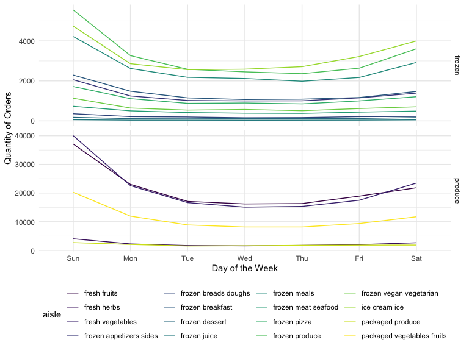
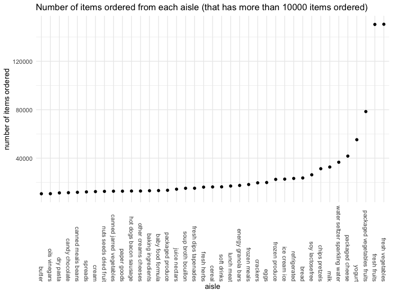

p8105\_hw3\_xf2226
================
Xin Fang
10/19/2021

# Problem 1

``` r
data("instacart")
summary(instacart) #order_dow is in range 0-6; not very understandable
instacart <- instacart %>% 
    mutate(
      order_dow = order_dow + 1,
      order_dow = wday(order_dow, label = T)
   ) 
```

## A short description of the dataset, noting the size and structure of the data, describing some key variables

This instacart dataset contains 1384617 rows and 15 columns.

The observations are orders which is included in the `order_id` column.
We have 131209 order in total. Within those orders, there are 39123
unique products. Some examples of the products include Bulgarian Yogurt,
Organic 4% Milk Fat Whole Milk Cottage Cheese, Organic Celery Hearts,
Cucumber Kirby, Lightly Smoked Sardines in Olive Oil. Those products are
coming from 134 unique aisles and 21 departments. The top two days of
the week where the most orders are placed is Sat, Sun, which are the
weekends.

Some key varaibles are:

-   `order_id`= order identifier
-   `product_id`= product identifier
-   `user_id`= customer identifier
-   `order_number`= the order sequence number for this user (1=first,
    n=nth)
-   `order_dow`= the day of the week on which the order was placed
-   `product_name`= name of the product
-   `aisle_id`= aisle identifier
-   `aisle`= the name of the aisle
-   `department_id`= department identifier
-   `department`= the name of the department

## Illstrative examples of observations

``` r
instacart_dow_dept <- instacart %>% 
  filter(department == "produce" | department == "frozen") %>% 
  group_by(order_dow, aisle, department) %>% 
  summarise(total = n())

instacart_dow_dept %>% 
  ggplot(aes(x = order_dow, y = total, group = aisle, color = aisle)) + 
  geom_line() +
  facet_grid(department ~ ., scales = "free_y") +
   labs(
    x = "Day of the Week",
    y = "Quantity of Orders",
  )
```

<!-- -->

## Problem 1.1 How many aisles, and which are most items from?

``` r
aisles <- instacart %>% 
  count(aisle) %>% 
  arrange(desc(n))
```

There are 134 number of aisles. The top 3 aisles where most items are
ordered are from fresh vegetables, fresh fruits, packaged vegetables
fruits

## Problem 1.2 Make a plot that shows the number of items ordered in each aisle, limiting this to aisles with more than 10000 items ordered. Arrange aisles sensibly, and organize your plot so others can read it.

``` r
aisles %>%
  filter(n > 10000) %>% 
  mutate(
    aisle = factor(aisle),
    aisle = fct_reorder(aisle, n)
  ) %>% 
  ggplot(aes(x = aisle, y = n)) + geom_point() +
  theme(axis.text.x = element_text(angle = 270, vjust = 0.5, hjust = 1)) + 
  labs(
    y = "number of items ordered", 
    title = "Number of items ordered from each aisle (that has more than 10000 items ordered)"
  )
```

<!-- -->

## Problem 1.3 Make a table showing the three most popular items in each of the aisles “baking ingredients”, “dog food care”, and “packaged vegetables fruits”. Include the number of times each item is ordered in your table.

``` r
instacart %>% 
  filter(aisle %in% c("baking ingredients", "dog food care", "packaged vegetables fruits")) %>% 
  group_by(aisle) %>% 
  count(product_name) %>% 
  mutate(rank = min_rank(desc(n))) %>% 
  filter(rank < 4) %>% #top three popular items
  arrange(aisle, rank) %>% 
  knitr::kable()
```

| aisle                      | product\_name                                 |    n | rank |
|:---------------------------|:----------------------------------------------|-----:|-----:|
| baking ingredients         | Light Brown Sugar                             |  499 |    1 |
| baking ingredients         | Pure Baking Soda                              |  387 |    2 |
| baking ingredients         | Cane Sugar                                    |  336 |    3 |
| dog food care              | Snack Sticks Chicken & Rice Recipe Dog Treats |   30 |    1 |
| dog food care              | Organix Chicken & Brown Rice Recipe           |   28 |    2 |
| dog food care              | Small Dog Biscuits                            |   26 |    3 |
| packaged vegetables fruits | Organic Baby Spinach                          | 9784 |    1 |
| packaged vegetables fruits | Organic Raspberries                           | 5546 |    2 |
| packaged vegetables fruits | Organic Blueberries                           | 4966 |    3 |

## Problem 1.4 Make a table showing the mean hour of the day at which Pink Lady Apples and Coffee Ice Cream are ordered on each day of the week; format this table for human readers (i.e. produce a 2 x 7 table).

``` r
instacart %>% 
    filter(product_name %in% c("Pink Lady Apples", "Coffee Ice Cream")) %>% 
    group_by(product_name, order_dow) %>% 
    summarize(mean_hour = mean(order_hour_of_day)) %>% #taking mean hour of the day
    pivot_wider(
        names_from = order_dow,
        values_from = mean_hour
    )
```

    ## # A tibble: 2 × 8
    ## # Groups:   product_name [2]
    ##   product_name       Sun   Mon   Tue   Wed   Thu   Fri   Sat
    ##   <chr>            <dbl> <dbl> <dbl> <dbl> <dbl> <dbl> <dbl>
    ## 1 Coffee Ice Cream  13.8  14.3  15.4  15.3  15.2  12.3  13.8
    ## 2 Pink Lady Apples  13.4  11.4  11.7  14.2  11.6  12.8  11.9

# Problem 2

## load and clean BRFSS dataset

``` r
data("brfss_smart2010")
brfss_smart2010 <- brfss_smart2010 %>% 
  janitor::clean_names() 

brfss <- brfss_smart2010 %>%  
  filter(topic %in% "Overall Health") %>%
  filter(response %in% c("Poor","Fair","Good","Very good","Excellent")) %>%
  mutate(response = factor(response, ordered = TRUE, 
                       levels = c("Poor", "Fair", "Good", "Very good", "Excellent")),
         locationdesc = gsub('^.{0,5}', '', locationdesc)) %>% 
  rename(state = locationabbr, county = locationdesc)
```

## Problem 2.1 In 2002, which states were observed at 7 or more locations? What about in 2010?

## Problem 2.2 Construct a dataset that is limited to Excellent responses, and contains, year, state, and a variable that averages the data\_value across locations within a state. Make a “spaghetti” plot of this average value over time within a state (that is, make a plot showing a line for each state across years – the geom\_line geometry and group aesthetic will help).

## Problem 2.3 Make a two-panel plot showing, for the years 2006, and 2010, distribution of data\_value for responses (“Poor” to “Excellent”) among locations in NY State.
